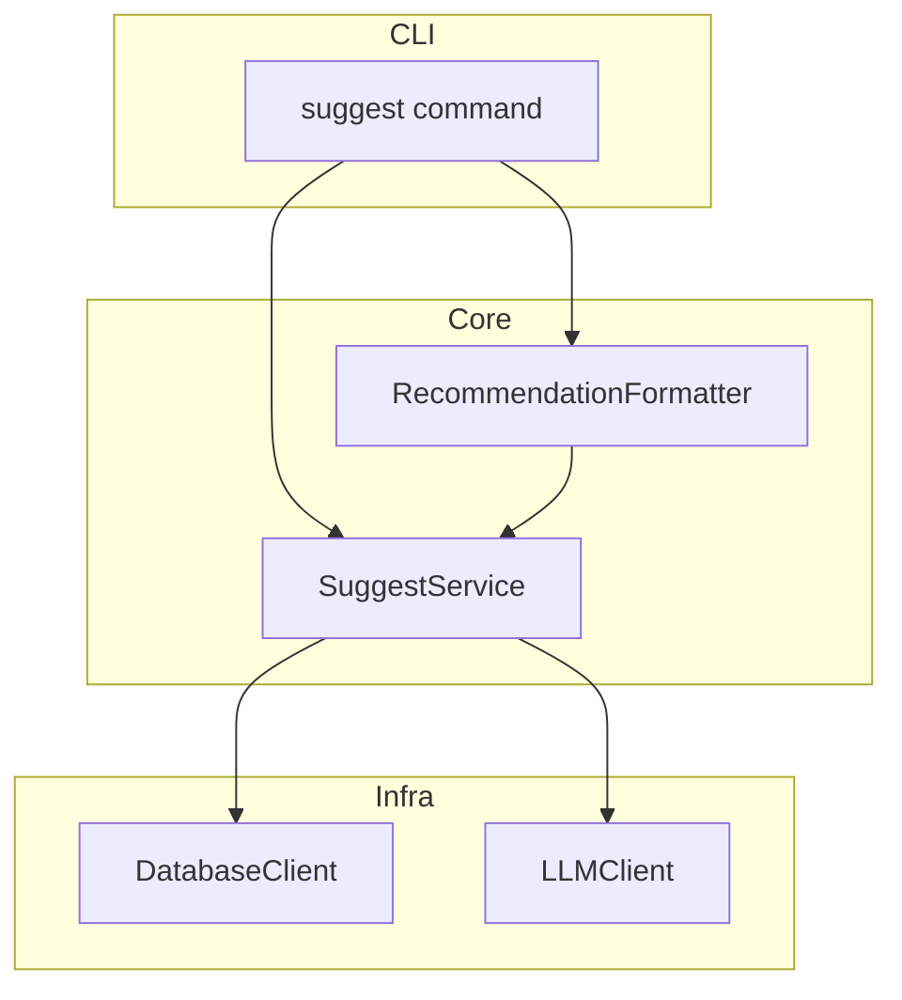
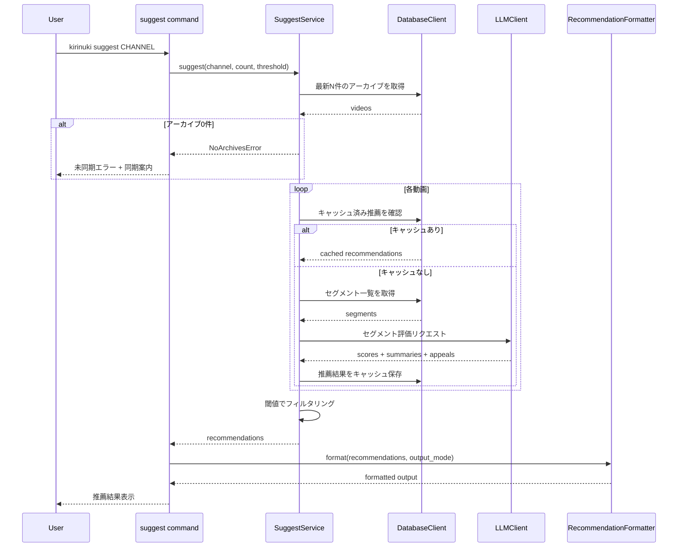

# Design Document: archive-clip-suggester

## Overview

**Purpose**: 最新の配信アーカイブから切り抜きに適した話題区間をLLMが自動評価・推薦し、動画URL・区間・要約・魅力紹介を一覧表示する機能を提供する。

**Users**: 配信の切り抜き動画を作成したいユーザーが、どの部分を切り抜くべきかの判断を効率化するために利用する。

**Impact**: `youtube-live-clipper` で構築された字幕蓄積・セグメンテーション基盤に推薦レイヤーを追加し、蓄積データの活用価値を高める。

### Goals
- チャンネル指定のみで最新アーカイブの切り抜き候補を自動推薦
- LLMによる多角的な切り抜き適性評価（独立性・エンタメ性・情報価値・感情的インパクト）
- ブラウザで即座に確認可能なタイムスタンプ付きURL付き結果表示
- 既存CLIサブコマンド体系への自然な統合

### Non-Goals
- 動画ダウンロードや切り抜き動画の生成
- 推薦ロジックのカスタマイズUI
- リアルタイム推薦やプッシュ通知
- 推薦結果の学習・フィードバックループ

## Architecture

### Existing Architecture Analysis

`youtube-live-clipper` が以下の基盤を提供する前提:

- **CLI層** (`cli/`): サブコマンド体系（click/typer）
- **Core層** (`core/`): 字幕パース、セグメンテーションロジック
- **Infra層** (`infra/`): yt-dlpラッパー、Claude APIクライアント、SQLiteアクセス
- **Models** (`models/`): Pydanticモデル（Video, Segment等）

本機能はこの構造にそのまま統合し、新規レイヤーは追加しない。

### Architecture Pattern & Boundary Map



**Architecture Integration**:
- 選択パターン: 既存レイヤードアーキテクチャにそのまま統合
- 新規コンポーネント: CLI 1件 + Core 2件 + Model 1件（最小限の追加）
- 既存パターン維持: CLI→Core→Infra の依存方向、Protocolによるインフラ抽象化
- Steering準拠: structure.mdのレイヤー分離原則を遵守

### Technology Stack

| Layer | Choice / Version | Role in Feature | Notes |
|-------|------------------|-----------------|-------|
| CLI | click or typer | `suggest`サブコマンド定義 | 既存CLI基盤を共有 |
| Core | Python 3.12+ | 推薦ロジック、フォーマッター | 型ヒント必須 |
| LLM | Claude API (Haiku 4.5) | セグメント切り抜き適性評価 | Structured Outputs使用 |
| Data | SQLite + 既存スキーマ | セグメント取得、推薦キャッシュ | `segment_recommendations`テーブル追加 |

新規外部依存は不要。全て既存スタックで実現。

## System Flows

### 推薦処理フロー



**Key Decisions**:
- 動画ごとにキャッシュ確認→評価の順で処理。キャッシュヒットならAPI呼び出しをスキップ
- 複数動画のLLM評価は逐次処理（動画間の独立性が高いため、将来的に並列化も容易）

## Requirements Traceability

| Requirement | Summary | Components | Interfaces | Flows |
|-------------|---------|------------|------------|-------|
| 1.1 | チャンネル指定で最新3件を選定 | SuggestService | SuggestService.suggest | 推薦処理フロー |
| 1.2 | `--count`オプションで件数変更 | suggest command | CLI引数定義 | - |
| 1.3 | アーカイブ不足時の全件対象化 | SuggestService | SuggestService.suggest | 推薦処理フロー |
| 1.4 | 0件時のエラー案内 | SuggestService | NoArchivesError | 推薦処理フロー |
| 1.5 | 選定アーカイブの情報表示 | suggest command | CLI出力 | - |
| 2.1 | LLMへのセグメント評価送信 | SuggestService | LLMClient.evaluate_segments | 推薦処理フロー |
| 2.2 | 4軸の評価基準 | SuggestService | 評価プロンプト設計 | - |
| 2.3 | 推薦スコア（1〜10）付与 | SuggestService | SegmentRecommendation.score | - |
| 2.4 | 閾値（デフォルト7）フィルタリング | SuggestService | SuggestService.suggest | 推薦処理フロー |
| 2.5 | `--threshold`オプション | suggest command | CLI引数定義 | - |
| 2.6 | 全件閾値未満時の案内 | SuggestService, suggest command | CLI出力 | - |
| 3.1 | スコア降順表示 | RecommendationFormatter | format | - |
| 3.2 | 推薦候補の情報項目 | RecommendationFormatter | SegmentRecommendation | - |
| 3.3 | 動画ごとグループ化+時系列ソート | RecommendationFormatter | format | - |
| 3.4 | タイムスタンプ付きYouTube URL生成 | RecommendationFormatter | build_youtube_url | - |
| 3.5 | `--json`オプション | RecommendationFormatter, suggest command | format_json | - |
| 4.1 | サブコマンド提供 | suggest command | CLI定義 | - |
| 4.2 | 一連処理の実行 | suggest command, SuggestService | suggest | 推薦処理フロー |
| 4.3 | 進捗ステータス表示 | suggest command | CLI出力 | - |
| 4.4 | `--help`オプション | suggest command | CLI定義 | - |

## Components and Interfaces

| Component | Domain/Layer | Intent | Req Coverage | Key Dependencies | Contracts |
|-----------|-------------|--------|--------------|------------------|-----------|
| suggest command | CLI | 推薦サブコマンドのエントリーポイント | 1.2, 1.5, 2.5, 2.6, 3.5, 4.1-4.4 | SuggestService (P0), RecommendationFormatter (P0) | - |
| SuggestService | Core | 推薦ロジックのオーケストレーション | 1.1, 1.3, 1.4, 2.1-2.4 | DatabaseClient (P0), LLMClient (P0) | Service |
| RecommendationFormatter | Core | 推薦結果のフォーマット・出力生成 | 3.1-3.5 | - | Service |
| SegmentRecommendation | Models | 推薦結果のデータモデル | 2.3, 3.2 | - | State |

### CLI層

#### suggest command

| Field | Detail |
|-------|--------|
| Intent | `kirinuki suggest` サブコマンドの定義。引数パース→SuggestService呼び出し→結果表示 |
| Requirements | 1.2, 1.5, 2.5, 2.6, 3.5, 4.1, 4.2, 4.3, 4.4 |

**Responsibilities & Constraints**
- CLI引数の定義とバリデーション（channel, --count, --threshold, --json）
- 処理進捗のステータスメッセージ表示
- エラーハンドリングとユーザーフレンドリーなメッセージ出力
- ビジネスロジックを含まない（SuggestServiceに委譲）

**Dependencies**
- Outbound: SuggestService — 推薦処理の実行 (P0)
- Outbound: RecommendationFormatter — 結果のフォーマット (P0)

**Contracts**: Service [ ] / API [ ] / Event [ ] / Batch [ ] / State [ ]

**Implementation Notes**
- 既存CLI定義ファイル（`cli/__init__.py` 等）にサブコマンドとして登録
- `--count` デフォルト3、`--threshold` デフォルト7
- 進捗表示は stderr に出力し、`--json` モード時も stdout を汚さない

### Core層

#### SuggestService

| Field | Detail |
|-------|--------|
| Intent | 最新アーカイブ選定→切り抜き適性評価→フィルタリングのオーケストレーション |
| Requirements | 1.1, 1.3, 1.4, 2.1, 2.2, 2.3, 2.4 |

**Responsibilities & Constraints**
- チャンネルIDに基づく最新N件のアーカイブ選定
- 動画ごとのセグメント評価（キャッシュ確認→LLM評価→キャッシュ保存）
- 推薦スコア閾値によるフィルタリング
- 外部ツール非依存（DatabaseClient, LLMClientはProtocol経由）

**Dependencies**
- Outbound: DatabaseClient — 動画・セグメント・キャッシュの読み書き (P0)
- Outbound: LLMClient — セグメント切り抜き適性評価 (P0)

**Contracts**: Service [x] / API [ ] / Event [ ] / Batch [ ] / State [ ]

##### Service Interface

```python
from dataclasses import dataclass

@dataclass
class SuggestOptions:
    channel_id: str
    count: int = 3
    threshold: int = 7

@dataclass
class SuggestResult:
    videos: list["VideoWithRecommendations"]
    total_candidates: int
    filtered_count: int

@dataclass
class VideoWithRecommendations:
    video_id: str
    title: str
    published_at: str
    recommendations: list["SegmentRecommendation"]


class SuggestService(Protocol):
    def suggest(self, options: SuggestOptions) -> SuggestResult:
        """最新アーカイブの切り抜き候補を推薦する。

        Preconditions:
          - channel_idが登録済みチャンネルであること
          - 対象動画のセグメンテーションが完了していること
        Postconditions:
          - 推薦結果がスコア閾値でフィルタリング済み
          - 新規評価はキャッシュに保存済み
        Raises:
          - NoArchivesError: 同期済みアーカイブが0件の場合
        """
        ...
```

**Implementation Notes**
- 動画ごとにキャッシュ確認。`prompt_version`が現行と一致する場合のみキャッシュ使用
- LLM評価はStructured Outputsで `list[SegmentRecommendation]` を取得
- 評価プロンプトに4軸の基準（独立性・エンタメ性・情報価値・感情的インパクト）を明示し、各軸の具体例を含める

#### RecommendationFormatter

| Field | Detail |
|-------|--------|
| Intent | 推薦結果を人間可読テキストまたはJSON形式にフォーマット |
| Requirements | 3.1, 3.2, 3.3, 3.4, 3.5 |

**Responsibilities & Constraints**
- スコア降順ソート（表示時）
- 動画ごとのグループ化、各動画内は時系列ソート
- タイムスタンプ付きYouTube URLの生成
- テキスト出力とJSON出力の両対応

**Dependencies**
- なし（純粋なフォーマッター）

**Contracts**: Service [x] / API [ ] / Event [ ] / Batch [ ] / State [ ]

##### Service Interface

```python
class RecommendationFormatter(Protocol):
    def format_text(self, result: SuggestResult) -> str:
        """推薦結果を人間可読テキストにフォーマットする。

        動画ごとにグループ化し、各動画内は時系列順。
        全体はスコア降順で最高スコアの動画グループから表示。
        """
        ...

    def format_json(self, result: SuggestResult) -> str:
        """推薦結果をJSON文字列にフォーマットする。"""
        ...

    @staticmethod
    def build_youtube_url(video_id: str, start_seconds: int) -> str:
        """タイムスタンプ付きYouTube URLを生成する。

        Format: https://www.youtube.com/watch?v={video_id}&t={start_seconds}
        """
        ...
```

**Implementation Notes**
- テキスト出力は動画ごとにヘッダー（タイトル+配信日時）を表示し、各候補をインデント付きで一覧
- JSON出力は `SuggestResult` のPydantic/dataclass直列化

### Models

#### SegmentRecommendation

| Field | Detail |
|-------|--------|
| Intent | 1セグメントの切り抜き推薦結果を表現するデータモデル |
| Requirements | 2.3, 3.2 |

**Contracts**: Service [ ] / API [ ] / Event [ ] / Batch [ ] / State [x]

##### State Management

```python
from pydantic import BaseModel, Field

class SegmentRecommendation(BaseModel):
    """切り抜き推薦結果。LLM評価の出力をそのままマッピング。"""
    segment_id: int
    video_id: str
    start_time: float = Field(description="区間開始時刻（秒）")
    end_time: float = Field(description="区間終了時刻（秒）")
    score: int = Field(ge=1, le=10, description="切り抜き推薦スコア")
    summary: str = Field(description="話題の要約（1〜2文）")
    appeal: str = Field(description="切り抜きの魅力紹介")
    prompt_version: str = Field(description="評価に使用したプロンプトバージョン")
```

- 永続化: `segment_recommendations`テーブルに保存
- キャッシュキー: `(segment_id, prompt_version)` の複合
- LLMからのStructured Outputs応答を直接パースしてインスタンス化

## Data Models

### Domain Model

- **SegmentRecommendation**: セグメントに対する切り抜き推薦の評価結果（値オブジェクト）
- 既存の **Video**, **Segment** エンティティに依存するが変更しない
- SegmentRecommendation は Segment への参照（segment_id）を持つ

### Physical Data Model

#### segment_recommendations テーブル（新規）

| Column | Type | Constraints | Description |
|--------|------|-------------|-------------|
| id | INTEGER | PRIMARY KEY AUTOINCREMENT | 一意識別子 |
| segment_id | INTEGER | NOT NULL, FK → segments(id) | 対象セグメント |
| video_id | TEXT | NOT NULL, FK → videos(video_id) | 対象動画（クエリ効率化） |
| score | INTEGER | NOT NULL, CHECK(score BETWEEN 1 AND 10) | 推薦スコア |
| summary | TEXT | NOT NULL | 話題要約 |
| appeal | TEXT | NOT NULL | 魅力紹介テキスト |
| prompt_version | TEXT | NOT NULL | 評価プロンプトバージョン |
| created_at | TEXT | NOT NULL, DEFAULT CURRENT_TIMESTAMP | 作成日時 |

**Indexes**:
- `idx_recommendations_video_id` ON (video_id) — 動画単位のキャッシュ検索
- `idx_recommendations_segment_prompt` ON (segment_id, prompt_version) UNIQUE — キャッシュキー

**Constraints**:
- `segment_id` + `prompt_version` のユニーク制約でキャッシュの一意性を保証

## Error Handling

### Error Strategy

| Error | Category | Response | Recovery |
|-------|----------|----------|----------|
| 同期済みアーカイブ0件 | Business Logic | `NoArchivesError` + 同期コマンド案内 | ユーザーが同期を実行 |
| 全候補が閾値未満 | Business Logic | 該当なし表示 + 閾値下げ案内 | `--threshold` を下げて再実行 |
| チャンネル未登録 | User Error | チャンネル未登録エラー + 登録コマンド案内 | ユーザーがチャンネル登録 |
| LLM API障害 | System Error | エラーメッセージ表示。キャッシュ済み結果があればそれを返す | キャッシュフォールバック / リトライ |
| LLMレスポンスのパース失敗 | System Error | 該当動画をスキップし、処理済みの結果のみ返す | 自動スキップ |

## Testing Strategy

### Unit Tests
- `SuggestService.suggest`: 最新N件選定ロジック（正常系、不足時、0件時）
- `SuggestService.suggest`: 閾値フィルタリング（全件通過、一部通過、全件不通過）
- `RecommendationFormatter.format_text`: テキスト出力の構造（グループ化、ソート順）
- `RecommendationFormatter.build_youtube_url`: URL生成（正常系、0秒指定）
- `SegmentRecommendation`: Pydanticバリデーション（スコア範囲外、必須フィールド欠落）

### Integration Tests
- LLMClient → SuggestService: Structured Outputsのパース正常系（モックLLM使用）
- DatabaseClient → SuggestService: キャッシュの読み書きサイクル
- CLI → SuggestService → Formatter: エンドツーエンドの出力検証（テキスト/JSON両モード）

### E2E Tests
- `kirinuki suggest CHANNEL` 実行→テキスト出力にURL・スコア・要約が含まれることを検証
- `kirinuki suggest CHANNEL --json` 実行→JSON出力がパース可能で必須フィールドが存在することを検証
