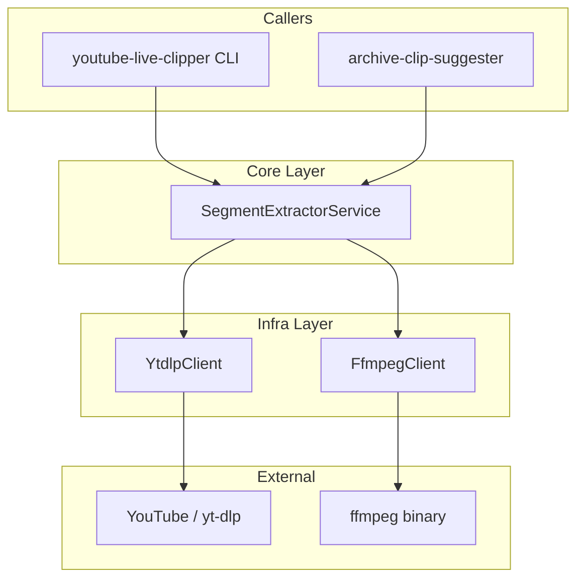
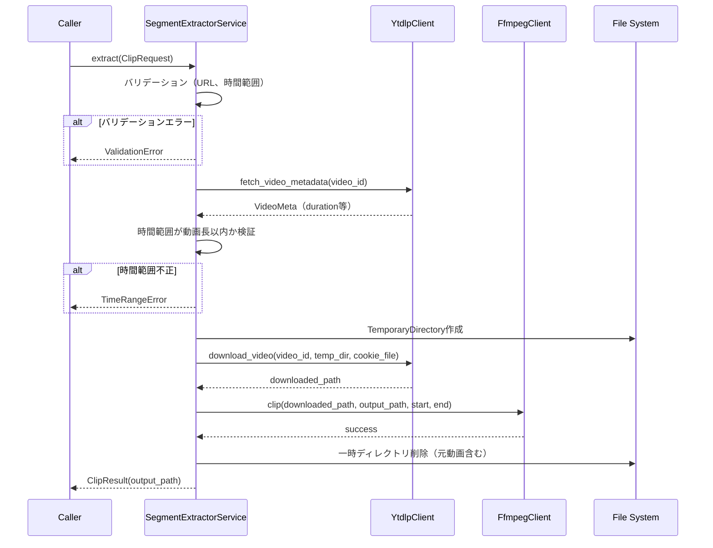
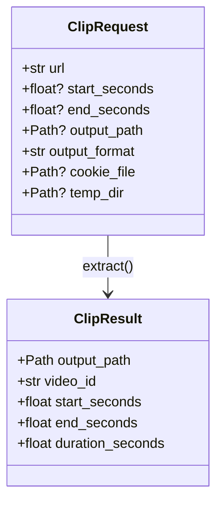

# Design Document — archive-segment-extractor

## Overview

**Purpose**: YouTubeLiveアーカイブURLと時間範囲を指定し、該当区間のみを切り出した動画ファイルを生成する。yt-dlpによるオンデマンドダウンロードとffmpegによる区間切り出しを組み合わせ、元動画は処理完了後に即時削除する。

**Users**: 他モジュール（`youtube-live-clipper` CLI層、`archive-clip-suggester` 推薦エンジン）がプログラム的に呼び出す。将来的にCLIサブコマンドからの直接呼び出しも想定。

### Goals
- URL + 開始/終了時刻を入力として切り抜き動画を生成する公開APIの提供
- オンデマンドDL → 切り出し → 元動画即時削除のライフサイクル管理
- Pydanticモデルによる入出力の型安全性
- 既存アーキテクチャ（CLI → Core → Infra）への自然な統合

### Non-Goals
- CLIサブコマンドの定義（呼び出し元のyoutube-live-clipperで対応）
- 動画の永続保存・管理
- 切り抜き動画のエンコード品質の詳細な制御（将来フェーズ）
- 複数区間の一括切り出し（将来フェーズ）

## Architecture

### Existing Architecture Analysis

`youtube-live-clipper`が定義する既存アーキテクチャ:
- **3層構造**: CLI → Core → Infra（Protocolによる抽象化）
- **YtdlpClient Protocol**: 字幕・メタデータ取得のみ（動画DLメソッドなし）
- **FfmpegClient**: 未定義（本機能で新設）
- **Models**: Pydantic v2ベース。`Video`, `Segment`等が定義済み

本機能は`YtdlpClient`に動画ダウンロードメソッドを追加し、新規`FfmpegClient` Protocolを導入する。

### Architecture Pattern & Boundary Map



**Architecture Integration**:
- **Selected pattern**: 既存レイヤードアーキテクチャにそのまま統合
- **Domain boundaries**: SegmentExtractorServiceがオーケストレーション（DL→切り出し→クリーンアップ）を担当。インフラ詳細はProtocolで隔離
- **Existing patterns preserved**: CLI→Core→Infra依存方向、Protocol抽象化
- **New components rationale**: FfmpegClientは新規外部ツール依存のため新設。YtdlpClientは既存Protocolを拡張
- **Steering compliance**: structure.mdの「コア層は外部非依存」「インフラ層は交換可能」原則を遵守

### Technology Stack

| Layer | Choice / Version | Role in Feature | Notes |
|-------|------------------|-----------------|-------|
| Core Services | Python 3.12+ | SegmentExtractorService | 型ヒント必須 |
| Video Download | yt-dlp (Python library) | 動画オンデマンドDL | Cookie認証対応。既存YtdlpClientを拡張 |
| Video Clipping | ffmpeg (subprocess) | 区間切り出し | `-c copy`（ストリームコピー）デフォルト |
| Validation | Pydantic v2 | 入出力モデル | ClipRequest, ClipResult |
| Temp Files | tempfile (stdlib) | 一時ディレクトリ管理 | コンテキストマネージャで自動クリーンアップ |

## System Flows

### 切り抜き処理フロー



## Requirements Traceability

| Requirement | Summary | Components | Interfaces | Flows |
|-------------|---------|------------|------------|-------|
| 1.1 | 区間切り出し動画生成 | SegmentExtractorService, FfmpegClient | extract(), clip() | 切り抜き処理 |
| 1.2 | 開始時刻のみ指定 | SegmentExtractorService | ClipRequest（end_seconds省略） | 切り抜き処理 |
| 1.3 | 終了時刻のみ指定 | SegmentExtractorService | ClipRequest（start_seconds省略） | 切り抜き処理 |
| 1.4 | 時刻形式（HH:MM:SS/秒数） | ClipRequest | parse_time() バリデータ | — |
| 1.5 | 結果パス返却 | SegmentExtractorService | ClipResult.output_path | 切り抜き処理 |
| 2.1 | オンデマンドDL | YtdlpClient | download_video() | 切り抜き処理 |
| 2.2 | 元動画即時削除 | SegmentExtractorService | TemporaryDirectory | 切り抜き処理 |
| 2.3 | エラー時クリーンアップ | SegmentExtractorService | TemporaryDirectory | 切り抜き処理 |
| 2.4 | 一時ディレクトリ設定 | ClipRequest | temp_dir | — |
| 3.1 | 出力先パス指定 | ClipRequest | output_path | — |
| 3.2 | デフォルト出力先 | SegmentExtractorService | 自動ファイル名生成 | — |
| 3.3 | 出力フォーマット指定 | ClipRequest | output_format | — |
| 3.4 | デフォルトフォーマット | ClipRequest | default="mp4" | — |
| 4.1 | Cookie認証でメンバー限定DL | YtdlpClient | cookiefile option | 切り抜き処理 |
| 4.2 | yt-dlp Cookie機構利用 | YtdlpClient | cookiefile option | 切り抜き処理 |
| 4.3 | Cookie未設定時エラー | YtdlpClient, SegmentExtractorService | AuthenticationRequiredError | — |
| 5.1 | 無効URL検証 | SegmentExtractorService | InvalidURLError | — |
| 5.2 | 時間範囲超過検証 | SegmentExtractorService | TimeRangeError | 切り抜き処理 |
| 5.3 | 開始>終了検証 | ClipRequest | Pydantic validator | — |
| 5.4 | ffmpeg未インストール検証 | FfmpegClient | FfmpegNotFoundError | — |
| 5.5 | ダウンロード失敗 | YtdlpClient, SegmentExtractorService | DownloadError | 切り抜き処理 |
| 6.1 | Python公開API | SegmentExtractorService | extract() | — |
| 6.2 | Pydantic入力モデル | ClipRequest | Pydantic BaseModel | — |
| 6.3 | Pydantic出力モデル | ClipResult | Pydantic BaseModel | — |
| 6.4 | Core層配置・DI対応 | SegmentExtractorService | Protocol依存注入 | — |

## Components and Interfaces

| Component | Domain/Layer | Intent | Req Coverage | Key Dependencies | Contracts |
|-----------|-------------|--------|--------------|------------------|-----------|
| ClipRequest | Models | 切り抜きリクエストパラメータ | 1.2, 1.3, 1.4, 3.1-3.4, 5.3, 6.2 | pydantic (P0) | State |
| ClipResult | Models | 切り抜き結果 | 1.5, 6.3 | pydantic (P0) | State |
| SegmentExtractorService | Core | 切り抜きオーケストレーション | 1.1-1.5, 2.1-2.4, 3.2, 4.3, 5.1-5.2, 5.5, 6.1, 6.4 | YtdlpClient (P0), FfmpegClient (P0) | Service |
| YtdlpClient（拡張） | Infra | 動画ダウンロード追加 | 2.1, 4.1, 4.2, 5.5 | yt-dlp (P0, External) | Service |
| FfmpegClient | Infra | ffmpegによる区間切り出し | 1.1, 5.4 | ffmpeg binary (P0, External) | Service |

### Models

#### ClipRequest

| Field | Detail |
|-------|--------|
| Intent | 切り抜きリクエストの入力パラメータを定義・バリデーションする |
| Requirements | 1.2, 1.3, 1.4, 3.1, 3.2, 3.3, 3.4, 5.3, 6.2 |

**Contracts**: State [x]

##### State Management

```python
class ClipRequest(BaseModel):
    url: str
    start_seconds: float | None = None
    end_seconds: float | None = None
    output_path: Path | None = None
    output_format: str = "mp4"
    cookie_file: Path | None = None
    temp_dir: Path | None = None
```

- `url`: YouTubeアーカイブURL（`https://www.youtube.com/watch?v=...` 形式）
- `start_seconds`, `end_seconds`: 秒数（float）。少なくとも一方は必須。`HH:MM:SS`形式からの変換はヘルパー関数で対応
- `output_path`: 出力先ファイルパス。未指定時はカレントディレクトリに`{video_id}_{start}-{end}.{format}`で自動生成
- `output_format`: 出力コンテナフォーマット。デフォルト`"mp4"`
- `cookie_file`: yt-dlp用Cookieファイルパス。メンバー限定動画アクセス用
- `temp_dir`: 一時ファイル保存先。未指定時はシステムデフォルト

**Validators**:
- `start_seconds`と`end_seconds`の少なくとも一方が指定されていること
- `start_seconds`が指定されている場合、0以上であること
- `start_seconds < end_seconds`（両方指定時）
- `output_format`がサポート対象（`mp4`, `mkv`, `webm`）であること

#### ClipResult

| Field | Detail |
|-------|--------|
| Intent | 切り抜き処理の結果を構造化して返す |
| Requirements | 1.5, 6.3 |

**Contracts**: State [x]

##### State Management

```python
class ClipResult(BaseModel):
    output_path: Path
    video_id: str
    start_seconds: float
    end_seconds: float
    duration_seconds: float
```

### Core Layer

#### SegmentExtractorService

| Field | Detail |
|-------|--------|
| Intent | 動画DL → 区間切り出し → クリーンアップのオーケストレーション |
| Requirements | 1.1-1.5, 2.1-2.4, 3.2, 4.3, 5.1, 5.2, 5.5, 6.1, 6.4 |

**Responsibilities & Constraints**
- 入力バリデーション（URL形式、時間範囲の論理整合性）
- メタデータ取得による時間範囲の動画長チェック
- 一時ディレクトリの作成・自動クリーンアップ管理
- DL→切り出しパイプラインのオーケストレーション
- 出力パスの自動生成（未指定時）
- コア層に配置し、外部ツールを直接importしない

**Dependencies**
- Outbound: YtdlpClient — メタデータ取得、動画ダウンロード (P0)
- Outbound: FfmpegClient — 区間切り出し (P0)

**Contracts**: Service [x]

##### Service Interface

```python
from typing import Protocol
from pathlib import Path

class SegmentExtractorService(Protocol):
    def extract(self, request: ClipRequest) -> ClipResult:
        """
        指定URLの指定区間を切り出した動画を生成する。

        処理フロー:
        1. 入力バリデーション
        2. メタデータ取得（動画長の検証）
        3. 一時ディレクトリに動画DL
        4. ffmpegで区間切り出し
        5. 一時ファイルクリーンアップ
        6. 結果返却
        """
        ...
```

- **Preconditions**: `ClipRequest`がPydanticバリデーション済み
- **Postconditions**: `ClipResult.output_path`に切り抜き動画が存在。一時ファイルは全削除済み
- **Invariants**: 正常終了・例外発生いずれの場合も一時ファイルはクリーンアップされる

**Implementation Notes**
- `tempfile.TemporaryDirectory`をコンテキストマネージャとして使用し、例外時も確実にクリーンアップ
- YouTube URL からvideo_idの抽出は正規表現ベースのユーティリティ関数として実装
- 出力パス未指定時のファイル名: `{video_id}_{start_seconds}-{end_seconds}.{output_format}`

### Infra Layer

#### YtdlpClient（拡張）

| Field | Detail |
|-------|--------|
| Intent | 既存YtdlpClient Protocolに動画ダウンロードメソッドを追加 |
| Requirements | 2.1, 4.1, 4.2, 5.5 |

**Responsibilities & Constraints**
- 動画のダウンロード（yt-dlp Python APIを使用）
- Cookie認証の透過的な適用
- ダウンロードパスの返却

**Dependencies**
- External: yt-dlp library (P0)

**Contracts**: Service [x]

##### Service Interface（追加メソッド）

```python
class YtdlpClient(Protocol):
    # ... 既存メソッド（list_channel_video_ids, fetch_video_metadata, fetch_subtitle）...

    def download_video(
        self,
        video_id: str,
        output_dir: Path,
        cookie_file: Path | None = None,
    ) -> Path:
        """
        動画を指定ディレクトリにダウンロードし、ファイルパスを返す。

        yt-dlpオプション:
        - format: 'bestvideo[ext=mp4]+bestaudio[ext=m4a]/best[ext=mp4]'
        - outtmpl: '{output_dir}/{video_id}.%(ext)s'
        - cookiefile: cookie_file（指定時のみ）
        """
        ...
```

- **Preconditions**: `video_id`が有効なYouTube動画ID。`output_dir`が書き込み可能なディレクトリ
- **Postconditions**: ダウンロードされた動画ファイルのPathが返却される
- **Error cases**: `DownloadError`（yt-dlp由来）、認証必要時は`AuthenticationRequiredError`にラップ

**Implementation Notes**
- `YoutubeDL(opts).download([url])`で実行。戻り値`1`の場合は`DownloadError`を送出
- `extract_info(download=True)`の戻り値から実際のファイルパスを取得（`info['requested_downloads'][0]['filepath']`）
- メンバー限定動画でCookie未設定の場合、yt-dlpは`ExtractorError`を送出 → `AuthenticationRequiredError`にマッピング

#### FfmpegClient

| Field | Detail |
|-------|--------|
| Intent | ffmpegによる動画の区間切り出し |
| Requirements | 1.1, 5.4 |

**Responsibilities & Constraints**
- ffmpegバイナリの存在確認
- subprocessによるffmpegコマンド実行
- エラーメッセージのパースと適切な例外変換

**Dependencies**
- External: ffmpeg binary (P0)

**Contracts**: Service [x]

##### Service Interface

```python
class FfmpegClient(Protocol):
    def check_available(self) -> None:
        """
        ffmpegがシステムにインストールされているか確認する。
        未インストールの場合FfmpegNotFoundErrorを送出する。
        """
        ...

    def clip(
        self,
        input_path: Path,
        output_path: Path,
        start_seconds: float,
        end_seconds: float,
    ) -> None:
        """
        入力動画の指定区間を切り出して出力ファイルに保存する。

        ffmpegコマンド:
        ffmpeg -y -ss {start} -i {input} -to {end} -c copy {output}

        -ss を -i の前に配置（キーフレームシーク: 高速）
        -c copy（ストリームコピー: 再エンコードなし）
        """
        ...
```

- **Preconditions**: `input_path`が存在する動画ファイル。`start_seconds < end_seconds`
- **Postconditions**: `output_path`に切り出された動画ファイルが存在
- **Error cases**: `FfmpegNotFoundError`（未インストール）、`ClipError`（ffmpeg実行失敗）

**Implementation Notes**
- 存在確認: `shutil.which("ffmpeg")`
- subprocess実行: `subprocess.run(cmd, capture_output=True, text=True, check=True)`
- 時刻フォーマット: 秒数（float）を`HH:MM:SS.mmm`に変換してffmpegに渡す
- `-y`フラグ: 出力ファイルの上書きを許可（確認プロンプト回避）

## Data Models

### Domain Model

本機能はDB永続化を行わない（ステートレス処理）。入出力のデータモデルのみ。



**Business Rules**:
- `start_seconds`と`end_seconds`の少なくとも一方は必須
- `start_seconds < end_seconds`（両方指定時）
- `start_seconds >= 0`, `end_seconds > 0`
- `end_seconds <= video_duration`（メタデータ取得後に検証）

## Error Handling

### Error Categories and Responses

```python
class SegmentExtractorError(Exception):
    """archive-segment-extractorの基底例外"""

class InvalidURLError(SegmentExtractorError):
    """無効なYouTube URL"""

class TimeRangeError(SegmentExtractorError):
    """時間範囲が不正（超過、逆順等）"""

class AuthenticationRequiredError(SegmentExtractorError):
    """メンバー限定動画で認証情報が未設定"""

class VideoDownloadError(SegmentExtractorError):
    """動画ダウンロード失敗"""

class FfmpegNotFoundError(SegmentExtractorError):
    """ffmpegがインストールされていない"""

class ClipError(SegmentExtractorError):
    """ffmpegによる切り出し処理の失敗"""
```

**User Errors**:
- 無効URL → `InvalidURLError`（URLフォーマット検証）
- 時間範囲不正 → `TimeRangeError`（開始>終了、動画長超過）
- Cookie未設定 → `AuthenticationRequiredError`（認証手順を案内）

**System Errors**:
- ffmpeg未インストール → `FfmpegNotFoundError`（インストール手順を案内）
- ダウンロード失敗 → `VideoDownloadError`（yt-dlpのエラーメッセージを含む）
- 切り出し失敗 → `ClipError`（ffmpegのstderrを含む）

### Error Strategy
- **Fail Fast**: バリデーションはDL開始前に完了。無駄なDLを防止
- **確実なクリーンアップ**: `TemporaryDirectory`コンテキストマネージャにより例外時も一時ファイル削除
- **原因の透過**: 各例外クラスに元のエラーメッセージを保持し、呼び出し元が原因を特定可能

## Testing Strategy

### Unit Tests
- **ClipRequest**: Pydanticバリデーション（時間範囲の検証、デフォルト値、フォーマット制約）
- **SegmentExtractorService**: オーケストレーションロジック（モック化したProtocol依存でテスト）
- **URL解析**: YouTube URLからvideo_id抽出の正確性
- **時刻変換**: 秒数→`HH:MM:SS.mmm`フォーマット変換
- **出力パス自動生成**: デフォルトファイル名のフォーマット検証

### Integration Tests
- **YtdlpClient.download_video**: yt-dlp APIのモック（ダウンロード成功/失敗/認証エラー）
- **FfmpegClient.clip**: ffmpegコマンドのモック（正常終了/エラー終了/未インストール）
- **一時ファイルクリーンアップ**: 正常終了時・例外発生時のクリーンアップ確認
- **SegmentExtractorService E2E**: DL→切り出し→クリーンアップの一連のフロー（全依存モック化）
