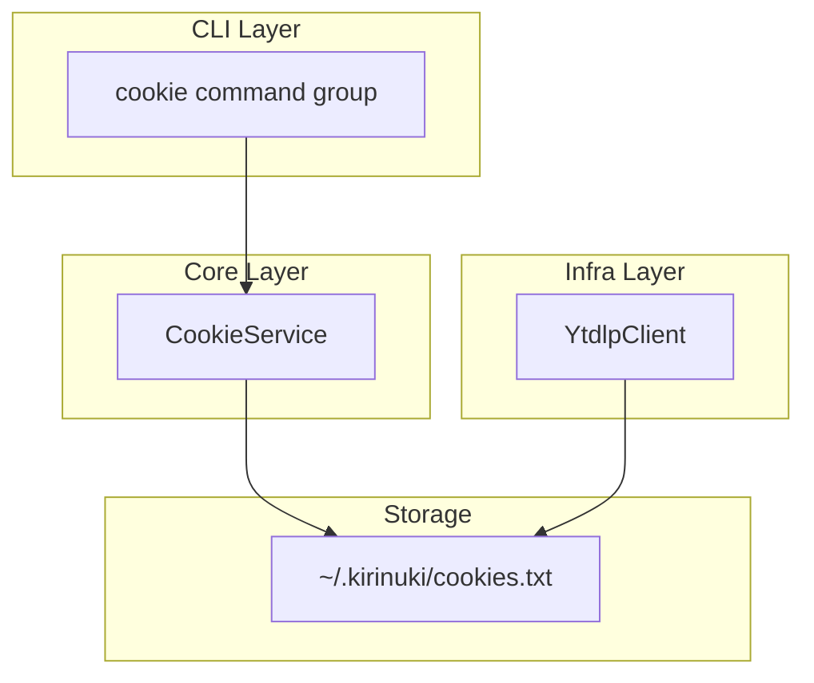
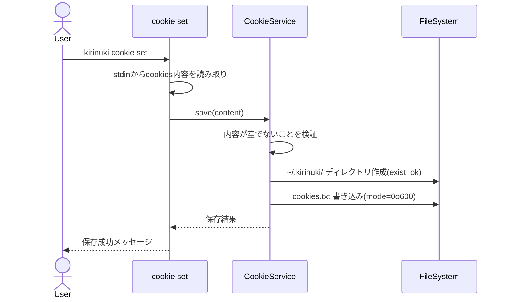
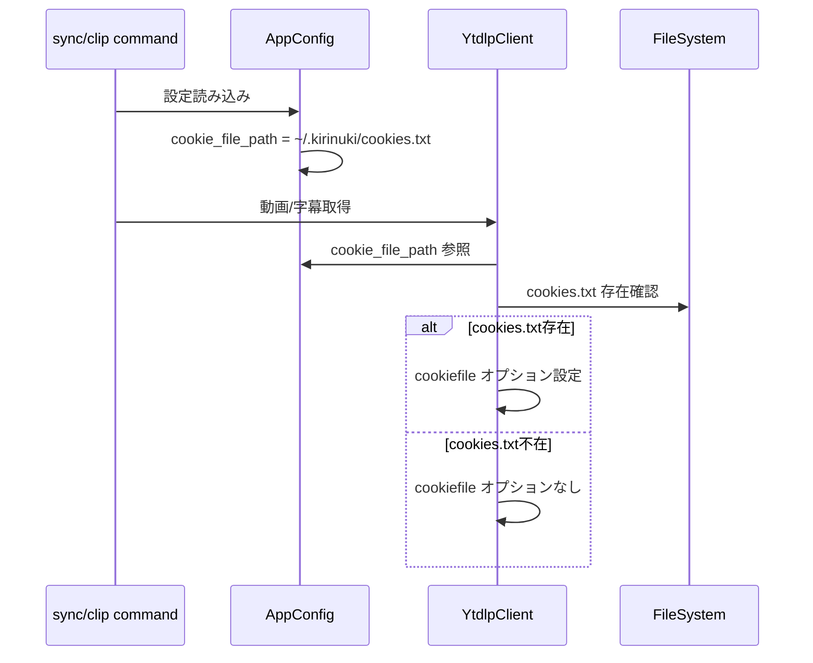

# Design Document: cli-cookie-manager

## Overview

**Purpose**: CLI上でcookiesの内容をペーストするだけでcookies.txtを内部固定パスに保存・更新できる機能を提供する。これにより、環境変数の設定やファイルパスの管理が不要になり、メンバー限定動画へのアクセスに必要なcookie認証の運用負荷を大幅に軽減する。

**Users**: YouTube Liveアーカイブの字幕蓄積・切り抜きを行うCLIユーザーが、ブラウザからエクスポートしたcookiesを素早く反映するために使用する。

**Impact**: 現行の環境変数ベースのcookie管理（`KIRINUKI_COOKIE_FILE_PATH`）を廃止し、内部固定パス（`~/.kirinuki/cookies.txt`）による自動管理に置き換える。

### Goals
- cookiesの内容をCLI上でペーストするだけで更新できる
- cookies.txtの保存場所をユーザーが意識する必要がない
- cookie設定状態の確認・削除が容易にできる

### Non-Goals
- cookiesの有効期限チェックや自動更新
- ブラウザからのcookies自動取得
- 複数のcookies.txtプロファイル管理

## Architecture

### Existing Architecture Analysis

現行のcookie管理フロー:
1. ユーザーが環境変数 `KIRINUKI_COOKIE_FILE_PATH` にcookies.txtのパスを設定
2. `AppConfig` が環境変数を読み込み `cookie_file_path: Path | None` に格納
3. `YtdlpClient._base_opts()` が `cookiefile` オプションとしてyt-dlpに渡す
4. `download_video()` ではリクエスト単位のオーバーライドも可能

変更すべき点:
- `AppConfig.cookie_file_path` のデフォルト値を固定パスに変更
- 環境変数による外部パス指定を廃止
- cookie管理用CLIコマンドの追加

### Architecture Pattern & Boundary Map



**Architecture Integration**:
- Selected pattern: 既存のCLI → Core → Infra 3層構造を踏襲
- Domain boundaries: CookieServiceがcookies.txtのファイル操作を担当。YtdlpClientは読み取りのみ
- Existing patterns preserved: Click コマンドグループ、pydantic-settings ベースの設定管理
- New components rationale: `CookieService`（core層）でファイル操作ロジックを集約し、CLI層を薄く保つ
- Steering compliance: レイヤー分離原則を維持

### Technology Stack

| Layer | Choice / Version | Role in Feature | Notes |
|-------|------------------|-----------------|-------|
| CLI | Click >=8.1 | cookieコマンドグループ定義、stdin入力 | 既存利用 |
| Core | Python 3.12+ 標準ライブラリ | ファイルI/O、パス管理 | pathlib, os |
| Storage | ファイルシステム | cookies.txt永続化 | `~/.kirinuki/cookies.txt` |

## System Flows

### Cookie更新フロー



### Cookie利用フロー（既存機能との統合）



## Requirements Traceability

| Requirement | Summary | Components | Interfaces | Flows |
|-------------|---------|------------|------------|-------|
| 1.1 | stdinからcookies入力受付 | CookieCmd | CLI stdin入力 | Cookie更新フロー |
| 1.2 | 固定パスへの保存 | CookieService | save() | Cookie更新フロー |
| 1.3 | 保存成功メッセージ表示 | CookieCmd | CLI出力 | Cookie更新フロー |
| 1.4 | 空入力時のエラー | CookieService | save()バリデーション | Cookie更新フロー |
| 2.1 | 固定パスでの保存 | CookieService, AppConfig | COOKIE_FILE_PATH定数 | Cookie利用フロー |
| 2.2 | 環境変数不要 | AppConfig | デフォルト値変更 | Cookie利用フロー |
| 2.3 | yt-dlpとの自動統合 | YtdlpClient, AppConfig | cookie_file_path | Cookie利用フロー |
| 3.1 | cookie存在確認 | CookieService, CookieCmd | status() | - |
| 3.2 | 最終更新日時表示 | CookieService | status() | - |
| 3.3 | 未設定時の警告 | YtdlpClient | 警告メッセージ出力 | Cookie利用フロー |
| 4.1 | 削除確認プロンプト | CookieCmd | click.confirm() | - |
| 4.2 | cookies.txt削除 | CookieService | delete() | - |
| 4.3 | 削除成功メッセージ | CookieCmd | CLI出力 | - |

## Components and Interfaces

| Component | Domain/Layer | Intent | Req Coverage | Key Dependencies | Contracts |
|-----------|--------------|--------|--------------|------------------|-----------|
| CookieCmd | CLI | cookieサブコマンド群の定義 | 1.1, 1.3, 3.1, 3.2, 4.1, 4.3 | CookieService (P0) | - |
| CookieService | Core | cookies.txtのCRUD操作 | 1.2, 1.4, 2.1, 3.1, 3.2, 4.2 | なし | Service |
| AppConfig (変更) | Models | cookie_file_pathのデフォルト値変更 | 2.1, 2.2, 2.3 | なし | - |
| YtdlpClient (変更) | Infra | cookies未設定時の警告追加 | 3.3 | AppConfig (P0) | - |

### Core Layer

#### CookieService

| Field | Detail |
|-------|--------|
| Intent | cookies.txtファイルのCRUD操作を提供する |
| Requirements | 1.2, 1.4, 2.1, 3.1, 3.2, 4.2 |

**Responsibilities & Constraints**
- cookies.txtの保存・読み込み・削除・状態確認を担当
- 保存先パスは `~/.kirinuki/cookies.txt` に固定
- ファイル操作のみを行い、外部サービスへの依存なし

**Dependencies**
- External: pathlib（標準ライブラリ）— ファイルパス操作

**Contracts**: Service [x]

##### Service Interface
```python
from dataclasses import dataclass
from datetime import datetime
from pathlib import Path


COOKIE_FILE_PATH: Path = Path.home() / ".kirinuki" / "cookies.txt"


@dataclass(frozen=True)
class CookieStatus:
    exists: bool
    updated_at: datetime | None


class CookieService:
    def __init__(self, cookie_path: Path = COOKIE_FILE_PATH) -> None: ...

    def save(self, content: str) -> None:
        """cookiesの内容をファイルに保存する。

        Raises:
            ValueError: contentが空または空白のみの場合
        """
        ...

    def status(self) -> CookieStatus:
        """cookies.txtの状態を返す。"""
        ...

    def delete(self) -> None:
        """cookies.txtを削除する。

        Raises:
            FileNotFoundError: ファイルが存在しない場合
        """
        ...
```

- Preconditions: `save()` — contentは非空文字列であること
- Postconditions: `save()` — ファイルが `COOKIE_FILE_PATH` に作成され、パーミッション600が設定される
- Invariants: `COOKIE_FILE_PATH` は常に `~/.kirinuki/cookies.txt`

**Implementation Notes**
- `save()` はディレクトリが存在しない場合に `mkdir(parents=True, exist_ok=True)` で作成
- ファイル書き込み後に `os.chmod(path, 0o600)` でパーミッションを制限
- `status()` は `Path.stat().st_mtime` から更新日時を取得

### CLI Layer

#### CookieCmd

| Field | Detail |
|-------|--------|
| Intent | cookie管理用CLIコマンドグループを提供する |
| Requirements | 1.1, 1.3, 3.1, 3.2, 4.1, 4.3 |

**Responsibilities & Constraints**
- `cookie set`: stdinからcookiesの内容を読み取り、CookieServiceに委譲
- `cookie status`: cookie設定状態を表示
- `cookie delete`: 確認プロンプト後にcookiesを削除
- CLI層は薄く保ち、ロジックはCookieServiceに委譲

**Dependencies**
- Inbound: cli/main.py — コマンドグループ登録 (P0)
- Outbound: CookieService — cookie操作 (P0)

**Contracts**: なし（CLI入出力のみ）

**Implementation Notes**
- `cookie set`: `sys.stdin.read()` で標準入力を読み取り。インタラクティブモード時はEOF入力方法をプロンプトに表示
- `cookie delete`: `click.confirm()` で削除確認
- `cookie status`: 存在有無と最終更新日時をフォーマットして表示

### Models Layer

#### AppConfig（変更）

| Field | Detail |
|-------|--------|
| Intent | cookie_file_pathのデフォルト値を固定パスに変更する |
| Requirements | 2.1, 2.2, 2.3 |

**変更内容**:
- `cookie_file_path` のデフォルト値を `Path.home() / ".kirinuki" / "cookies.txt"` に変更
- 型を `Path | None` から `Path` に変更
- 環境変数 `KIRINUKI_COOKIE_FILE_PATH` によるオーバーライドは廃止

### Infra Layer

#### YtdlpClient（変更）

| Field | Detail |
|-------|--------|
| Intent | cookies未設定時の警告メッセージを追加する |
| Requirements | 3.3 |

**変更内容**:
- `_base_opts()` で `cookie_file_path` のファイルが存在しない場合、`cookiefile` オプションを設定しない（現行動作を維持）
- `AuthenticationRequiredError` 発生時に、cookies.txtが未設定であることを警告メッセージに含める

## Data Models

### Domain Model

```python
@dataclass(frozen=True)
class CookieStatus:
    exists: bool          # cookies.txtが存在するか
    updated_at: datetime | None  # 最終更新日時（存在しない場合はNone）
```

単純なValue Objectであり、永続化は不要。

## Error Handling

### Error Strategy
- **空入力**: `CookieService.save()` が `ValueError` を発生、CLI層でエラーメッセージ表示
- **ファイル不在時の削除**: `CookieService.delete()` が `FileNotFoundError` を発生、CLI層でエラーメッセージ表示
- **ディレクトリ作成失敗**: `OSError` をそのまま伝播（パーミッション不足等のシステムエラー）
- **認証エラー時の警告**: `YtdlpClient` が `AuthenticationRequiredError` を発生する際、cookies未設定ならその旨を追記

### Error Categories and Responses
**User Errors**: 空のcookies入力 → 「cookiesの内容が空です」メッセージ
**User Errors**: 未設定のcookies削除 → 「cookiesが設定されていません」メッセージ
**System Errors**: ファイルI/O失敗 → OSError伝播

## Testing Strategy

### Unit Tests
- `CookieService.save()`: 正常保存、空入力エラー、ディレクトリ自動作成
- `CookieService.status()`: 存在時の状態取得、不在時の状態取得
- `CookieService.delete()`: 正常削除、不在時エラー
- `AppConfig`: 固定パスのデフォルト値確認

### Integration Tests
- `cookie set` コマンド: stdinからの入力→ファイル保存→成功メッセージの一連のフロー
- `cookie status` コマンド: 設定済み・未設定それぞれの表示確認
- `cookie delete` コマンド: 確認プロンプト→削除→成功メッセージのフロー
- yt-dlp連携: 保存済みcookiesが `_base_opts()` に反映されることの確認

### Security Considerations
- cookies.txtには認証情報が含まれるため、ファイルパーミッションを600（owner read/write only）に設定
- `.gitignore` に `~/.kirinuki/` は含まれないが、ホームディレクトリ外のリポジトリで使用するため影響なし
