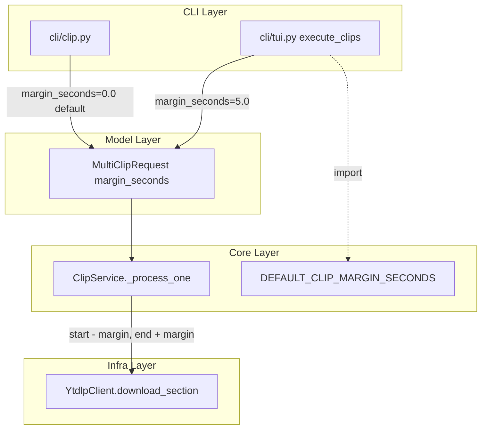
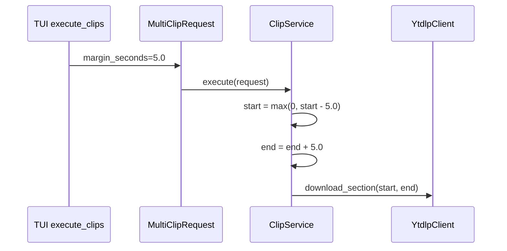
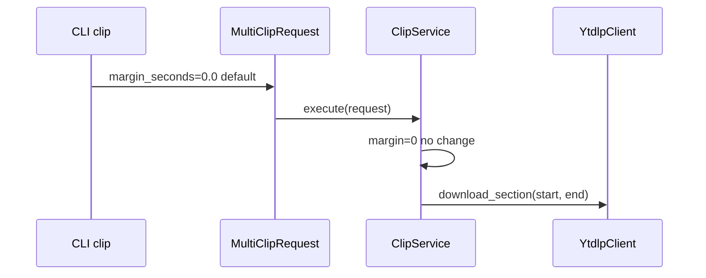

# Design Document

## Overview
**Purpose**: TUIフローで選択した区間の切り抜き時に前後5秒のマージンを自動付与し、音ズレ補正やセグメンテーション精度による話題の途切れを防止する。
**Users**: TUIインタラクティブモード（`--tui`）を使用する切り抜きユーザー。
**Impact**: `MultiClipRequest`モデルにマージンフィールドを追加し、`ClipService`でマージンを適用する。CLIの`clip`コマンドは影響を受けない。

### Goals
- TUI切り抜き時に前後5秒のマージンを自動適用
- CLI `clip`コマンドの既存動作を維持
- マージン秒数を定数として明示的に管理

### Non-Goals
- マージン秒数のユーザー設定（CLI引数・設定ファイル）対応
- マージン適用時の画面表示・通知

## Architecture

### Existing Architecture Analysis
現行のクリップ実行フローは以下の通り:
1. CLI/TUIが`MultiClipRequest`を構築
2. `ClipService.execute()`が受け取り、各`TimeRange`に対して`_process_one()`を実行
3. `_process_one()`が`download_section(start_seconds, end_seconds)`にそのまま渡す

マージン機能は、この既存フローの`MultiClipRequest`構築時と`_process_one()`実行時に最小限の変更を加えるだけで実現できる。

### Architecture Pattern & Boundary Map



- **Selected pattern**: 既存のリクエストモデル拡張パターン（MultiClipRequestにフィールド追加）
- **Existing patterns preserved**: CLI→コア→インフラの3層分離、MultiClipRequestベースのリクエスト制御
- **New components rationale**: 新規コンポーネントなし。既存の3ファイルにフィールド・ロジックを追加

### Technology Stack

| Layer | Choice / Version | Role in Feature | Notes |
|-------|------------------|-----------------|-------|
| Model | Pydantic v2 | margin_secondsフィールド定義 | デフォルト0.0で後方互換 |
| Core | ClipService | マージン適用ロジック | _process_one内で適用 |

## System Flows





## Requirements Traceability

| Requirement | Summary | Components | Interfaces | Flows |
|-------------|---------|------------|------------|-------|
| 1.1 | TUI切り抜き時にマージン自動付与 | TUI execute_clips, ClipService | MultiClipRequest.margin_seconds | TUI Flow |
| 1.2 | 負の開始時刻をクランプ | ClipService._process_one | — | TUI Flow |
| 1.3 | 終了超過はyt-dlpに委ねる | ClipService._process_one | — | TUI Flow |
| 2.1 | CLIではマージン非適用 | CLI clip | MultiClipRequest(default) | CLI Flow |
| 2.2 | CLI従来動作を維持 | CLI clip | — | CLI Flow |
| 3.1 | デフォルト5秒の定数定義 | ClipService module | DEFAULT_CLIP_MARGIN_SECONDS | — |
| 3.2 | リクエスト単位でマージン制御 | MultiClipRequest | margin_seconds field | — |

## Components and Interfaces

| Component | Domain/Layer | Intent | Req Coverage | Key Dependencies | Contracts |
|-----------|--------------|--------|--------------|-----------------|-----------|
| MultiClipRequest | models/clip.py | マージン秒数をリクエストに保持 | 3.2 | — | State |
| ClipService | core/clip_service.py | マージン適用ロジック | 1.1, 1.2, 1.3, 3.1 | MultiClipRequest (P0) | Service |
| TUI execute_clips | cli/tui.py | マージン付きリクエスト構築 | 1.1 | ClipService (P0) | — |
| CLI clip | cli/clip.py | マージンなしリクエスト構築 | 2.1, 2.2 | ClipService (P0) | — |

### Model Layer

#### MultiClipRequest

| Field | Detail |
|-------|--------|
| Intent | 切り抜きリクエストにマージン秒数を保持する |
| Requirements | 3.2 |

**Responsibilities & Constraints**
- `margin_seconds`フィールドをデフォルト`0.0`で追加
- 既存のバリデーション（ranges数チェック、filenames数チェック等）に影響しない

**Contracts**: State [x]

##### State Management
```python
class MultiClipRequest(BaseModel):
    # ... existing fields ...
    margin_seconds: float = 0.0
```
- デフォルト`0.0`により既存コードは一切変更不要（後方互換）
- バリデーション: `margin_seconds >= 0`（負のマージンは不正）

### Core Layer

#### ClipService

| Field | Detail |
|-------|--------|
| Intent | マージンを適用して切り抜きを実行する |
| Requirements | 1.1, 1.2, 1.3, 3.1 |

**Responsibilities & Constraints**
- `_process_one()`内でrequest.margin_secondsを参照し、download_sectionに渡すstart/endを調整
- 開始時刻のクランプ: `max(0, start_seconds - margin_seconds)`
- 終了時刻: `end_seconds + margin_seconds`（上限クランプ不要、yt-dlpに委ねる）
- `ClipOutcome.range`は元のTimeRangeを保持（マージン適用前の値）

**Contracts**: Service [x]

##### Service Interface
```python
# モジュールレベル定数
DEFAULT_CLIP_MARGIN_SECONDS: float = 5.0

# _process_one内のマージン適用ロジック（既存メソッドの拡張）
def _process_one(index: int) -> ClipOutcome:
    time_range = request.ranges[index]
    margin = request.margin_seconds
    effective_start = max(0.0, time_range.start_seconds - margin)
    effective_end = time_range.end_seconds + margin
    # effective_start, effective_endをdownload_sectionに渡す
```
- 前提条件: `request.margin_seconds >= 0`
- 事後条件: `effective_start >= 0`、`effective_start < effective_end`
- 不変条件: `ClipOutcome.range`は元のTimeRangeを保持

### CLI Layer

#### TUI execute_clips

| Field | Detail |
|-------|--------|
| Intent | TUIフローでマージン付きリクエストを構築する |
| Requirements | 1.1 |

**Implementation Notes**
- `MultiClipRequest`構築時に`margin_seconds=DEFAULT_CLIP_MARGIN_SECONDS`を設定
- `DEFAULT_CLIP_MARGIN_SECONDS`を`core.clip_service`からインポート

#### CLI clip

| Field | Detail |
|-------|--------|
| Intent | 変更なし（既存動作を維持） |
| Requirements | 2.1, 2.2 |

**Implementation Notes**
- `MultiClipRequest`構築時に`margin_seconds`を指定しない（デフォルト`0.0`が適用される）
- 既存コードに一切の変更なし

## Data Models

### Domain Model
- `MultiClipRequest`に`margin_seconds: float = 0.0`フィールドを追加
- `TimeRange`は変更なし（元の時間範囲を保持するValue Object）
- `ClipOutcome.range`は元のTimeRangeを保持（マージン適用前の値）

## Error Handling

### Error Strategy
- `margin_seconds < 0`の場合: Pydanticバリデーションで拒否
- マージン適用後のstart >= endの場合: 元のTimeRangeバリデーションで保証済み（margin >= 0かつstart < endであれば、effective_start < effective_endは常に成立）

## Testing Strategy

### Unit Tests
- `ClipService._process_one`: margin_seconds=5.0で正しいstart/endがdownload_sectionに渡されることを検証
- `ClipService._process_one`: margin_seconds=0.0で元のstart/endがそのまま渡されることを検証
- `ClipService._process_one`: margin適用で開始が負になる場合に0にクランプされることを検証
- `MultiClipRequest`: margin_seconds負値のバリデーションエラーを検証

### Integration Tests
- TUI `execute_clips`: マージン付きリクエストが正しく構築されることを検証
- CLI `clip`: 従来通りマージンなしリクエストが構築されることを検証
