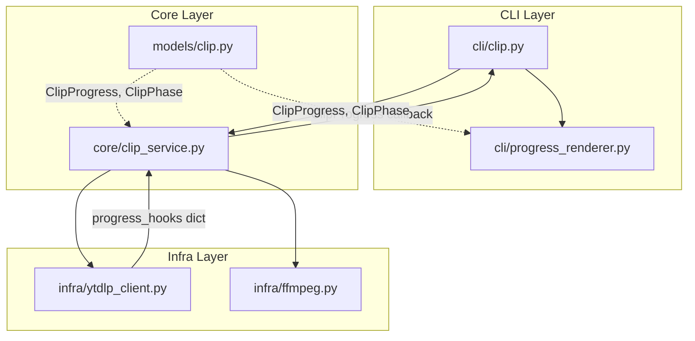
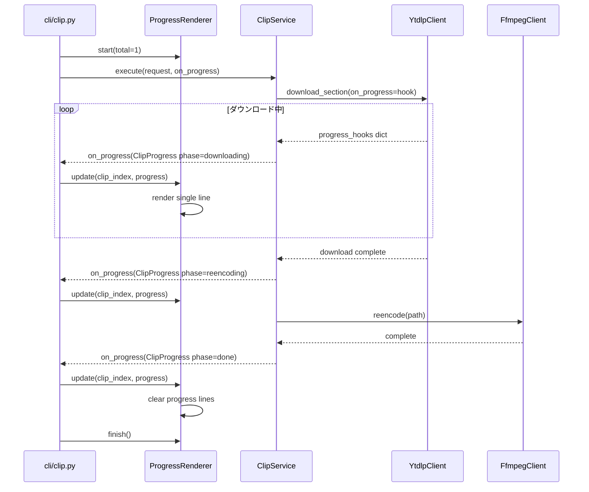
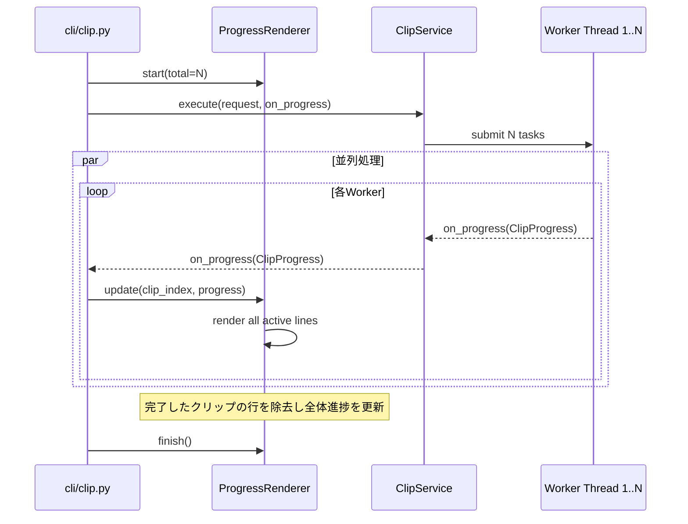

# Design Document

## Overview
**Purpose**: clipコマンド実行時に、ダウンロードと再エンコードの進捗をリアルタイムにターミナル表示する機能を提供する。
**Users**: kirinuki CLIユーザーが切り抜き処理の進行状況を視覚的に把握できるようになる。
**Impact**: 既存のClipService・YtdlpClient・FfmpegClient・CLIコマンドを拡張し、進捗コールバックとターミナル描画を追加する。

### Goals
- yt-dlpのダウンロード進捗（進捗率・サイズ・速度・ETA）をリアルタイム表示
- ffmpeg再エンコード中のステータス表示
- マルチクリップ時に全体進捗 + 並列処理中の各クリップ個別進捗を同時表示
- スレッドセーフで、ちらつきのないターミナル描画

### Non-Goals
- ffmpegの詳細な再エンコード進捗率（パーセント）の表示
- 非ターミナル環境（パイプリダイレクト等）での進捗バーのエミュレーション
- `rich`等の外部TUIライブラリの導入

## Architecture

### Existing Architecture Analysis
- **CLI層** (`cli/clip.py`): `on_progress=click.echo`で単純な文字列コールバックをClipServiceに渡している
- **コア層** (`core/clip_service.py`): `_notify(msg: str)`で文字列メッセージを送信。`threading.Lock`でスレッドセーフ
- **インフラ層** (`infra/ytdlp_client.py`): `quiet: True`で進捗抑制。`progress_hooks`未使用
- **インフラ層** (`infra/ffmpeg.py`): `capture_output=True`で出力抑制

### Architecture Pattern & Boundary Map



- **Selected pattern**: 既存の3層分離を維持し、コールバックベースで進捗データを伝播
- **新規コンポーネント**: `ProgressRenderer`（CLI層）、`ClipProgress`/`ClipPhase`（モデル層）
- **Steering compliance**: CLI層は薄く、コア層は外部非依存の原則を維持

### Technology Stack

| Layer | Choice / Version | Role in Feature | Notes |
|-------|------------------|-----------------|-------|
| CLI | ANSIエスケープシーケンス | 複数行のターミナル上書き描画 | 新規依存なし |
| Core | Python threading.Lock | スレッドセーフな進捗状態管理 | 既存パターンを踏襲 |
| Infra | yt-dlp progress_hooks | ダウンロード進捗データ取得 | yt-dlp組み込みAPI |

## System Flows

### 単一クリップのフロー



### マルチクリップのフロー



## Requirements Traceability

| Requirement | Summary | Components | Interfaces | Flows |
|-------------|---------|------------|------------|-------|
| 1.1 | ダウンロード進捗リアルタイム表示 | YtdlpClient, ClipService, ProgressRenderer | progress_hooks, on_progress callback | 単一クリップフロー |
| 1.2 | 再エンコードステータス表示 | ClipService, ProgressRenderer | on_progress callback | 単一クリップフロー |
| 1.3 | 完了メッセージ表示 | ClipService, ProgressRenderer | on_progress callback | 単一/マルチフロー |
| 1.4 | 同一行上書き更新 | ProgressRenderer | ANSI escape | 両フロー共通 |
| 2.1 | 全体進捗[完了数/全体数]表示 | ProgressRenderer | render() | マルチクリップフロー |
| 2.2 | 処理中クリップの個別進捗行表示 | ProgressRenderer | render() | マルチクリップフロー |
| 2.3 | 完了クリップの行除去・全体進捗更新 | ProgressRenderer | update(), render() | マルチクリップフロー |
| 2.4 | サマリー表示（既存動作維持） | cli/clip.py | 変更なし | 両フロー共通 |
| 3.1 | 進捗メッセージの混在防止 | ProgressRenderer | threading.Lock | マルチクリップフロー |
| 3.2 | スレッドセーフな進捗更新 | ClipService, ProgressRenderer | threading.Lock | マルチクリップフロー |
| 3.3 | ちらつき・描画崩れ防止 | ProgressRenderer | バッファ一括出力 | 両フロー共通 |

## Components and Interfaces

| Component | Domain/Layer | Intent | Req Coverage | Key Dependencies | Contracts |
|-----------|--------------|--------|--------------|------------------|-----------|
| ClipProgress | models | 進捗データモデル | 1.1, 1.2, 1.3 | なし | State |
| YtdlpClient | infra | progress_hooks経由で進捗データ取得 | 1.1 | yt-dlp (P0) | Service |
| ClipService | core | 進捗コールバック伝播 | 1.1-1.3, 2.3, 3.2 | YtdlpClient (P0), FfmpegClient (P1) | Service |
| ProgressRenderer | cli | ターミナル複数行描画 | 1.4, 2.1-2.3, 3.1-3.3 | ClipProgress (P0) | State |

### Models Layer

#### ClipProgress / ClipPhase

| Field | Detail |
|-------|--------|
| Intent | 進捗データの構造化表現 |
| Requirements | 1.1, 1.2, 1.3 |

**Responsibilities & Constraints**
- クリップ処理の各フェーズとその進捗情報を型安全に表現
- 外部依存なし、純粋なデータモデル

**Contracts**: State [x]

##### State Management

```python
from enum import Enum
from dataclasses import dataclass

class ClipPhase(Enum):
    DOWNLOADING = "downloading"
    REENCODING = "reencoding"
    DONE = "done"
    ERROR = "error"

@dataclass(frozen=True)
class ClipProgress:
    clip_index: int          # 0-based index
    phase: ClipPhase
    percent: float | None = None          # 0.0-100.0
    downloaded_bytes: int | None = None
    total_bytes: int | None = None
    speed: float | None = None            # bytes/sec
    eta: int | None = None                # seconds
```

### Infra Layer

#### YtdlpClient (拡張)

| Field | Detail |
|-------|--------|
| Intent | download_sectionにprogress_hooks対応を追加 |
| Requirements | 1.1 |

**Responsibilities & Constraints**
- `download_section()`に`on_progress`コールバック引数を追加
- yt-dlpの`progress_hooks`オプションを設定し、コールバック経由で進捗データを外部に伝播
- 既存の引数・戻り値・エラーハンドリングは維持

**Dependencies**
- External: yt-dlp `progress_hooks` API (P0)

**Contracts**: Service [x]

##### Service Interface

```python
class YtdlpClient:
    def download_section(
        self,
        video_id: str,
        start_seconds: float,
        end_seconds: float,
        output_path: Path,
        cookie_file: Path | None = None,
        on_progress: Callable[[dict], None] | None = None,  # 追加
    ) -> Path: ...
```

- `on_progress`はyt-dlpのprogress_hooks dictをそのまま転送
- `on_progress=None`の場合、既存動作と完全互換

### Core Layer

#### ClipService (拡張)

| Field | Detail |
|-------|--------|
| Intent | 進捗コールバックの型を`str`から`ClipProgress`に変更し、フェーズ情報を伝播 |
| Requirements | 1.1, 1.2, 1.3, 2.3, 3.2 |

**Responsibilities & Constraints**
- `on_progress`の型を`Callable[[ClipProgress], None]`に変更
- yt-dlpのprogress_hooks dictを`ClipProgress`に変換してコールバック
- 再エンコード開始・完了のフェーズ通知を追加
- `threading.Lock`による排他制御を維持

**Dependencies**
- Inbound: cli/clip.py — on_progressコールバック提供 (P0)
- Outbound: YtdlpClient — download_section + on_progress (P0)
- Outbound: FfmpegClient — reencode (P1)

**Contracts**: Service [x]

##### Service Interface

```python
class ClipService:
    def execute(
        self,
        request: MultiClipRequest,
        on_progress: Callable[[ClipProgress], None] | None = None,  # str → ClipProgress
    ) -> MultiClipResult: ...
```

- 内部の`_process_one()`でyt-dlpのprogress_hooks dictを受け取り、`ClipProgress`に変換してコールバック
- yt-dlpの`downloading`→`ClipPhase.DOWNLOADING`、ffmpeg実行中→`ClipPhase.REENCODING`、完了→`ClipPhase.DONE`

**Implementation Notes**
- yt-dlpのprogress_hooks dictからClipProgressへの変換ロジック:
  - `d["status"] == "downloading"`: `percent`は`d.get("downloaded_bytes", 0) / total * 100`で算出（`total_bytes`優先、なければ`total_bytes_estimate`を使用）
  - `d["status"] == "finished"`: ダウンロードフェーズの完了（再エンコードへ移行前の中間状態）
- DASHトラック（映像・音声）の進捗は独立して報告されるため、最新の`downloading`状態をそのまま伝播する方針

### CLI Layer

#### ProgressRenderer

| Field | Detail |
|-------|--------|
| Intent | 複数クリップの進捗をANSIエスケープで複数行表示・上書き更新 |
| Requirements | 1.4, 2.1, 2.2, 2.3, 3.1, 3.2, 3.3 |

**Responsibilities & Constraints**
- 複数行の進捗表示をANSIエスケープシーケンスで管理
- スレッドセーフな状態更新と描画
- 非TTY環境ではフォールバック（進捗表示なし、または簡易メッセージ）

**Dependencies**
- Inbound: cli/clip.py — ClipProgressを受け取り描画 (P0)
- External: sys.stderr — ターミナル出力先 (P0)

**Contracts**: State [x]

##### State Management

```python
class ProgressRenderer:
    def __init__(self, total: int, output: TextIO = sys.stderr) -> None: ...
    def update(self, progress: ClipProgress) -> None: ...
    def finish(self) -> None: ...
```

- `__init__`: 全体数を設定。`output.isatty()`でTTY判定
- `update`: `ClipProgress`を受け取り、内部状態を更新して再描画
- `finish`: 進捗行をクリアし、カーソル位置を復元

**内部状態**:
- `_states: dict[int, ClipProgress]` — clip_index → 最新進捗
- `_completed: int` — 完了数
- `_lines_written: int` — 前回描画した行数（カーソル移動量の計算用）
- `_lock: threading.Lock` — スレッドセーフな更新

**描画ロジック**:
- 描画のたびに、前回描画した行数分カーソルを上に移動し、全行を上書き
- 単一クリップ: 1行のみ表示
- マルチクリップ: 1行目に`[完了数/全体数] 完了`、2行目以降に処理中クリップの個別進捗
- バッファに全行を構築してから一括書き込み（ちらつき防止）

**表示フォーマット例**:

単一クリップ:
```
ダウンロード中 45.2% | 12.3MB/27.2MB | 5.2MB/s | ETA 0:03
```

マルチクリップ:
```
[2/5] 完了
  #1 ダウンロード中 45.2% | 12.3MB/27.2MB | 5.2MB/s | ETA 0:03
  #3 再エンコード中...
  #4 ダウンロード中 12.8% | 3.1MB/24.5MB | 4.8MB/s | ETA 0:08
```

## Data Models

### Domain Model
- `ClipPhase`: 列挙型。`DOWNLOADING`, `REENCODING`, `DONE`, `ERROR`の4フェーズ
- `ClipProgress`: 不変データクラス。特定クリップの特定時点での進捗スナップショット
- 既存モデル（`MultiClipRequest`, `MultiClipResult`, `ClipOutcome`）は変更なし

## Error Handling

### Error Strategy
- 進捗表示のエラー（描画失敗等）はクリップ処理自体を中断しない
- 非TTY環境では進捗表示をスキップ（既存のサマリー表示は維持）

### Error Categories and Responses
- **描画エラー** (IOError等): ログ出力して進捗表示を無効化し、処理は続行
- **yt-dlp progress_hooks内の欠損データ**: `None`として扱い、該当フィールドを表示から省略
- **非TTY環境**: `isatty()`チェックで検出、ANSI出力を抑制

## Testing Strategy

### Unit Tests
- `ClipProgress`/`ClipPhase`のデータモデル構築テスト
- `ProgressRenderer`の状態管理テスト（update呼び出しによる内部状態の変化検証）
- `ProgressRenderer`のフォーマットテスト（表示文字列の生成検証）
- ClipServiceの`on_progress`コールバック呼び出しタイミング・引数検証

### Integration Tests
- YtdlpClientの`download_section(on_progress=...)`がprogress_hooks dictを伝播することの検証（モック使用）
- ClipService → ProgressRenderer間の進捗データフローの検証

### E2E Tests
- 単一クリップ実行時に進捗メッセージが出力されることの検証
- マルチクリップ実行時に全体進捗 + 個別進捗が出力されることの検証
- 非TTY環境（`isatty()=False`）で進捗バーが抑制されることの検証
