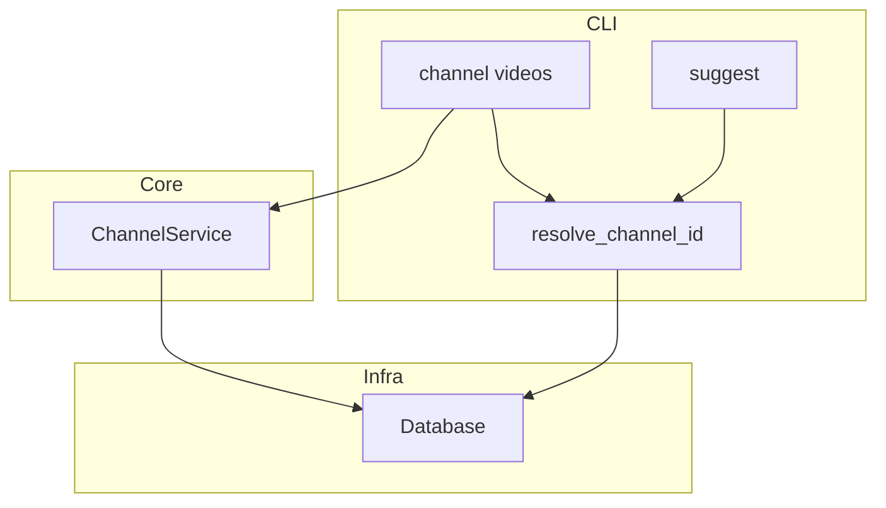
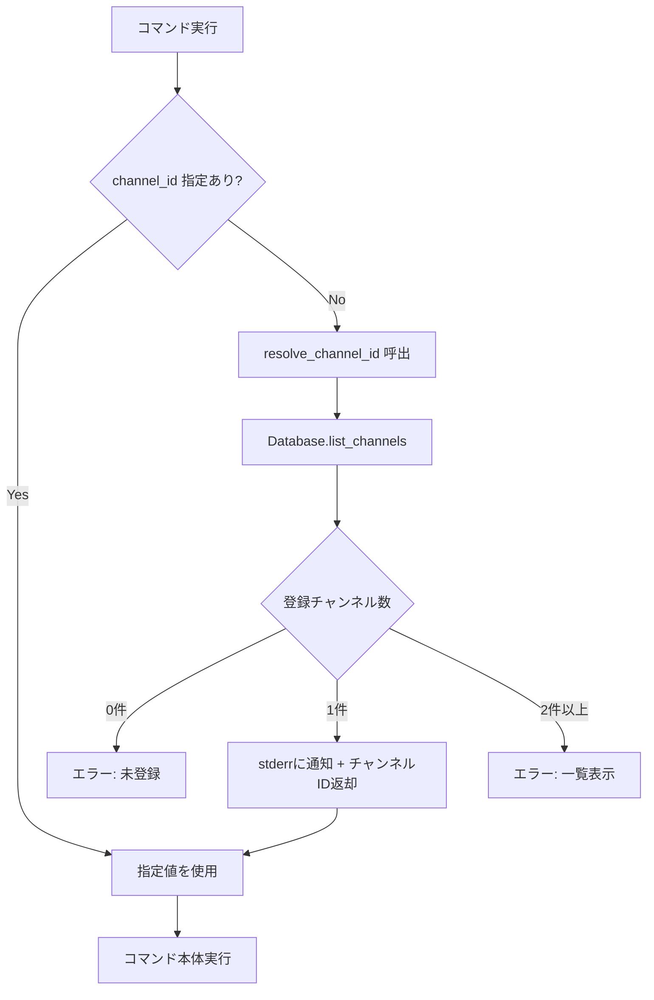

# Design Document

## Overview

**Purpose**: チャンネルIDを必要とするCLIコマンドにおいて、登録チャンネルが1つだけの場合に自動的にそのチャンネルIDをデフォルトとして使用する機能を提供する。これにより、単一チャンネル運用時の操作を簡略化する。

**Users**: 単一のYouTubeチャンネルを対象にアーカイブ管理を行うユーザーが、`channel videos` および `suggest` コマンドを実行する際にチャンネルID指定を省略できる。

**Impact**: 既存の `channel videos` と `suggest` コマンドの引数定義を変更し、チャンネルIDをオプショナルにする。既存の明示指定による動作は影響を受けない。

### Goals
- 登録チャンネルが1つの場合、チャンネルID省略でコマンドを実行可能にする
- 省略時に使用されたチャンネルをユーザーに明示する
- 複数チャンネル・未登録時の適切なエラーメッセージを提供する

### Non-Goals
- チャンネルIDのデフォルト値を設定ファイル等で永続的に指定する機能
- 複数チャンネル登録時のインタラクティブな選択UI
- `suggest` コマンドのDB接続パターン（`DatabaseClient`）の統一リファクタリング

## Architecture

### Existing Architecture Analysis

現在のCLI層は2つのパターンでチャンネルIDを受け取る:

1. **`channel videos`**: `create_app_context()` → `AppContext` → `ChannelService` → `Database`
2. **`suggest`**: 独自に `DatabaseClient` を直接生成、`AppContext` を経由しない

両コマンドとも `@click.argument` で必須位置引数としてチャンネルIDを受け取っている。

### Architecture Pattern & Boundary Map



**Architecture Integration**:
- **Selected pattern**: CLI層ユーティリティ関数 — 解決ロジックをCLI層の共通関数として配置
- **Domain boundaries**: チャンネルID解決はCLIのユーザー入力補完であり、ドメインロジックではない。CLI層に配置することでコア層への影響を回避
- **Existing patterns preserved**: `create_app_context()` パターン、`suggest` の独自DB接続パターンともに変更なし
- **New components rationale**: `resolve_channel_id()` 関数のみ追加。既存の `Database.list_channels()` を活用
- **Steering compliance**: CLI層は薄く保つ原則に沿い、解決ロジックは件数チェックのみの単純な関数

### Technology Stack

| Layer | Choice / Version | Role in Feature | Notes |
|-------|------------------|-----------------|-------|
| CLI | click | 引数定義を `required=False` に変更 | 既存利用 |
| Core | ChannelService | 変更なし（既存APIを間接利用） | |
| Data | Database (SQLite) | `list_channels()` でチャンネル一覧取得 | 既存API |

## System Flows



## Requirements Traceability

| Requirement | Summary | Components | Interfaces | Flows |
|-------------|---------|------------|------------|-------|
| 1.1 | 1チャンネル時の自動選択 | resolve_channel_id | resolve_channel_id() | デフォルト解決フロー |
| 1.2 | 複数チャンネル時のエラー | resolve_channel_id | resolve_channel_id() | エラーフロー |
| 1.3 | 0チャンネル時のエラー | resolve_channel_id | resolve_channel_id() | エラーフロー |
| 1.4 | 明示指定時の既存動作維持 | channel videos, suggest | CLI引数定義 | 直接使用フロー |
| 2.1 | channel videosコマンド対応 | channel_videos | Click引数変更 | — |
| 2.2 | suggestコマンド対応 | suggest | Click引数変更 | — |
| 2.3 | 同一ロジック使用 | resolve_channel_id | resolve_channel_id() | — |
| 3.1 | 自動選択時の通知 | resolve_channel_id | stderr出力 | デフォルト解決フロー |
| 3.2 | 複数チャンネル時の一覧表示 | resolve_channel_id | エラーメッセージ | エラーフロー |

## Components and Interfaces

| Component | Domain/Layer | Intent | Req Coverage | Key Dependencies | Contracts |
|-----------|--------------|--------|--------------|------------------|-----------|
| resolve_channel_id | CLI / ユーティリティ | チャンネルID省略時の自動解決 | 1.1, 1.2, 1.3, 2.3, 3.1, 3.2 | Database (P0) | Service |
| channel_videos (変更) | CLI | 引数をオプショナルに変更 | 1.4, 2.1 | resolve_channel_id (P0) | — |
| suggest (変更) | CLI | 引数をオプショナルに変更 | 1.4, 2.2 | resolve_channel_id (P0) | — |

### CLI / ユーティリティ

#### resolve_channel_id

| Field | Detail |
|-------|--------|
| Intent | チャンネルIDが省略された場合に登録チャンネル数に応じて自動解決またはエラーを返す |
| Requirements | 1.1, 1.2, 1.3, 2.3, 3.1, 3.2 |

**Responsibilities & Constraints**
- チャンネルIDが `None` の場合のみ解決ロジックを実行する
- チャンネルIDが明示指定されている場合はそのまま返却する（1.4）
- 登録チャンネル一覧の取得には `Database.list_channels()` を使用する

**Dependencies**
- Inbound: `channel_videos`, `suggest` — チャンネルID解決依頼 (P0)
- Outbound: `Database.list_channels()` — 登録チャンネル一覧取得 (P0)

**Contracts**: Service [x]

##### Service Interface

```python
def resolve_channel_id(
    channel_id: str | None,
    db: Database,
) -> str:
    """チャンネルIDを解決する。

    Args:
        channel_id: ユーザーが明示指定したチャンネルID。Noneの場合は自動解決を試みる。
        db: Databaseインスタンス。

    Returns:
        解決されたチャンネルID。

    Raises:
        click.UsageError: チャンネルが未登録、または複数登録されている場合。
    """
```

- **Preconditions**: `db` が初期化済みであること
- **Postconditions**:
  - `channel_id` が非Noneの場合: そのまま返却
  - 登録チャンネルが1つの場合: そのチャンネルIDを返却し、stderrに通知メッセージを出力
  - 登録チャンネルが0件の場合: `click.UsageError` を送出（メッセージ: チャンネル未登録の旨）
  - 登録チャンネルが2件以上の場合: `click.UsageError` を送出（メッセージ: チャンネル一覧付き）
- **Invariants**: 既存の明示指定動作に影響を与えない

**Implementation Notes**
- 通知メッセージは `click.echo(..., err=True)` で標準エラー出力に出力する
- エラーメッセージにはチャンネル名とチャンネルIDの両方を含める
- `click.UsageError` はClickが自動的にヘルプメッセージとともに表示する

### CLI / コマンド変更

#### channel_videos (変更)

| Field | Detail |
|-------|--------|
| Intent | `channel_id` 引数をオプショナルに変更し、`resolve_channel_id` を呼び出す |
| Requirements | 1.4, 2.1 |

**変更内容**:
- `@click.argument("channel_id")` → `@click.argument("channel_id", default=None, required=False)`
- コールバック先頭で `channel_id = resolve_channel_id(channel_id, ctx.db)` を呼び出す

#### suggest (変更)

| Field | Detail |
|-------|--------|
| Intent | `channel` 引数をオプショナルに変更し、`resolve_channel_id` を呼び出す |
| Requirements | 1.4, 2.2 |

**変更内容**:
- `@click.argument("channel")` → `@click.argument("channel", default=None, required=False)`
- コールバック先頭で `Database` インスタンスを生成し `channel = resolve_channel_id(channel, db)` を呼び出す
- `suggest` コマンドは現在 `DatabaseClient` を使用しているが、`resolve_channel_id` は `Database.list_channels()` を使用するため、`Database` インスタンスの追加生成が必要

## Error Handling

### Error Categories and Responses

**User Errors**:
- チャンネル未登録（0件）→ `click.UsageError`: 「チャンネルが登録されていません。先に `kirinuki channel add <URL>` でチャンネルを登録してください。」
- 複数チャンネル登録時の省略 → `click.UsageError`: 「複数のチャンネルが登録されています。チャンネルIDを指定してください。」＋チャンネル一覧

### Error Message Format

```
# 0件の場合
Error: チャンネルが登録されていません。先に `kirinuki channel add <URL>` でチャンネルを登録してください。

# 複数チャンネルの場合
Error: 複数のチャンネルが登録されています。チャンネルIDを指定してください:
  - チャンネル名A (UC...)
  - チャンネル名B (UC...)
```

## Testing Strategy

### Unit Tests
- `resolve_channel_id`: チャンネルID指定時にそのまま返却されること
- `resolve_channel_id`: 1チャンネル登録時にそのIDが返却されること
- `resolve_channel_id`: 0チャンネル時に `click.UsageError` が発生すること
- `resolve_channel_id`: 複数チャンネル時に `click.UsageError` が発生し一覧が含まれること
- `resolve_channel_id`: 1チャンネル自動選択時にstderrに通知が出力されること

### Integration Tests
- `channel videos` コマンドをチャンネルID省略で実行し、1チャンネル登録時に正常動作すること
- `suggest` コマンドをチャンネルID省略で実行し、1チャンネル登録時に正常動作すること
- 複数チャンネル登録時にエラーメッセージとチャンネル一覧が表示されること
