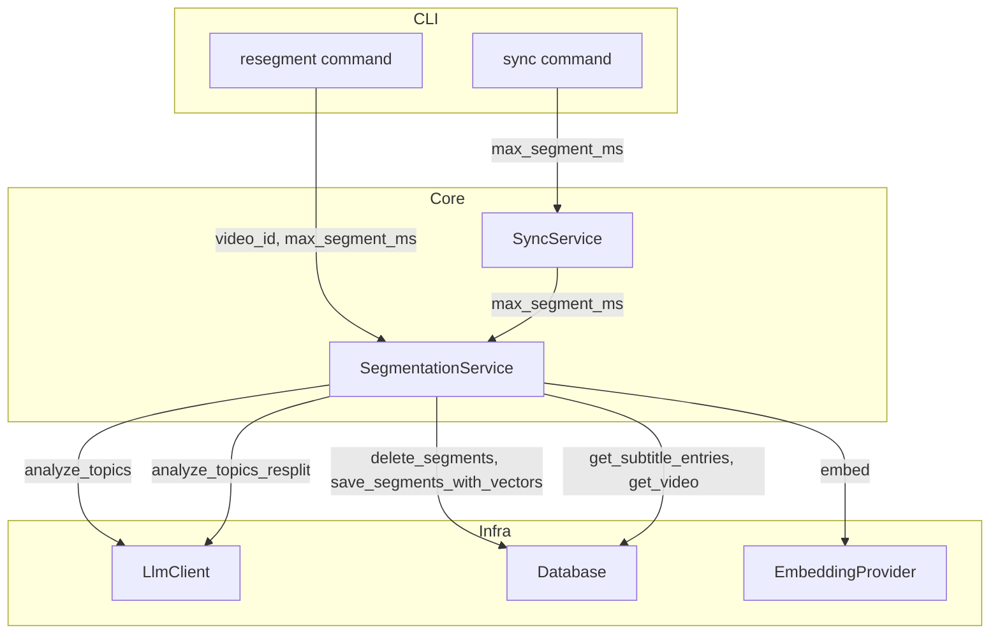
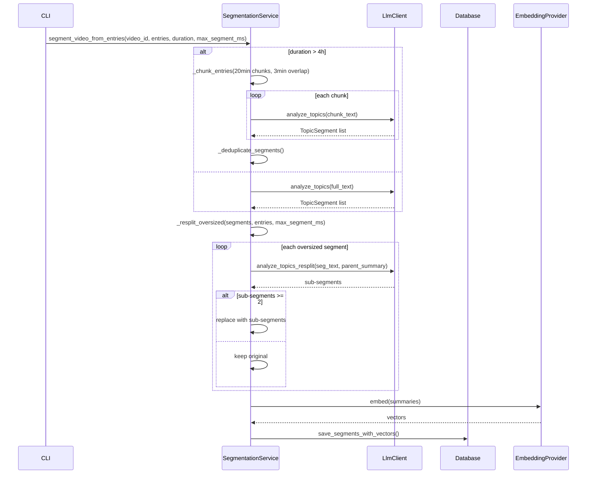
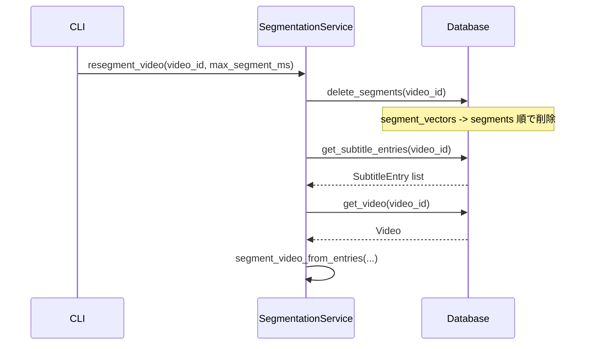

# Design Document: Fine-Grained Segmentation

## Overview

**Purpose**: セグメンテーションの粒度を細かくし、長時間配信から特定の話題をピンポイントで検索可能にする。
**Users**: kirinuki CLIのユーザーが、配信アーカイブの各サブトピックを個別に検索・参照するために利用する。
**Impact**: 既存のセグメンテーションパイプライン（LLMプロンプト、チャンク定数、サービス層、CLI層）を改修し、再セグメンテーション機能を追加する。

### Goals
- サブトピック単位での細粒度セグメンテーションの実現
- セグメント最大長の制御（デフォルト5分、CLI指定可）
- 既存データの再セグメンテーション手段の提供
- 最小長制約の撤廃と意味ベースフィルタの導入

### Non-Goals
- セグメンテーション結果のGUI表示
- セグメント粒度のユーザーごとのカスタマイズ（プリセット方式）
- リアルタイム配信中のセグメンテーション

## Architecture

### Existing Architecture Analysis

既存のレイヤー構成（CLI → Core → Infra）を維持する。変更は以下の4レイヤーに限定:

- **Infra層**: `LlmClient`のプロンプト改善 + 再分割用メソッド追加、`Database`にセグメント削除・一覧メソッド追加
- **Core層**: `SegmentationService`にresplit・resegmentロジック追加、`SyncService`にパラメータ伝搬
- **CLI層**: `sync`コマンドにオプション追加、`resegment`サブコマンド新設

### Architecture Pattern & Boundary Map



**Architecture Integration**:
- Selected pattern: 既存レイヤードアーキテクチャを維持
- Domain boundaries: SegmentationServiceがセグメンテーションロジックを集約、SyncServiceはパラメータ伝搬のみ
- Existing patterns preserved: MagicMockによるテスト、Pydanticドメインモデル、Click CLIフレームワーク
- New components rationale: `RESPLIT_SYSTEM_PROMPT`と`analyze_topics_resplit`は再分割専用のLLM呼び出しに必要
- Steering compliance: CLI層は薄く、コア層は外部非依存、インフラ層は交換可能

### Technology Stack

| Layer | Choice / Version | Role in Feature | Notes |
|-------|------------------|-----------------|-------|
| CLI | Click | `--max-segment-ms`オプション、`resegment`サブコマンド | 既存パターン踏襲 |
| Core Services | Python 3.12+ | SegmentationService, SyncService | max_segment_msパラメータ伝搬 |
| LLM | Claude API (anthropic) | 細粒度プロンプト、再分割プロンプト | SYSTEM_PROMPT全面改訂 |
| Data / Storage | SQLite + sqlite-vec | セグメント削除、セグメント済みID一覧 | FK順序を考慮した削除 |

## System Flows

### セグメンテーションフロー（再分割込み）



再分割は1パスのみ実行し、再帰は行わない。再分割失敗時は元セグメントを保持するフォールバック設計。

### 再セグメンテーションフロー



## Requirements Traceability

| Requirement | Summary | Components | Interfaces | Flows |
|-------------|---------|------------|------------|-------|
| 1.1 | max_segment_msデフォルト300,000ms | SegmentationService | segment_video_from_entries | セグメンテーション |
| 1.2 | max_segment_msパラメータ指定 | SyncService, CLI | sync_all, sync_channel | パラメータ伝搬 |
| 1.3 | 超過セグメントの再分割 | SegmentationService, LlmClient | _resplit_oversized, analyze_topics_resplit | 再分割 |
| 1.4 | 再分割後も超過時はそのまま保持 | SegmentationService | _resplit_oversized | 再分割 |
| 2.1 | 最小長制約なし | LlmClient | SYSTEM_PROMPT | - |
| 2.2 | 短いセグメントの統合なし | LlmClient | SYSTEM_PROMPT | - |
| 2.3 | LLMプロンプトで統合指示を排除 | LlmClient | SYSTEM_PROMPT | - |
| 3.1 | サブトピック変化での分割指示 | LlmClient | SYSTEM_PROMPT | - |
| 3.2 | 細かい話題検出を明示的に指示 | LlmClient | SYSTEM_PROMPT | - |
| 3.3 | 階層的要約フォーマット | LlmClient | SYSTEM_PROMPT, RESPLIT_SYSTEM_PROMPT | - |
| 4.1 | チャンクサイズ45→20分 | SegmentationService | CHUNK_MINUTES | チャンク分割 |
| 4.2 | オーバーラップ5→3分 | SegmentationService | OVERLAP_MINUTES | チャンク分割 |
| 4.3 | 重複排除ロジック維持 | SegmentationService | _deduplicate_segments | チャンク分割 |
| 5.1 | resegmentコマンド | CLI, SegmentationService | resegment_video | 再セグメンテーション |
| 5.2 | --video-idオプション | CLI | resegment | 再セグメンテーション |
| 5.3 | 全動画一括再セグメンテーション | CLI, Database | get_segmented_video_ids | 再セグメンテーション |
| 5.4 | 進捗表示 | CLI | resegment | - |
| 6.1 | --max-segment-msオプション | CLI | sync, resegment | パラメータ伝搬 |
| 6.2 | デフォルト値300,000ms | CLI, SegmentationService | - | - |

## Components and Interfaces

| Component | Domain/Layer | Intent | Req Coverage | Key Dependencies | Contracts |
|-----------|-------------|--------|--------------|------------------|-----------|
| LlmClient | Infra | LLMプロンプト改善・再分割API | 1.3, 2.1-2.3, 3.1-3.3 | anthropic (P0) | Service |
| Database | Infra | セグメント削除・ID一覧 | 5.1, 5.3 | sqlite3 (P0) | Service |
| SegmentationService | Core | 再分割ロジック・再セグメンテーション | 1.1-1.4, 4.1-4.3, 5.1 | LlmClient (P0), Database (P0), EmbeddingProvider (P0) | Service |
| SyncService | Core | max_segment_msパラメータ伝搬 | 1.2, 6.1-6.2 | SegmentationService (P0) | Service |
| CLI sync/resegment | CLI | CLIオプション・サブコマンド | 5.1-5.4, 6.1-6.2 | SyncService (P0), SegmentationService (P0) | - |

### Infra層

#### LlmClient

| Field | Detail |
|-------|--------|
| Intent | LLMプロンプトを細粒度分割向けに刷新し、再分割用APIを追加 |
| Requirements | 1.3, 2.1, 2.2, 2.3, 3.1, 3.2, 3.3 |

**Responsibilities & Constraints**
- SYSTEM_PROMPTの全面改訂（統合指示削除、サブトピック分割基準追加、品質基準追加、階層的要約フォーマット）
- RESPLIT_SYSTEM_PROMPTの新規定義（parent_summaryプレースホルダ、最低2分割指示）
- analyze_topics_resplitメソッドの追加

**Dependencies**
- External: anthropic — Claude API呼び出し (P0)

**Contracts**: Service [x]

##### Service Interface
```python
class LlmClient:
    def analyze_topics(self, subtitle_text: str) -> list[TopicSegment]: ...
    def analyze_topics_resplit(
        self, subtitle_text: str, parent_summary: str
    ) -> list[TopicSegment]: ...
```
- Preconditions: subtitle_textが非空文字列
- Postconditions: TopicSegmentのリスト（空リスト可）、start_ms < end_ms
- Invariants: JSONパース失敗時は空リストを返す

**Implementation Notes**
- RESPLIT_SYSTEM_PROMPTは`str.format()`でparent_summaryを埋め込み
- コードフェンス除去、JSONパース処理は既存の`analyze_topics`と同一パターン

#### Database

| Field | Detail |
|-------|--------|
| Intent | セグメント削除とセグメント済みvideo_id一覧の取得 |
| Requirements | 5.1, 5.3 |

**Responsibilities & Constraints**
- segment_vectorsを先に削除（FK制約のため）、その後segmentsを削除
- `get_segmented_video_ids`は全テーブルスキャン（DISTINCT）

**Dependencies**
- External: sqlite3 — DB操作 (P0)

**Contracts**: Service [x]

##### Service Interface
```python
class Database:
    def delete_segments(self, video_id: str) -> int: ...
    def get_segmented_video_ids(self) -> list[str]: ...
```
- Preconditions: DBが初期化済み
- Postconditions: delete_segmentsは削除件数を返す
- Invariants: 他の動画のセグメントに影響しない

### Core層

#### SegmentationService

| Field | Detail |
|-------|--------|
| Intent | 再分割ロジック、再セグメンテーション、チャンク定数変更 |
| Requirements | 1.1, 1.2, 1.3, 1.4, 4.1, 4.2, 4.3, 5.1 |

**Responsibilities & Constraints**
- `CHUNK_MINUTES`: 45→20、`OVERLAP_MINUTES`: 5→3
- `segment_video_from_entries`に`max_segment_ms`パラメータ追加（デフォルト300,000）
- LLM呼び出し後、embedding生成前に`_resplit_oversized`を挟む
- `resegment_video`: DB内の既存セグメントを削除し、字幕データから再セグメンテーション

**Dependencies**
- Inbound: SyncService — segment_video_from_entries呼び出し (P0)
- Inbound: CLI — resegment_video呼び出し (P0)
- Outbound: LlmClient — analyze_topics, analyze_topics_resplit (P0)
- Outbound: Database — delete_segments, get_subtitle_entries, get_video, save_segments_with_vectors (P0)
- Outbound: EmbeddingProvider — embed (P0)

**Contracts**: Service [x]

##### Service Interface
```python
class SegmentationService:
    def segment_video_from_entries(
        self,
        video_id: str,
        entries: list[SubtitleEntry],
        duration_seconds: int,
        max_segment_ms: int = 300_000,
    ) -> list[Segment]: ...

    def resegment_video(
        self, video_id: str, max_segment_ms: int = 300_000
    ) -> list[Segment]: ...

    def _resplit_oversized(
        self,
        segments: list[TopicSegment],
        entries: list[SubtitleEntry],
        max_segment_ms: int,
    ) -> list[TopicSegment]: ...
```
- Preconditions: video_idがDB内に存在（resegment_video時）
- Postconditions: resegment_videoは旧セグメントを削除し新セグメントを生成
- Invariants: _resplit_oversizedは1パスのみ、失敗時は元セグメント保持

#### SyncService

| Field | Detail |
|-------|--------|
| Intent | max_segment_msパラメータの伝搬 |
| Requirements | 1.2, 6.1, 6.2 |

**Responsibilities & Constraints**
- `sync_all` → `sync_channel` → `_sync_single_video` / `_retry_segmentation` の全メソッドに`max_segment_ms`パラメータを追加
- デフォルト値は300,000（5分）

**Contracts**: Service [x]

##### Service Interface
```python
class SyncService:
    def sync_all(self, max_segment_ms: int = 300_000) -> SyncResult: ...
    def sync_channel(
        self, channel_id: str, max_segment_ms: int = 300_000
    ) -> SyncResult: ...
```

### CLI層

**syncコマンド**: `@click.option("--max-segment-ms", default=300000, type=int)` を追加し、`sync_service.sync_all(max_segment_ms=max_segment_ms)` に伝搬。

**resegmentサブコマンド**:
- `--video-id`: 指定時は単一動画のみ再セグメンテーション
- `--max-segment-ms`: デフォルト300000
- オプションなし: `db.get_segmented_video_ids()`で全動画を処理、進捗表示 `(N/total)`

## Data Models

### Domain Model

変更対象のドメインモデルはなし。既存の `TopicSegment`、`Segment`、`SubtitleEntry` をそのまま使用。

### Physical Data Model

既存テーブルスキーマに変更なし。新規テーブルの追加もなし。

`delete_segments`のSQL実行順序:
1. `DELETE FROM segment_vectors WHERE segment_id IN (SELECT id FROM segments WHERE video_id = ?)`
2. `DELETE FROM segments WHERE video_id = ?`

## Error Handling

### Error Strategy

| エラー種別 | 発生箇所 | 対応 |
|-----------|---------|------|
| LLM応答のJSONパース失敗 | analyze_topics_resplit | 空リストを返す、元セグメントを保持 |
| LLM API呼び出し失敗 | _resplit_oversized | Exception catchで元セグメント保持 |
| 再分割が1件以下 | _resplit_oversized | 元セグメントを保持 |
| 字幕データなし | resegment_video | 空リストを返す |
| 動画不存在 | resegment_video | 空リストを返す |
| 個別動画の再セグメンテーション失敗 | CLI resegment | エラー表示して次の動画に進む |

## Testing Strategy

### Unit Tests
- `TestAnalyzeTopicsResplit`: resplitプロンプト使用、parent_summary注入、空入力、JSON不正
- `TestResplitOversized`: 超過セグメント再分割、非超過セグメント保持、失敗時フォールバック、1件返却時フォールバック
- `TestResegment`: 既存セグメント削除→再生成、字幕なし、動画不存在
- `TestDeleteSegments`: セグメント+ベクトル削除、他動画への影響なし、0件削除
- `TestGetSegmentedVideoIds`: セグメント済みID一覧、空テーブル

### Integration Tests
- `sync`コマンドに`--max-segment-ms`が伝搬されることの確認
- `resegment`コマンドの単一動画・全動画処理の確認
- SyncService経由でmax_segment_msがSegmentationServiceまで到達することの確認
