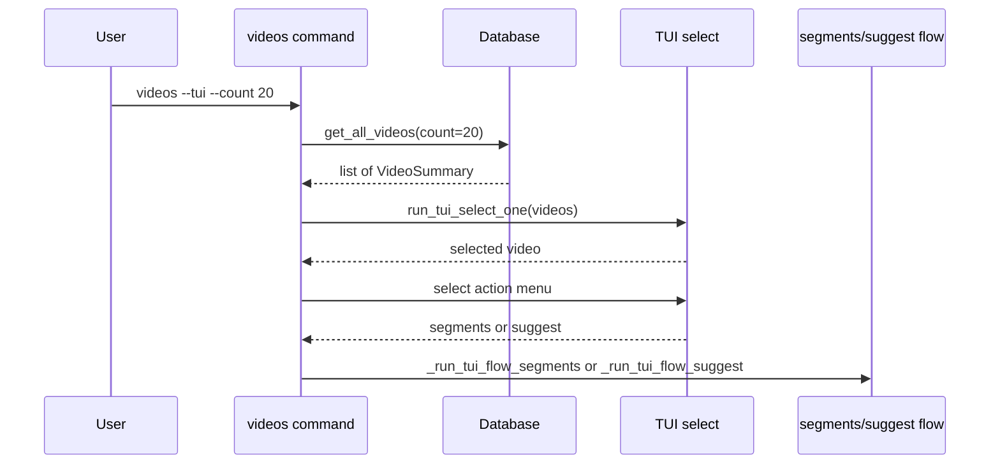

# Design Document

## Overview
**Purpose**: DB内の全動画を配信日時の新しい順に一覧表示するCLIコマンド`videos`を提供する。
**Users**: 切り抜き作業者が、蓄積済み動画の確認と、TUIモードでの`segments`/`suggest`への連携に利用する。

### Goals
- 全チャンネル横断で動画一覧を新しい順に表示する
- `--tui`モードで動画選択 → segments/suggest連携のワンストップフローを提供する

### Non-Goals
- チャンネル別のフィルタリング（既存の`channel videos`で対応済み）
- 動画の削除・編集操作
- 複数動画の同時選択

## Architecture

### Existing Architecture Analysis
- `channel videos`コマンドがチャンネル単位の動画一覧を提供済み
- TUIフローは`_run_tui_flow_segments()`/`_run_tui_flow_suggest()`として`main.py`に実装済み
- DB層は`channel_id`必須のメソッドのみ提供

### Architecture Pattern & Boundary Map



**Architecture Integration**:
- Selected pattern: 既存のCLI→DB直接呼び出しパターンを踏襲
- Existing patterns preserved: `create_app_context`によるDI、TUIアダプターパターン
- New components: DBメソッド1つ、TUIヘルパー1つ、CLIコマンド1つ

## Requirements Traceability

| Requirement | Summary | Components | Interfaces |
|-------------|---------|------------|------------|
| 1.1 | 全動画を配信日時降順で表示 | Database, videos command | `get_all_videos()` |
| 1.2 | 配信日時・タイトル・URLを表示 | videos command | — |
| 1.3 | デフォルト20件表示 | videos command | `--count`オプション |
| 1.4 | `--count`で件数変更 | videos command | `--count`オプション |
| 1.5 | 0件時のメッセージ表示 | videos command | — |
| 2.1 | TUIモードで選択メニュー表示 | tui.py | `run_tui_select_one()` |
| 2.2 | segments/suggest選択メニュー | videos command | beaupy `select` |
| 2.3 | segments --tui連携 | videos command | `_run_tui_flow_segments()` |
| 2.4 | suggest --tui連携 | videos command | `_run_tui_flow_suggest()` |
| 2.5 | 単一選択のみ | tui.py | `run_tui_select_one()` |

## Components and Interfaces

| Component | Domain/Layer | Intent | Req Coverage | Key Dependencies |
|-----------|-------------|--------|--------------|-----------------|
| `videos` command | CLI | 動画一覧表示とTUI連携 | 1.1-1.5, 2.1-2.5 | Database, tui.py |
| `Database.get_all_videos` | Infra | 全チャンネル横断の動画取得 | 1.1, 1.3, 1.4 | SQLite |
| `run_tui_select_one` | CLI/TUI | 単一選択TUIメニュー | 2.1, 2.5 | beaupy |

### Infra層

#### Database.get_all_videos

| Field | Detail |
|-------|--------|
| Intent | 全チャンネル横断で動画をcount件取得（配信日時降順） |
| Requirements | 1.1, 1.3, 1.4 |

**Responsibilities & Constraints**
- 全チャンネルの動画を`COALESCE(broadcast_start_at, published_at) DESC`でソートして返す
- `count`パラメータで件数を制限する

**Contracts**: Service [x]

##### Service Interface
```python
def get_all_videos(self, count: int) -> list[VideoSummary]:
    """全チャンネルの動画をcount件、配信日時降順で取得する。"""
    ...
```
- Preconditions: `count > 0`
- Postconditions: `len(result) <= count`、配信日時降順

### CLI/TUI層

#### run_tui_select_one

| Field | Detail |
|-------|--------|
| Intent | 一覧から1つだけ選択するTUIメニュー |
| Requirements | 2.1, 2.5 |

**Contracts**: Service [x]

##### Service Interface
```python
def run_tui_select_one(options: list[str]) -> int | None:
    """単一選択メニューを表示し、選択されたインデックスを返す。キャンセル時はNone。"""
    ...
```
- beaupyの`select`関数を使用
- `pagination=True`, `page_size`はターミナル高さから算出

#### videos command

| Field | Detail |
|-------|--------|
| Intent | 動画一覧表示とTUIモードでのsegments/suggest連携 |
| Requirements | 1.1-1.5, 2.1-2.5 |

**Responsibilities & Constraints**
- `@cli.command()` として登録
- `--count`オプション（デフォルト20）、`--tui`フラグ
- 通常モード: 配信日時・タイトル・YouTube URLをテキスト出力
- TUIモード: 動画選択 → 操作選択（segments/suggest） → 既存TUIフロー実行

**Dependencies**
- Inbound: なし
- Outbound: `Database.get_all_videos` — 動画取得 (P0)
- Outbound: `run_tui_select_one` — 動画選択 (P1)
- Outbound: `_run_tui_flow_segments` / `_run_tui_flow_suggest` — 既存TUIフロー (P1)

**Implementation Notes**
- YouTube URLは`https://www.youtube.com/watch?v={video_id}`で構築
- TUIモードのsegments/suggest選択もbeaupyの`select`で実装
- `suggest`連携時は`SuggestService`のインスタンス化が必要（`create_app_context`内で利用可能な依存から構築）

## Error Handling

### Error Categories and Responses
- **動画0件**: メッセージ「動画が登録されていません」を表示して終了（Req 1.5）
- **TUIキャンセル**: `KeyboardInterrupt`またはNone返却でキャンセルメッセージを表示して終了
- **segments/suggest実行エラー**: 既存のエラーハンドリングに委譲

## Testing Strategy

### Unit Tests
- `Database.get_all_videos`: 件数制限、ソート順、0件時の動作
- `run_tui_select_one`: beaupy `select`のモック検証、キャンセル時のNone返却

### Integration Tests
- `videos`コマンド通常モード: 出力フォーマットの検証
- `videos`コマンド0件時: メッセージ出力の検証
- `videos --count N`: 件数制限の動作検証
