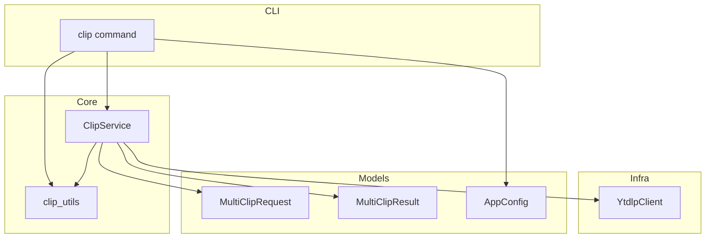
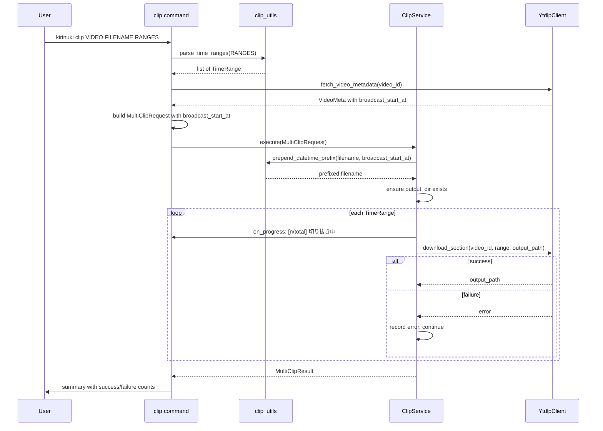

# Design Document: multi-clip

## Overview

**Purpose**: `kirinuki clip` コマンドを再設計し、同一動画の複数箇所を効率的に切り出す機能を提供する。yt-dlp の `download_ranges` API を活用し、必要なフラグメントのみをダウンロードすることで、丸ごとDL方式と比較して大幅な帯域・時間効率の改善を実現する。
**Users**: YouTube Live アーカイブの切り抜きを行うCLIユーザー。
**Impact**: 既存の `clip` コマンドのCLI引数構成・サービス層・データモデルを刷新する。後方互換性は維持しない。

### Goals
- yt-dlp `download_ranges` による必要フラグメントのみの部分ダウンロード
- 複数の時間範囲を1回のコマンドで処理
- `kirinuki clip <video> <filename> <time_ranges>` の直感的なCLI
- 設定ファイルによる出力先ディレクトリのデフォルト指定
- 個別失敗時の続行と進捗表示
- 出力ファイル名への配信開始日時（JST）プレフィックス自動付与

### Non-Goals
- `force_keyframes_at_cuts` による再エンコード（低速のため不採用）
- 動画フォーマットの変換
- GUI対応
- タイムゾーンのユーザー設定（JSTに固定）

## Architecture

### Existing Architecture Analysis

現在の `clip` コマンドは以下の3層構成:
- **CLI層** (`cli/clip.py`): 引数パース → `ClipService` 呼び出し → 結果表示
- **Core層** (`core/clip_service.py`): 丸ごとDL → ffmpeg切り出し → クリーンアップ
- **Infra層** (`infra/ffmpeg.py`, `infra/ytdlp_client.py`): 外部ツールラッパー

**設計変更**: yt-dlp `download_ranges` の採用により、「丸ごとDL + 別途ffmpeg切り出し」から「yt-dlp による部分DL+トリム一体処理」に移行。`FfmpegClientImpl` は clip コマンドでは直接使用しなくなる（yt-dlp が内部でffmpegを呼ぶため）。詳細な調査結果は `research.md` を参照。

### Architecture Pattern & Boundary Map



**Architecture Integration**:
- Selected pattern: 既存レイヤー分離型を維持
- Domain boundaries: CLI（入力パース・表示）/ Core（オーケストレーション・ユーティリティ）/ Infra（外部ツール）
- Key change: `FfmpegClient` への依存を削除。yt-dlp が内部でffmpegを呼ぶため自前呼び出し不要
- New components rationale: `MultiClipRequest` / `MultiClipResult` は複数範囲を表現するために新設

### Technology Stack

| Layer | Choice / Version | Role in Feature | Notes |
|-------|------------------|-----------------|-------|
| CLI | click | コマンド引数定義、進捗表示 | 既存利用 |
| Core Services | Python 3.12+ | オーケストレーション、ユーティリティ | 既存利用 |
| Data Models | Pydantic v2 | リクエスト/レスポンスのバリデーション | 既存利用 |
| Config | pydantic-settings | `output_dir` の追加 | 既存利用 |
| Infra | yt-dlp (`download_ranges` API) | 部分DL + トリム一体処理 | **新規利用**: `download_range_func` |
| Infra | ffmpeg | yt-dlp 内部で利用（直接呼び出しなし） | 依存は残るが直接呼び出し不要 |

## System Flows



**Key Decisions**:
- 各 TimeRange を個別に `download_section()` で処理。yt-dlp が該当フラグメントのみDL+トリムを一体処理
- 一時ファイルの管理が不要（yt-dlp が直接出力先に書き込む）
- 個別の range 失敗時はエラー記録して次の range に進む
- 日時プレフィックスは ClipService がファイル名構築時に `prepend_datetime_prefix()` で付与
- CLI/TUI は `fetch_video_metadata()` で `broadcast_start_at` を取得し、`MultiClipRequest` に渡す

## Requirements Traceability

| Requirement | Summary | Components | Interfaces | Flows |
|-------------|---------|------------|------------|-------|
| 1.1 | CLI引数形式 | ClipCmd | click arguments | — |
| 1.2 | カンマ区切り時間範囲 | ClipUtils | `parse_time_ranges()` | — |
| 1.3 | 単一範囲もサポート | ClipUtils | `parse_time_ranges()` | — |
| 1.4 | --output-dir オプション | ClipCmd, AppConfig | click option | — |
| 2.1 | 効率的な部分DL・複数切り出し | ClipService, YtdlpClient | `execute()`, `download_section()` | Main flow loop |
| 2.2 | 単一範囲で1ファイル | ClipService | `execute()` | Main flow |
| 2.3 | 不正範囲のバリデーション | MultiClipRequest | `model_validator` | — |
| 3.1 | 複数時の連番付与 | ClipUtils | `build_numbered_filename()` | — |
| 3.2 | 単一時は連番なし | ClipUtils | `build_numbered_filename()` | — |
| 3.3 | 拡張子前に連番挿入 | ClipUtils | `build_numbered_filename()` | — |
| 4.1 | output_dir 設定項目 | AppConfig | `output_dir` field | — |
| 4.2 | CLI引数が設定より優先 | ClipCmd | click option + config | — |
| 4.3 | ディレクトリ自動作成 | ClipService | `execute()` | Main flow |
| 5.1 | 処理番号表示 | ClipCmd | `on_progress` callback | Main flow loop |
| 5.2 | 個別失敗時の続行 | ClipService | `execute()` | Main flow alt |
| 5.3 | サマリー表示 | ClipCmd | result display | Main flow end |
| 5.4 | DL失敗時のスキップ | ClipService | `execute()` | Main flow |
| 6.1 | 日時プレフィックス付与 | ClipService, ClipUtils | `prepend_datetime_prefix()` | Main flow |
| 6.2 | broadcast_start_at未取得時のフォールバック | ClipUtils | `prepend_datetime_prefix()` | — |
| 6.3 | 自動生成ファイル名への付与 | ClipService, ClipUtils | `prepend_datetime_prefix()` | Main flow |
| 6.4 | 連番との組み合わせ | ClipService, ClipUtils | `prepend_datetime_prefix()`, `build_numbered_filename()` | Main flow |
| 6.5 | 重複プレフィックス防止 | ClipUtils | `has_datetime_prefix()` | — |
| 6.6 | JST固定タイムゾーン | ClipUtils | `prepend_datetime_prefix()` | — |

## Components and Interfaces

| Component | Domain/Layer | Intent | Req Coverage | Key Dependencies | Contracts |
|-----------|--------------|--------|--------------|------------------|-----------|
| ClipCmd | CLI | コマンド引数パース・進捗表示・結果出力 | 1.1-1.4, 4.2, 5.1, 5.3, 6.1-6.6 | ClipService (P0), AppConfig (P0), YtdlpClient (P0) | — |
| ClipService | Core | 複数範囲の切り出しオーケストレーション・日時プレフィックス付与 | 2.1-2.3, 4.3, 5.2, 5.4, 6.1, 6.3, 6.4 | YtdlpClient (P0), ClipUtils (P0) | Service |
| ClipUtils | Core | 時間範囲パース、ファイル名生成、日時プレフィックス処理 | 1.2, 1.3, 3.1-3.3, 6.1-6.6 | — | — |
| YtdlpClient | Infra | yt-dlp `download_ranges` による部分DL、メタデータ取得 | 2.1, 6.1 | yt-dlp (P0) | Service |
| MultiClipRequest | Models | 複数範囲リクエストのバリデーション | 2.3, 6.1 | — | — |
| MultiClipResult | Models | 切り出し結果の集約 | 5.2, 5.3 | — | — |
| AppConfig | Models | output_dir 設定項目の追加 | 4.1 | — | — |

### CLI Layer

#### ClipCmd (`cli/clip.py`)

| Field | Detail |
|-------|--------|
| Intent | ユーザー入力のパースと結果表示 |
| Requirements | 1.1, 1.2, 1.3, 1.4, 4.2, 5.1, 5.3, 6.1-6.6 |

**Responsibilities & Constraints**
- 位置引数 `video`, `filename`, `time_ranges` のパース
- `--output-dir` オプションの処理（CLI引数 > AppConfig > デフォルト）
- `YtdlpClient.fetch_video_metadata()` で `broadcast_start_at` を取得し `MultiClipRequest` に渡す
- メタデータ取得失敗時はワーニング表示して `broadcast_start_at=None` で続行
- 進捗コールバックの提供
- 結果サマリーの表示

**Dependencies**
- Outbound: ClipService — 切り出し実行 (P0)
- Outbound: ClipUtils — 時間範囲パース、ファイル名生成 (P0)
- Outbound: YtdlpClient — メタデータ取得 (P0)
- Outbound: AppConfig — 出力先ディレクトリ設定 (P0)

**Implementation Notes**
- click の `@click.argument` で3つの位置引数、`@click.option` で `--output-dir`
- `time_ranges` のパースは CLI 層で行い、バリデーション済みデータを `MultiClipRequest` に渡す
- `fetch_video_metadata()` で取得した `broadcast_start_at`（フォールバック: `published_at`）を `MultiClipRequest.broadcast_start_at` に設定
- 出力パスの組み立て: ClipService が `prepend_datetime_prefix()` + `build_numbered_filename()` で構築

### Core Layer

#### ClipService (`core/clip_service.py`)

| Field | Detail |
|-------|--------|
| Intent | 複数範囲の切り出しオーケストレーション・日時プレフィックス付与 |
| Requirements | 2.1, 2.2, 2.3, 4.3, 5.2, 5.4, 6.1, 6.3, 6.4 |

**Responsibilities & Constraints**
- 出力先ディレクトリの作成（存在しない場合）
- `request.broadcast_start_at` を用いてファイル名に日時プレフィックスを付与
- 各 TimeRange に対して `YtdlpClient.download_section()` を呼び出し
- 個別の切り出し失敗をエラーとして記録し、残りを続行
- 一時ファイル管理不要（yt-dlp が直接出力先に書き込む）

**Dependencies**
- Outbound: YtdlpClient — 部分DL+トリム (P0)
- Outbound: ClipUtils — `prepend_datetime_prefix()`, `build_numbered_filename()` (P0)

**Contracts**: Service [x]

##### Service Interface
```python
class ClipService:
    def __init__(
        self,
        ytdlp_client: object,
    ) -> None: ...

    def execute(
        self,
        request: MultiClipRequest,
        on_progress: Callable[[ClipProgress], None] | None = None,
    ) -> MultiClipResult: ...
```
- Preconditions: ffmpeg がシステムで利用可能（yt-dlp が内部で使用）、`request.ranges` が1つ以上
- Postconditions: 成功した範囲の出力ファイルが `request.output_dir` に存在し、日時プレフィックスが付与されている
- Invariants: 個別の切り出し失敗が他の切り出しに影響しない

**ファイル名構築順序**:
1. `build_numbered_filename(filename, index, total)` で連番付与
2. `prepend_datetime_prefix(numbered_filename, broadcast_start_at)` で日時プレフィックス付与
3. `filenames` リスト指定時（TUI経由）も同様に各ファイル名に対して `prepend_datetime_prefix()` を適用

#### ClipUtils (`core/clip_utils.py`)

| Field | Detail |
|-------|--------|
| Intent | 時間範囲パース、連番ファイル名生成、日時プレフィックス処理 |
| Requirements | 1.2, 1.3, 3.1, 3.2, 3.3, 6.1-6.6 |

**Responsibilities & Constraints**
- カンマ区切り時間範囲文字列のパースと `TimeRange` リスト化
- 連番付きファイル名の生成（単一時は連番なし）
- 日時プレフィックスの生成・付与・重複検出

##### 追加関数

```python
from datetime import datetime

_JST = timezone(timedelta(hours=9))
_DATETIME_PREFIX_RE = re.compile(r"^\d{8}_\d{4}_")

def parse_time_ranges(time_ranges_str: str) -> list[TimeRange]:
    """カンマ区切りの時間範囲文字列をパースする。

    Args:
        time_ranges_str: "18:03-19:31,21:31-23:20" 形式の文字列

    Returns:
        TimeRange のリスト

    Raises:
        ValueError: フォーマット不正の場合
    """
    ...

def build_numbered_filename(filename: str, index: int, total: int) -> str:
    """連番付きファイル名を生成する。

    Args:
        filename: ベースファイル名（例: "動画.mp4"）
        index: 1始まりのインデックス
        total: 総数（1の場合は連番なし）

    Returns:
        "動画1.mp4" or "動画.mp4"（total=1の場合）
    """
    ...

def has_datetime_prefix(filename: str) -> bool:
    """ファイル名が既に YYYYMMDD_HHMM_ 形式の日時プレフィックスを持つかを判定する。"""
    ...

def prepend_datetime_prefix(
    filename: str,
    broadcast_start_at: datetime | None,
) -> str:
    """ファイル名の先頭に配信開始日時プレフィックスを付与する。

    - broadcast_start_at をJST変換し YYYYMMDD_HHMM_ 形式でプレフィックス
    - broadcast_start_at が None の場合はファイル名をそのまま返す
    - 既にプレフィックスがある場合は重複付与しない

    Args:
        filename: ベースファイル名（例: "動画.mp4"）
        broadcast_start_at: 配信開始日時（UTC or tz-aware）。Noneならプレフィックスなし

    Returns:
        "20260310_2100_動画.mp4" or "動画.mp4"（broadcast_start_at=Noneの場合）
    """
    ...
```

### Infra Layer

#### YtdlpClient (`infra/ytdlp_client.py`)

| Field | Detail |
|-------|--------|
| Intent | yt-dlp `download_ranges` API による部分DL+トリム |
| Requirements | 2.1 |

**Responsibilities & Constraints**
- `download_range_func` を使用して指定範囲のフラグメントのみダウンロード
- `format_sort: ['proto:https']` でDASH形式を優先（HLS形式の既知問題回避）
- Cookie認証の引き継ぎ

**Dependencies**
- External: yt-dlp — `download_range_func`, `YoutubeDL` (P0)
- External: ffmpeg — yt-dlp が内部で使用 (P0)

**Contracts**: Service [x]

##### Service Interface（追加メソッド）
```python
class YtdlpClient:
    def download_section(
        self,
        video_id: str,
        start_seconds: float,
        end_seconds: float,
        output_path: Path,
        cookie_file: Path | None = None,
    ) -> Path:
        """指定時間範囲のフラグメントのみをダウンロードし、出力先に保存する。

        yt-dlp の download_ranges API を使用。DASH形式のフラグメントレベルで
        部分ダウンロードを行い、ffmpegによるトリムを一体処理する。

        Raises:
            VideoDownloadError: ダウンロード失敗
            AuthenticationRequiredError: 認証が必要
        """
        ...
```
- Preconditions: ffmpeg がシステムで利用可能
- Postconditions: `output_path` に指定範囲のクリップファイルが存在する
- yt-dlp オプション: `download_ranges`, `format_sort: ['proto:https']`, `outtmpl`

### Models Layer

#### MultiClipRequest (`models/clip.py`)

| Field | Detail |
|-------|--------|
| Intent | 複数範囲の切り出しリクエストのバリデーション |
| Requirements | 2.3 |

```python
from datetime import datetime

class TimeRange(BaseModel):
    start_seconds: float
    end_seconds: float

    @model_validator(mode="after")
    def validate_range(self) -> "TimeRange":
        """start < end かつ start >= 0 を検証"""
        ...

class MultiClipRequest(BaseModel):
    video_id: str
    filename: str
    output_dir: Path
    ranges: list[TimeRange]
    filenames: list[str] | None = None
    cookie_file: Path | None = None
    broadcast_start_at: datetime | None = None  # 日時プレフィックス用

    @model_validator(mode="after")
    def validate_ranges(self) -> "MultiClipRequest":
        """ranges が1つ以上であることを検証"""
        ...
```

#### MultiClipResult (`models/clip.py`)

| Field | Detail |
|-------|--------|
| Intent | 複数切り出しの結果集約 |
| Requirements | 5.2, 5.3 |

```python
class ClipOutcome(BaseModel):
    """個別の切り出し結果"""
    range: TimeRange
    output_path: Path | None  # 失敗時は None
    error: str | None = None  # 失敗時のエラーメッセージ

class MultiClipResult(BaseModel):
    video_id: str
    outcomes: list[ClipOutcome]

    @property
    def success_count(self) -> int: ...

    @property
    def failure_count(self) -> int: ...
```

#### AppConfig (`models/config.py`)

| Field | Detail |
|-------|--------|
| Intent | 出力先ディレクトリの設定追加 |
| Requirements | 4.1 |

```python
# AppConfig に追加するフィールド
output_dir: Path = Field(
    default_factory=lambda: KIRINUKI_DIR / "output",
)
```

## Error Handling

### Error Categories and Responses

**User Errors**:
- 時間範囲フォーマット不正 → パース段階でエラーメッセージ表示、処理中断
- ファイル名に不正文字 → OS レベルのエラーをキャッチして報告

**System Errors**:
- ffmpeg 未インストール → yt-dlp がエラーを送出、インストール案内
- 動画DL失敗 → `VideoDownloadError` (5.4)
- 認証エラー → `AuthenticationRequiredError`、cookie設定案内
- HLS形式での空ファイル生成 → `format_sort: ['proto:https']` でDASH優先により回避
- メタデータ取得失敗 → ワーニング表示し `broadcast_start_at=None` で続行（プレフィックスなし）

**Business Logic Errors**:
- 個別範囲の切り出し失敗 → `ClipOutcome.error` に記録して続行 (5.2)
- 出力ディレクトリ作成失敗 → `OSError` をキャッチ、権限エラーを報告

## Testing Strategy

### Unit Tests
- `parse_time_ranges()`: 正常系（単一、複数、各時刻フォーマット）、異常系（不正フォーマット、逆順、空文字列）
- `build_numbered_filename()`: 単一時（連番なし）、複数時（連番あり）、拡張子なしケース
- `prepend_datetime_prefix()`: UTC→JST変換、broadcast_start_at=None時のスキップ、重複プレフィックス防止
- `has_datetime_prefix()`: 正規表現マッチ（正常パターン、非マッチパターン）
- `MultiClipRequest` バリデーション: 正常系、不正範囲、空リスト、broadcast_start_at付きリクエスト
- `MultiClipResult` プロパティ: success_count, failure_count の計算

### Integration Tests
- `ClipService.execute()`: モック化した YtdlpClient で全フロー検証
- `ClipService.execute()` with `broadcast_start_at`: 出力ファイル名に日時プレフィックスが付与されることを検証
- 部分失敗シナリオ: 3範囲中1つが失敗、残り2つは成功
- 出力ディレクトリ自動作成の検証

### E2E Tests
- CLI引数パースから結果表示まで（click の `CliRunner` 使用）
- `--output-dir` オプションの優先順位検証
- 出力ファイル名に日時プレフィックスが付与されることの検証
