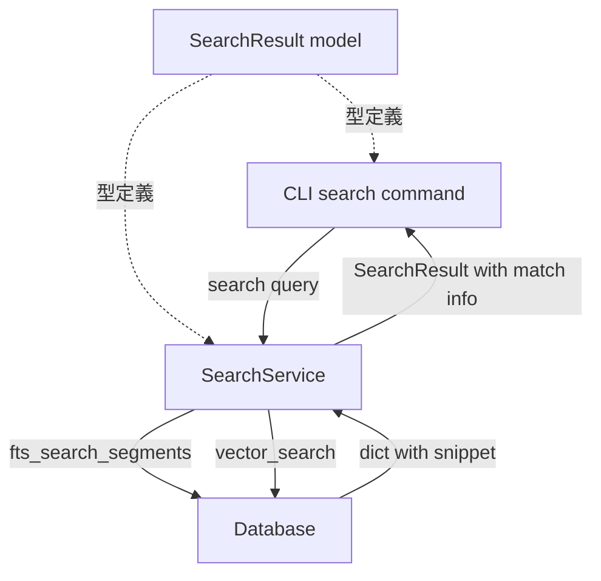
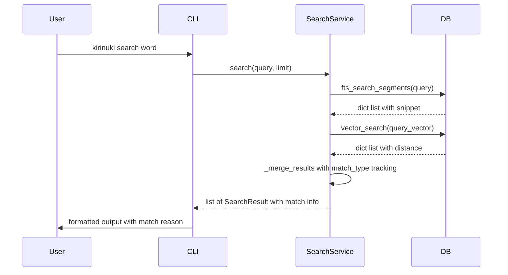
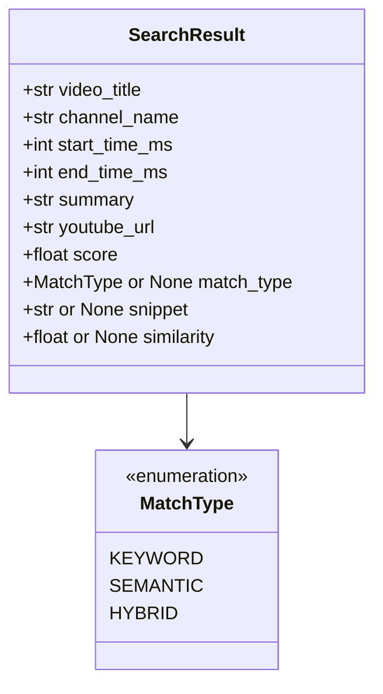

# Design Document: search-hit-reason-display

## Overview

**Purpose**: `kirinuki search` コマンドの検索結果に、各結果がなぜヒットしたのかの理由情報を付加する。ユーザーは検索語と表示される話題の関連性を即座に把握できるようになる。

**Users**: kirinuki CLIの検索利用者が、検索結果の妥当性を判断するワークフローで使用する。

**Impact**: 既存のSearchResultモデル、SearchService、FTSクエリ、CLI表示ロジックを拡張する。

### Goals
- 検索結果ごとにマッチ種別（キーワード / セマンティック / 両方）を表示する
- キーワードマッチ時にマッチした字幕テキストのスニペットを表示する
- セマンティックマッチ時に類似度スコアをパーセンテージで表示する

### Non-Goals
- 検索アルゴリズム自体の改善やスコアリングロジックの変更
- 検索結果のソート順序の変更
- ベクトル検索の埋め込みモデルの変更

## Architecture

### Existing Architecture Analysis

既存の検索パイプラインは3層構造で実装されている：

- **CLI層** (`cli/main.py`): `search`コマンドがSearchService.searchを呼び出し、結果をフォーマット表示
- **コア層** (`core/search_service.py`): FTSとベクトルのハイブリッド検索を実行し、スコアリング・マージ・重複排除を担当
- **インフラ層** (`infra/database.py`): `fts_search_segments`と`vector_search`がSQLiteクエリを実行

変更対象のドメイン境界：
- SearchResultモデル（`models/domain.py`）にマッチ理由フィールドを追加
- Database.fts_search_segments（`infra/database.py`）にスニペット取得を追加
- SearchService._merge_results（`core/search_service.py`）にマッチ種別追跡を追加
- CLI search表示（`cli/main.py`）にマッチ理由行を追加

### Architecture Pattern & Boundary Map



**Architecture Integration**:
- 選択パターン: 既存のレイヤード・アーキテクチャを維持し、各層に最小限の拡張を加える
- 既存パターン: CLI→Core→Infra の依存方向、dict中間表現、Pydanticモデル
- 新規コンポーネント: なし（既存コンポーネントの拡張のみ）

### Technology Stack

| Layer | Choice / Version | Role in Feature | Notes |
|-------|------------------|-----------------|-------|
| CLI | click | マッチ理由行の表示フォーマット | 既存利用 |
| Core | Python 3.12+ | マッチ種別追跡・マージロジック | 既存利用 |
| Data | SQLite FTS5 | GROUP_CONCATによるスニペット生成 | クエリ拡張 |
| Models | Pydantic v2 | SearchResult / MatchType定義 | フィールド追加 |

## System Flows



## Requirements Traceability

| Requirement | Summary | Components | Interfaces | Flows |
|-------------|---------|------------|------------|-------|
| 1.1 | FTSのみ→「キーワード」表示 | SearchService, CLI search | SearchResult.match_type | merge_results |
| 1.2 | ベクトルのみ→「セマンティック」表示 | SearchService, CLI search | SearchResult.match_type | merge_results |
| 1.3 | 両方→「キーワード+セマンティック」表示 | SearchService, CLI search | SearchResult.match_type | merge_results |
| 2.1 | FTSマッチ時に字幕スニペット表示 | Database, CLI search | SearchResult.snippet | fts_search_segments |
| 2.2 | スニペットはセグメント内のマッチ行を含む | Database | fts_search_segments | fts query |
| 2.3 | 長すぎるスニペットを切り詰め | CLI search | - | display |
| 3.1 | ベクトルマッチ時に類似度表示 | SearchService, CLI search | SearchResult.similarity | merge_results |
| 3.2 | 類似度を0〜100%で表示 | CLI search | - | display |
| 4.1 | 動画情報・時間・要約・理由・URLの構造 | CLI search | - | display |
| 4.2 | キーワードマッチ理由行にスニペット | CLI search | - | display |
| 4.3 | セマンティックマッチ理由行に類似度 | CLI search | - | display |
| 4.4 | 両方の場合にスニペットと類似度 | CLI search | - | display |
| 5.1 | SearchResultにmatch_typeフィールド | SearchResult model | MatchType enum | - |
| 5.2 | SearchResultにsnippetフィールド | SearchResult model | str or None | - |
| 5.3 | SearchResultにsimilarityフィールド | SearchResult model | float or None | - |
| 5.4 | マージ時にマッチ情報を正しく設定 | SearchService | _merge_results | merge_results |

## Components and Interfaces

| Component | Domain/Layer | Intent | Req Coverage | Key Dependencies | Contracts |
|-----------|--------------|--------|--------------|------------------|-----------|
| MatchType | Models | マッチ種別のEnum定義 | 1.1-1.3, 5.1 | - | State |
| SearchResult | Models | マッチ理由フィールド追加 | 5.1-5.3 | MatchType (P0) | State |
| Database.fts_search_segments | Infra | スニペット付きFTS検索 | 2.1-2.2 | subtitle_fts (P0) | Service |
| SearchService._merge_results | Core | マッチ種別追跡付きマージ | 1.1-1.3, 5.4 | Database (P0) | Service |
| CLI search | CLI | マッチ理由行の表示 | 4.1-4.4, 2.3, 3.2 | SearchResult (P0) | - |

### Models Layer

#### MatchType Enum

| Field | Detail |
|-------|--------|
| Intent | マッチ種別を型安全に表現するStr Enum |
| Requirements | 1.1, 1.2, 1.3, 5.1 |

**Responsibilities & Constraints**
- `keyword`, `semantic`, `hybrid`の3値を持つStrEnum
- 既存のSkipReasonと同じパターンを踏襲

**Contracts**: State [x]

##### State Management
```python
class MatchType(str, Enum):
    KEYWORD = "keyword"
    SEMANTIC = "semantic"
    HYBRID = "hybrid"
```

#### SearchResult Model Extension

| Field | Detail |
|-------|--------|
| Intent | 検索結果にマッチ理由情報を保持するフィールドを追加 |
| Requirements | 5.1, 5.2, 5.3 |

**Responsibilities & Constraints**
- 既存フィールド（video_title, channel_name, start_time_ms, end_time_ms, summary, youtube_url, score）は変更しない
- 新規フィールドはすべてOptional（デフォルトNone）で後方互換性を維持

**Contracts**: State [x]

##### State Management
```python
class SearchResult(BaseModel):
    # 既存フィールド（変更なし）
    video_title: str
    channel_name: str
    start_time_ms: int
    end_time_ms: int
    summary: str
    youtube_url: str
    score: float = 0.0
    # 新規フィールド
    match_type: MatchType | None = None
    snippet: str | None = None
    similarity: float | None = None  # 0.0〜1.0
```

### Infra Layer

#### Database.fts_search_segments 拡張

| Field | Detail |
|-------|--------|
| Intent | FTS検索時にマッチした字幕テキストをスニペットとして返却する |
| Requirements | 2.1, 2.2 |

**Responsibilities & Constraints**
- 既存のSELECTにGROUP_CONCATでマッチした字幕テキストを追加
- GROUP BYでセグメント単位に集約
- スニペットの区切り文字は「…」を使用
- 返却dictに`snippet`キーを追加

**Dependencies**
- Inbound: SearchService — FTS検索呼び出し (P0)
- External: SQLite FTS5 — trigram検索 (P0)

**Contracts**: Service [x]

##### Service Interface
```python
def fts_search_segments(self, query: str, limit: int = 50) -> list[dict]:
    """FTS検索結果から関連するセグメントを特定して返す。

    Returns:
        list[dict]: 各dictは以下のキーを持つ:
            segment_id: int
            video_id: str
            start_ms: int
            end_ms: int
            summary: str
            video_title: str
            channel_name: str
            snippet: str  # 新規: マッチした字幕テキストの連結
    """
```

**Implementation Notes**
- GROUP_CONCATの区切り文字は「…」
- DISTINCTをGROUP BYに変更し、GROUP_CONCATを適用
- SQLクエリ変更のみ、新テーブルや新インデックスは不要

### Core Layer

#### SearchService._merge_results 拡張

| Field | Detail |
|-------|--------|
| Intent | マージ時にマッチ種別・スニペット・類似度を追跡し、SearchResultに設定する |
| Requirements | 1.1, 1.2, 1.3, 3.1, 5.4 |

**Responsibilities & Constraints**
- FTS結果にはmatch_type=keyword, snippet=字幕テキストを設定
- ベクトル結果にはmatch_type=semantic, similarity=1.0-distanceを設定
- 重複セグメントはmatch_type=hybridに更新し、snippetとsimilarityの両方を保持
- スコアリングロジックは既存のまま変更しない

**Dependencies**
- Inbound: SearchService.search — マージ呼び出し (P0)
- Outbound: SearchResult model — 結果構築 (P0)

**Contracts**: Service [x]

##### Service Interface
```python
def _merge_results(
    self,
    fts_results: list[dict],
    vec_results: list[dict],
    limit: int,
) -> list[SearchResult]:
    """FTSとベクトル検索結果をマージし、マッチ理由情報を含むSearchResultリストを返す。

    - FTSのみ: match_type=KEYWORD, snippet=字幕テキスト
    - ベクトルのみ: match_type=SEMANTIC, similarity=類似度
    - 両方: match_type=HYBRID, snippet=字幕テキスト, similarity=類似度
    """
```

### CLI Layer

#### search コマンド表示拡張

| Field | Detail |
|-------|--------|
| Intent | マッチ理由行を含む新しい表示フォーマットで検索結果を出力する |
| Requirements | 2.3, 3.2, 4.1, 4.2, 4.3, 4.4 |

**Responsibilities & Constraints**
- 既存の表示行（動画情報、時間・要約、URL）は維持
- 時間・要約行とURL行の間にマッチ理由行を追加
- キーワードマッチ時: `     💬 キーワード | "マッチした字幕テキスト"`
- セマンティックマッチ時: `     🔍 セマンティック | 類似度 85%`
- 両方マッチ時: `     💬🔍 キーワード+セマンティック | "字幕テキスト" (類似度 85%)`
- スニペットは最大80文字で切り詰め、超過時は末尾に「…」を付加

**Dependencies**
- Inbound: User — CLIコマンド実行 (P0)
- Outbound: SearchService — search呼び出し (P0)
- Outbound: SearchResult model — 結果参照 (P0)

**Implementation Notes**
- match_typeがNoneの場合（後方互換）はマッチ理由行を表示しない
- 類似度はsimilarity * 100で整数パーセンテージに変換
- スニペットの切り詰めはCLI層の責務

## Data Models

### Domain Model

既存のSearchResultモデルにOptionalフィールドを追加する。新規テーブルやスキーマ変更は不要。



### Physical Data Model
スキーマ変更なし。`fts_search_segments`のSELECT句にGROUP_CONCATを追加するのみ。

## Error Handling

### Error Categories and Responses
- **FTS検索がスニペットを返せない場合**: snippet=Noneのまま結果を返す。CLI側ではスニペットなしのフォーマットで表示
- **GROUP_CONCATの結果がNULLの場合**: snippet=Noneとして処理
- **ベクトル検索のdistanceが異常値の場合**: 既存のmax(0, 1.0 - distance)のクランプで対処済み

## Testing Strategy

### Unit Tests
- `MatchType` Enumの値検証
- `SearchResult`にmatch_type, snippet, similarityを設定して正しく保持されること
- `_merge_results`がFTSのみ/ベクトルのみ/両方の各ケースで正しいmatch_typeを設定すること
- `_merge_results`がFTS結果のsnippetを正しくSearchResultに伝搬すること
- `_merge_results`がベクトル結果のdistanceからsimilarityを正しく算出すること

### Integration Tests
- `fts_search_segments`がsnippetを含むdictを返すこと
- CLI searchコマンドがマッチ理由行を含む出力を生成すること
- キーワードマッチ/セマンティックマッチ/ハイブリッドマッチの各パターンで正しい表示フォーマットであること
