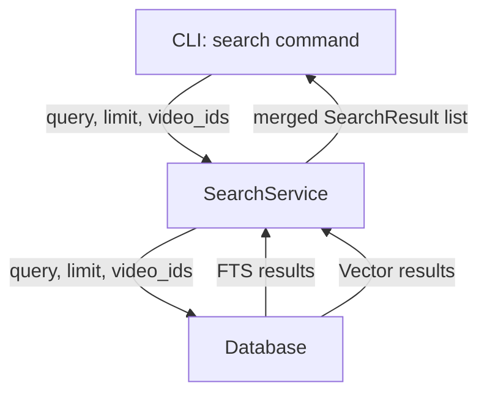
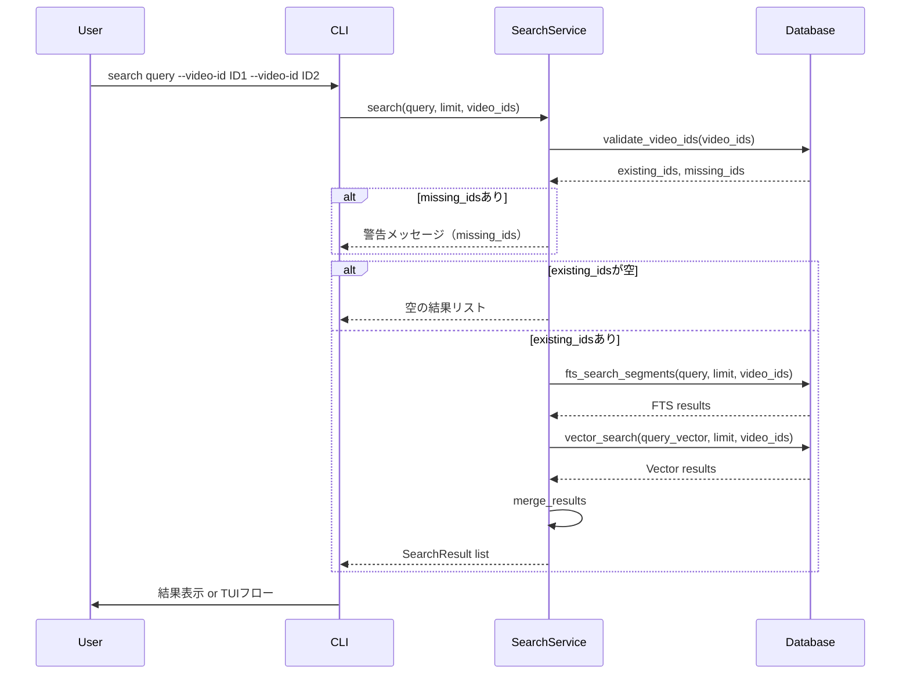

# Design Document: search-video-id-filter

## Overview

**Purpose**: `search`コマンドに`--video-id`オプションを追加し、指定した動画IDのセグメントのみを検索対象とする絞り込み機能を提供する。
**Users**: 特定の配信内容を検索したいユーザーが、動画IDを指定して効率的に目的のセグメントを見つける。
**Impact**: 既存のsearchコマンド・サービス・データベース層にオプショナルパラメータを追加。後方互換性を完全に維持。

### Goals
- `--video-id`オプションで1つまたは複数の動画IDによる絞り込みが可能
- FTS検索・ベクトル検索の両方にフィルタが適用される
- 既存の検索動作（オプション省略時）に変更なし

### Non-Goals
- チャンネルIDや日付範囲での絞り込み（将来の拡張候補）
- 動画IDの部分一致やワイルドカード検索
- 新しい検索アルゴリズムの導入

## Architecture

### Existing Architecture Analysis

現在のsearch機能は CLI → SearchService → Database の3層構成。

- **CLI層** (`cli/main.py`): clickコマンド定義、`query`引数と`--limit`/`--tui`オプション
- **コア層** (`core/search_service.py`): FTSとベクトル検索を並行実行し、結果をマージ・ランキング
- **インフラ層** (`infra/database.py`): `fts_search_segments`（SQL JOINベース）と`vector_search`（sqlite-vec vec0テーブル）

**制約**: sqlite-vecの`vec0`テーブルはKNN検索時に`WHERE embedding MATCH ? AND k = ?`の専用構文を使用し、追加のWHERE条件を直接適用できない。

### Architecture Pattern & Boundary Map



**Architecture Integration**:
- 選択パターン: 既存3層アーキテクチャを維持し、各層にオプショナル引数を追加
- 既存パターン保持: CLI→コア→インフラの依存方向、dictベースのDB結果フォーマット
- 新コンポーネント: なし（既存コンポーネントの拡張のみ）

### Technology Stack

| Layer | Choice / Version | Role in Feature | Notes |
|-------|------------------|-----------------|-------|
| CLI | click | `--video-id`オプション定義（`multiple=True`） | 既存ライブラリ |
| Services | SearchService | video_idsフィルタの伝播とバリデーション | 既存クラス拡張 |
| Data | SQLite + FTS5 + sqlite-vec | フィルタ付き検索クエリ | 既存DB拡張 |

## System Flows



**Key Decisions**:
- バリデーションはSearchService層で実行し、存在しないIDの警告をCLI層に伝播
- FTS/ベクトル検索は既存のフローを維持し、video_idsフィルタのみ追加

## Requirements Traceability

| Requirement | Summary | Components | Interfaces | Flows |
|-------------|---------|------------|------------|-------|
| 1.1 | --video-idオプション追加 | CLI search command | click option | CLI→SS |
| 1.2 | 複数video-id指定（OR） | CLI, SearchService, Database | multiple=True, list引数 | CLI→SS→DB |
| 1.3 | 省略時の後方互換性 | 全層 | video_ids=None デフォルト | 既存フロー維持 |
| 1.4 | 存在しないID警告 | SearchService | validate_video_ids, SearchOutcome | SS→CLI |
| 1.5 | 全ID不在時の正常終了 | SearchService, CLI | 空リスト返却 | SS→CLI |
| 2.1 | FTSでのvideo_idフィルタ | Database | fts_search_segments拡張 | DB内部 |
| 2.2 | FTSスコアリング維持 | SearchService | _merge_results変更なし | SS内部 |
| 3.1 | ベクトル検索でのvideo_idフィルタ | Database | vector_search拡張 | DB内部 |
| 3.2 | ベクトルスコアリング維持 | SearchService | _merge_results変更なし | SS内部 |
| 4.1 | TUIモードとの統合 | CLI | 既存TUIフローに変更なし | CLI内部 |
| 4.2 | TUI切り抜きフロー維持 | CLI | 既存TUIフローに変更なし | CLI内部 |

## Components and Interfaces

| Component | Domain/Layer | Intent | Req Coverage | Key Dependencies | Contracts |
|-----------|-------------|--------|--------------|------------------|-----------|
| search command | CLI | --video-idオプション受付、バリデーション結果表示 | 1.1, 1.2, 1.3, 1.4, 1.5, 4.1, 4.2 | SearchService (P0) | Service |
| SearchService | Core | video_idsバリデーション、フィルタ付き検索実行 | 1.2, 1.3, 1.4, 1.5, 2.1, 2.2, 3.1, 3.2 | Database (P0) | Service |
| Database | Infra | フィルタ付きSQL/KNNクエリ実行 | 2.1, 2.2, 3.1, 3.2 | SQLite, sqlite-vec (P0) | Service |

### CLI Layer

#### search command（拡張）

| Field | Detail |
|-------|--------|
| Intent | `--video-id`オプションの受付とSearchServiceへの伝播 |
| Requirements | 1.1, 1.2, 1.3, 1.4, 1.5, 4.1, 4.2 |

**Responsibilities & Constraints**
- `--video-id`オプションをclick option（`multiple=True`）として定義
- SearchServiceから返却される警告メッセージの表示
- 既存の`--tui`フローへのフィルタ結果の受け渡し（変更なし）

**Dependencies**
- Outbound: SearchService — 検索実行 (P0)

**Contracts**: Service [x]

##### Service Interface
```python
# cli/main.py - search command拡張
@cli.command()
@click.argument("query")
@click.option("--limit", "-n", default=10, help="検索結果の最大件数")
@click.option("--video-id", multiple=True, default=(), help="絞り込む動画ID（複数指定可）")
@click.option("--tui", is_flag=True, default=False, help="TUIモードで結果を表示し、切り抜きを実行")
def search(query: str, limit: int, video_id: tuple[str, ...], tui: bool) -> None: ...
```
- Preconditions: video_idはtupleとしてclickが処理（空tupleはフィルタなし）
- Postconditions: SearchServiceの結果を表示またはTUIフローに渡す

**Implementation Notes**
- clickの`multiple=True`により`--video-id A --video-id B`形式で複数指定を受付
- 空tupleの場合は`video_ids=None`としてSearchServiceに渡す
- 警告メッセージは`click.echo`で`stderr`相当に出力（`err=True`）

### Core Layer

#### SearchService（拡張）

| Field | Detail |
|-------|--------|
| Intent | video_idsバリデーションとフィルタ付き検索の実行 |
| Requirements | 1.2, 1.3, 1.4, 1.5, 2.1, 2.2, 3.1, 3.2 |

**Responsibilities & Constraints**
- video_idsの存在確認とmissing IDsの分離
- Databaseの各検索メソッドへのvideo_idsの伝播
- 既存のマージ・スコアリングロジックは変更しない

**Dependencies**
- Inbound: CLI search command — 検索リクエスト (P0)
- Outbound: Database — 検索クエリ実行 (P0)
- Outbound: OpenAIEmbeddingProvider — ベクトル生成 (P0)

**Contracts**: Service [x]

##### Service Interface
```python
class SearchService:
    def search(
        self,
        query: str,
        limit: int = 10,
        video_ids: list[str] | None = None,
    ) -> SearchResult_with_warnings: ...
```

`SearchResult_with_warnings`は戻り値の設計として2つの選択肢がある:
- **方式A**: `search`メソッドは`list[SearchResult]`を返し、警告はコールバックまたはloggerで出力
- **方式B**: 戻り値を`tuple[list[SearchResult], list[str]]`（結果, 警告メッセージ）とする

**選択: 方式B** — `tuple[list[SearchResult], list[str]]`を返却。CLI層が警告表示を制御できる。

```python
class SearchService:
    def search(
        self,
        query: str,
        limit: int = 10,
        video_ids: list[str] | None = None,
    ) -> tuple[list[SearchResult], list[str]]:
        """検索を実行する。

        Returns:
            tuple of (検索結果リスト, 警告メッセージリスト)
        """
        ...
```

- Preconditions: video_idsがNoneの場合はフィルタなし（後方互換）
- Postconditions: 警告メッセージには存在しないvideo_idの情報を含む
- Invariants: 既存のマージ・スコアリングロジック（`_merge_results`）は変更しない

**Implementation Notes**
- 既存の`search`メソッドの戻り値型が変わるため、呼び出し元（CLI）の修正も必要
- `validate_video_ids`でDBに問い合わせ、存在するIDのみを検索に使用
- 全IDが不在の場合は空リスト＋警告を返却

### Infra Layer

#### Database（拡張）

| Field | Detail |
|-------|--------|
| Intent | video_idフィルタ付きのFTS/ベクトル検索クエリ実行 |
| Requirements | 2.1, 2.2, 3.1, 3.2 |

**Responsibilities & Constraints**
- `fts_search_segments`にvideo_idフィルタ条件を追加
- `vector_search`にオーバーフェッチ＋post-filterロジックを追加
- 新規メソッド`validate_video_ids`を追加

**Dependencies**
- Inbound: SearchService — 検索リクエスト (P0)
- External: SQLite FTS5 — キーワード検索 (P0)
- External: sqlite-vec — ベクトル検索 (P0)

**Contracts**: Service [x]

##### Service Interface

```python
class Database:
    def validate_video_ids(self, video_ids: list[str]) -> tuple[list[str], list[str]]:
        """video_idsの存在確認を行う。

        Returns:
            tuple of (存在するID, 存在しないID)
        """
        ...

    def fts_search_segments(
        self,
        query: str,
        limit: int = 50,
        video_ids: list[str] | None = None,
    ) -> list[dict]: ...

    def vector_search(
        self,
        query_vector: list[float],
        limit: int = 10,
        video_ids: list[str] | None = None,
    ) -> list[dict]: ...
```

- Preconditions: video_idsがNoneの場合はフィルタなし
- Postconditions:
  - `fts_search_segments`: SQL WHERE句に `AND s.video_id IN (?)` を動的追加
  - `vector_search`: kをオーバーフェッチ倍率（5倍）で拡大し、JOIN後に `s.video_id IN (?)` でフィルタ。フィルタ後にlimitで切り詰め
- Invariants: video_idsがNoneの場合、既存クエリと完全に同一の結果を返す

**Implementation Notes**
- FTS: `WHERE subtitle_fts MATCH ? AND s.video_id IN ({placeholders})` — プレースホルダを動的生成
- Vector: `WHERE embedding MATCH ? AND k = ?` は変更せず、k値を`limit * 5`に増加。結果取得後にPythonでvideo_idフィルタリングし、limit件に切り詰め
- `validate_video_ids`: `SELECT video_id FROM videos WHERE video_id IN ({placeholders})` で一括確認

## Error Handling

### Error Strategy

| エラーケース | 対応 | Req |
|-------------|------|-----|
| 一部のvideo_idが不在 | 警告表示、存在するIDのみで検索続行 | 1.4 |
| 全video_idが不在 | 警告表示、空結果で正常終了 | 1.5 |
| ベクトル検索オーバーフェッチ後に結果不足 | 結果が0件でも正常終了（既存動作と同様） | — |

## Testing Strategy

### Unit Tests
- `SearchService.search` にvideo_ids指定時の正しいフィルタリング動作
- `SearchService.search` にvideo_ids=None時の後方互換動作
- `SearchService.search` に存在しないvideo_id指定時の警告メッセージ生成
- `Database.validate_video_ids` の存在/不在ID分離ロジック
- `Database.fts_search_segments` のvideo_idフィルタ付きSQL生成

### Integration Tests
- CLI `search --video-id` エンドツーエンドの動作確認（DBモック使用）
- FTS + ベクトル検索のハイブリッド結果がvideo_idフィルタ適用後も正しくマージされること
- `--video-id` と `--tui` の併用時にTUIフローが正常に動作すること
