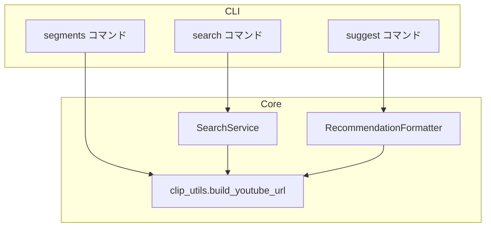

# Design Document: segment-archive-url

## Overview

**Purpose**: `search`・`segments`・`suggest` の3コマンド出力にYouTube Liveアーカイブの区間URLを一貫して表示し、ユーザーが即座に該当区間を視聴できるようにする。

**Users**: CLIユーザーが検索・一覧・推薦結果から直接YouTube動画を確認するワークフローで利用する。

**Impact**: `segments` コマンドにURL表示を新規追加し、既存の重複するURL生成ロジック（`search_service.py` と `formatter.py`）を `clip_utils.py` の共通関数に統合する。

### Goals
- `segments` コマンド出力にタイムスタンプ付きYouTube URLを追加する
- URL生成ロジックを `clip_utils.py` の単一関数に統合する
- 既存の `search`・`suggest` の出力を維持する

### Non-Goals
- URL形式の変更（`&t=` パラメータ仕様の変更）
- 新規CLIオプションの追加
- データモデルの変更（`Segment` モデルにURLフィールドは追加しない）

## Architecture

### Existing Architecture Analysis

現在、URL生成が2箇所に分散している:

1. `SearchService._generate_youtube_url(video_id, start_ms)` — ミリ秒→秒変換込み
2. `RecommendationFormatter.build_youtube_url(video_id, start_seconds)` — 秒で受け取る

`segments` コマンドにはURL生成が存在しない。

### Architecture Pattern & Boundary Map



**Architecture Integration**:
- 選択パターン: 既存のレイヤー分離パターンを維持し、コアユーティリティに共通関数を集約
- 新規コンポーネント: なし（既存の `clip_utils.py` に関数を追加）
- Steering準拠: 「コア層は外部非依存」「CLI層は薄く」の原則を維持

### Technology Stack

| Layer | Choice / Version | Role in Feature | Notes |
|-------|------------------|-----------------|-------|
| CLI | click（既存） | コマンド出力にURL行を追加 | 変更なし |

新規依存は不要。既存のPython標準ライブラリのみ使用。

## Requirements Traceability

| Requirement | Summary | Components | Interfaces | Flows |
|-------------|---------|------------|------------|-------|
| 1.1 | segments コマンドにURL表示 | segments コマンド（main.py） | `build_youtube_url()` | segments 出力フロー |
| 1.2 | `&t=` に開始秒を設定 | `clip_utils.build_youtube_url()` | `build_youtube_url(video_id, start_ms)` | — |
| 1.3 | 0件時はURL非表示 | segments コマンド（main.py） | — | 既存の早期リターン |
| 2.1 | 3コマンドで同一関数使用 | clip_utils, search_service, formatter | `build_youtube_url()` | — |
| 2.2 | video_id + ミリ秒を受け取りURL返却 | `clip_utils.build_youtube_url()` | `(video_id: str, start_ms: int) -> str` | — |
| 2.3 | ミリ秒→秒の切り捨て変換 | `clip_utils.build_youtube_url()` | — | — |
| 3.1 | search のURL表示維持 | search_service.py | `build_youtube_url()` | search 出力フロー |
| 3.2 | suggest テキスト出力のURL維持 | formatter.py | `build_youtube_url()` | suggest テキスト出力フロー |
| 3.3 | suggest JSON出力の youtube_url 維持 | formatter.py | `build_youtube_url()` | suggest JSON出力フロー |

## Components and Interfaces

| Component | Domain/Layer | Intent | Req Coverage | Key Dependencies | Contracts |
|-----------|-------------|--------|-------------|-----------------|-----------|
| `clip_utils.build_youtube_url` | Core / Utility | YouTube URL生成の共通関数 | 1.1, 1.2, 2.1, 2.2, 2.3 | なし | Service |
| `segments` コマンド | CLI | セグメント一覧にURL表示追加 | 1.1, 1.3 | clip_utils (P0) | — |
| `SearchService` | Core / Service | 共通関数への切り替え | 2.1, 3.1 | clip_utils (P0) | — |
| `RecommendationFormatter` | Core / Formatter | 共通関数への切り替え | 2.1, 3.2, 3.3 | clip_utils (P0) | — |

### Core / Utility

#### `clip_utils.build_youtube_url`

| Field | Detail |
|-------|--------|
| Intent | video_id と開始ミリ秒からタイムスタンプ付きYouTube URLを生成する |
| Requirements | 1.1, 1.2, 2.1, 2.2, 2.3 |

**Responsibilities & Constraints**
- YouTube動画URLにタイムスタンプクエリパラメータを付与して返す
- ミリ秒→秒変換は整数除算（`// 1000`）で切り捨て
- 純粋関数（副作用なし、外部依存なし）

**Dependencies**
- なし

**Contracts**: Service [x]

##### Service Interface

```python
def build_youtube_url(video_id: str, start_ms: int) -> str:
    """タイムスタンプ付きYouTube URLを生成する。

    Args:
        video_id: YouTube動画ID
        start_ms: 開始時刻（ミリ秒）

    Returns:
        https://www.youtube.com/watch?v={video_id}&t={start_seconds} 形式の文字列
    """
```

- Preconditions: `video_id` が空でないこと、`start_ms >= 0`
- Postconditions: 戻り値が `https://www.youtube.com/watch?v=` で始まること
- Invariants: `start_ms` のミリ秒→秒変換は常に切り捨て

### CLI

#### `segments` コマンド（出力変更）

| Field | Detail |
|-------|--------|
| Intent | 各セグメント表示の下にURL行を追加する |
| Requirements | 1.1, 1.3 |

**出力形式（変更後）**:
```
セグメント一覧 (N件):

  MM:SS - MM:SS | セグメント要約
     https://www.youtube.com/watch?v=VIDEO_ID&t=SECONDS

  MM:SS - MM:SS | セグメント要約
     https://www.youtube.com/watch?v=VIDEO_ID&t=SECONDS
```

**Implementation Notes**
- Integration: `build_youtube_url(video_id, s.start_ms)` を各セグメントのループ内で呼び出し、`click.echo` で出力
- Validation: セグメント0件時は既存の早期リターンがありURL表示は不要
- Risks: なし（出力行の追加のみ）

### Core / Service

#### `SearchService`（リファクタリング）

| Field | Detail |
|-------|--------|
| Intent | プライベートメソッド `_generate_youtube_url` を共通関数に置き換え |
| Requirements | 2.1, 3.1 |

**Implementation Notes**
- Integration: `self._generate_youtube_url(video_id, start_ms)` を `build_youtube_url(video_id, start_ms)` に置換。インターフェースが同じ（ミリ秒受け取り）なので単純な差し替え
- Risks: なし（同一ロジックの移動のみ）

### Core / Formatter

#### `RecommendationFormatter`（リファクタリング）

| Field | Detail |
|-------|--------|
| Intent | 静的メソッド `build_youtube_url` を共通関数に置き換え |
| Requirements | 2.1, 3.2, 3.3 |

**Implementation Notes**
- Integration: `self.build_youtube_url(video_id, int(start_time))` → `build_youtube_url(video_id, int(rec.start_time * 1000))` に変更。秒→ミリ秒変換が必要
- Validation: 既存テストで出力URLが変わらないことを確認
- Risks: 秒→ミリ秒変換で `int(seconds * 1000)` のprecision。`start_time` はfloatだが、元々LLM出力の整数値なので実用上問題なし

## Data Models

データモデルの変更は不要。

- `Segment`（domain.py）: `video_id`, `start_ms`, `end_ms`, `summary` — URLは表示時に動的生成
- `SearchResult`（domain.py）: `youtube_url` フィールドは既存のまま維持
- `SegmentRecommendation`（recommendation.py）: 変更なし

## Testing Strategy

### Unit Tests
1. **`build_youtube_url` 関数テスト**: 正常値、ミリ秒→秒切り捨て確認、境界値（0ms, 大きな値）
2. **`segments` コマンド出力テスト**: URL行が含まれること、0件時にURLが出力されないこと
3. **`search` コマンド回帰テスト**: URL形式が変わらないこと
4. **`suggest` コマンド回帰テスト**: テキスト・JSON両形式でURL形式が変わらないこと

### Integration Tests
1. **3コマンド横断テスト**: 同一video_id・start_msに対して全コマンドが同一URLを生成すること
