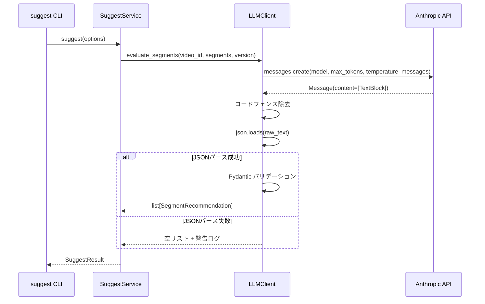

# Design Document: suggest-response-model-error

## Overview

**Purpose**: `kirinuki suggest` コマンドのセグメント評価時に発生する `response_model` エラーを修正し、LLM レスポンスの JSON パース処理をプロジェクト既存パターンに統一する。

**Users**: `kirinuki suggest` コマンドを使用するすべてのユーザー。

**Impact**: `src/kirinuki/infra/llm.py` の `evaluate_segments` メソッドを修正し、`response_model` パラメータを除去。JSON 手動パースに変更する。

### Goals
- `kirinuki suggest` コマンドがエラーなく動作する
- LLM レスポンスパース処理を `llm_client.py` と統一

### Non-Goals
- `instructor` ライブラリの導入
- 評価プロンプトの内容改善（スコアリングロジック等）
- LLM クライアントの統合（`llm.py` と `llm_client.py` の統合リファクタリング）

## Architecture

### Existing Architecture Analysis

現在のインフラ層には2つの LLM クライアントが存在する:

| ファイル | 用途 | レスポンスパース方式 |
|---------|------|-------------------|
| `infra/llm_client.py` | 話題セグメンテーション | JSON手動パース（正常動作） |
| `infra/llm.py` | セグメント評価（suggest） | `response_model`（エラー） |

修正対象は `infra/llm.py` のみ。`llm_client.py` は変更不要。

### Architecture Pattern & Boundary Map

**Selected Pattern**: 既存のJSON手動パースパターンを踏襲

変更はインフラ層（`infra/llm.py`）に閉じる。コア層（`core/suggest.py`）やCLI層への影響はない。`LLMClient.evaluate_segments` の公開インターフェース（引数・戻り値の型）は変更しない。

### Technology Stack

| Layer | Choice / Version | Role in Feature | Notes |
|-------|------------------|-----------------|-------|
| Backend / Services | `anthropic` SDK | LLM API呼び出し | `response_model` を除去 |
| Backend / Services | `pydantic` v2 | レスポンスバリデーション | 既存の `SegmentEvaluation` モデルを活用 |
| Backend / Services | Python `json` + `re` | JSONパース + コードフェンス除去 | 標準ライブラリ |

## System Flows



## Requirements Traceability

| Requirement | Summary | Components | Interfaces | Flows |
|-------------|---------|------------|------------|-------|
| 1.1 | response_model除去、JSONパース | LLMClient | evaluate_segments | メインフロー |
| 1.2 | Pydanticバリデーション | LLMClient | evaluate_segments | 成功パス |
| 1.3 | コードフェンス除去 | LLMClient | evaluate_segments | パース前処理 |
| 1.4 | JSONエラーハンドリング | LLMClient | evaluate_segments | エラーパス |
| 2.1 | llm_client.pyとのパターン統一 | LLMClient | — | — |
| 2.2 | プロンプトでJSON形式指示 | LLMClient | EVALUATION_PROMPT | — |
| 2.3 | instructor依存排除 | LLMClient | — | — |

## Components and Interfaces

| Component | Domain/Layer | Intent | Req Coverage | Key Dependencies | Contracts |
|-----------|-------------|--------|--------------|------------------|-----------|
| LLMClient | infra | セグメント評価のLLMレスポンスパース修正 | 1.1–1.4, 2.1–2.3 | anthropic SDK (P0) | Service |

### インフラ層

#### LLMClient (`src/kirinuki/infra/llm.py`)

| Field | Detail |
|-------|--------|
| Intent | セグメント評価のLLMレスポンスを正しくパースする |
| Requirements | 1.1, 1.2, 1.3, 1.4, 2.1, 2.2, 2.3 |

**Responsibilities & Constraints**
- `messages.create()` から `response_model` パラメータを除去する
- テキストレスポンスからコードフェンスを除去し、JSONとしてパースする
- パース結果を `SegmentEvaluation` Pydantic モデルでバリデーションする
- JSON パースエラー時は空リストを返し、警告ログを出力する

**Dependencies**
- External: `anthropic` SDK — LLM API呼び出し (P0)
- External: `pydantic` — レスポンスバリデーション (P0)

**Contracts**: Service [x]

##### Service Interface

```python
class LLMClient:
    def evaluate_segments(
        self,
        video_id: str,
        segments: list[dict[str, str | int]],
        prompt_version: str,
    ) -> list[SegmentRecommendation]:
        """動画1本分のセグメントを一括評価する。

        LLMレスポンスのJSONパース失敗時は空リストを返す。
        公開インターフェースは変更なし。
        """
        ...
```

- Preconditions: `segments` は空でない辞書リスト（`id`, `start_ms`, `end_ms`, `summary` キーを含む）
- Postconditions: 各 `SegmentRecommendation` の `score` は 1〜10 の範囲
- Invariants: メソッドシグネチャ・戻り値の型は変更しない

**Implementation Notes**
- `EVALUATION_PROMPT` の末尾に JSON 配列形式の出力指示を追加する（`llm_client.py` の `SYSTEM_PROMPT` と同様のアプローチ）
- コードフェンス除去には `llm_client.py` と同じ正規表現パターンを使用: `re.sub(r"^```(?:json)?\s*\n?", "", raw_text.strip())` + `re.sub(r"\n?```\s*$", "", raw_text)`
- `EvaluationResponse` Pydantic モデルは残すが、`response_model` としてではなく `model_validate` による手動バリデーションに使用する
- `import json`, `import re`, `import logging` を追加する

## Data Models

### Domain Model

既存の `SegmentEvaluation` および `EvaluationResponse` Pydantic モデルはそのまま維持する。用途が `response_model` パラメータからバリデーション用に変わるのみ。

```python
class SegmentEvaluation(BaseModel):
    segment_id: int
    score: int = Field(ge=1, le=10)
    summary: str
    appeal: str

class EvaluationResponse(BaseModel):
    evaluations: list[SegmentEvaluation]
```

LLM への出力指示は `evaluations` キーを持つJSONオブジェクト形式とする（既存モデル構造と一致させるため）。

## Error Handling

### Error Strategy

| エラー種別 | 発生条件 | 対応 |
|-----------|---------|------|
| JSONDecodeError | LLMが不正なJSON を返した | 空リスト返却 + 警告ログ |
| ValidationError | JSONは正しいがスキーマ不一致 | 空リスト返却 + 警告ログ |

`llm_client.py` と同一のフェイルセーフパターンを適用する。

## Testing Strategy

### Unit Tests
- `evaluate_segments` が `response_model` なしで `messages.create()` を呼び出すこと
- 正常なJSON レスポンスが `SegmentRecommendation` リストに変換されること
- コードフェンス付きJSON レスポンスが正しくパースされること
- 不正な JSON レスポンスで空リストが返却され、警告ログが出力されること
- Pydantic バリデーションエラー（例: score が範囲外）で空リストが返却されること
