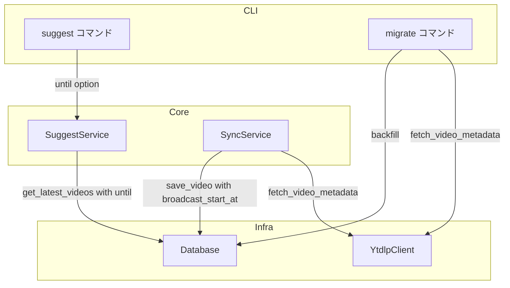
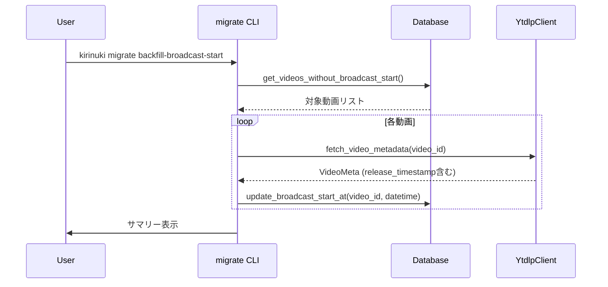

# Design Document

## Overview
**Purpose**: YouTube Liveの配信開始日時をDBに正しく保存し、`suggest` コマンドで配信日時による絞り込みを可能にする。
**Users**: CLIユーザーが特定期間の配信のみを対象に切り抜き候補の推薦を受けるワークフローで使用する。
**Impact**: videosテーブルに `broadcast_start_at` カラムを追加し、既存データのバックフィル手段を提供する。

### Goals
- yt-dlpの `release_timestamp` から配信開始日時を正確に取得・保存する
- `suggest --until` で配信開始日時によるフィルタリングを実現する
- 既存DB動画の配信開始日時を一括更新するマイグレーションコマンドを提供する

### Non-Goals
- `--since`（開始日時の下限）フィルターの追加（将来検討）
- `search` コマンドへの日時フィルター拡張
- 配信開始日時の表示フォーマット変更

## Architecture

### Existing Architecture Analysis
- **3層構造**: CLI → Core → Infra が既に確立
- **DBスキーマ**: `schema_version` テーブルでバージョン管理（現在 version 1）
- **yt-dlpクライアント**: `fetch_video_metadata()` が `VideoMeta` を返す既存パターン
- **suggestフロー**: `SuggestOptions` → `SuggestService._resolve_videos()` → DB クエリ

### Architecture Pattern & Boundary Map



**Architecture Integration**:
- Selected pattern: 既存3層パターンの拡張
- 新コンポーネントは `migrate` CLIグループのみ。その他は既存コンポーネントの拡張
- Steering compliance: CLI薄層原則を維持。マイグレーション処理もDB・yt-dlpの組み合わせで実現

### Technology Stack

| Layer | Choice / Version | Role in Feature | Notes |
|-------|------------------|-----------------|-------|
| CLI | click | `--until` オプション追加、`migrate` グループ追加 | 既存 |
| Core | SuggestService | `until` フィルター適用 | 拡張 |
| Data | SQLite + schema_version | `broadcast_start_at` カラム追加 | version 1 → 2 |
| Infra | yt-dlp | `release_timestamp` フィールド抽出 | 既存APIの活用 |

## System Flows

### バックフィルフロー



## Requirements Traceability

| Requirement | Summary | Components | Interfaces |
|-------------|---------|------------|------------|
| 1.1 | yt-dlpから配信開始日時を取得・保存 | YtdlpClient, SyncService, Database | VideoMeta, save_video() |
| 1.2 | 取得不可時のフォールバック | YtdlpClient | VideoMeta |
| 1.3 | broadcast_start_atカラム追加 | Database | SCHEMA_SQL, _migrate_v1_to_v2() |
| 1.4 | スキーママイグレーション | Database | initialize() |
| 2.1 | バックフィルコマンド提供 | migrate CLI | CLI定義 |
| 2.2 | 未設定動画のみ対象 | Database | get_videos_without_broadcast_start() |
| 2.3 | フォールバック適用 | migrate CLI | バックフィルロジック |
| 2.4 | 処理サマリー表示 | migrate CLI | CLI出力 |
| 2.5 | エラー時の継続処理 | migrate CLI | エラーハンドリング |
| 3.1 | --untilフィルター適用 | SuggestService, Database | get_latest_videos(), SuggestOptions |
| 3.2 | 省略時は絞り込みなし | SuggestService | _resolve_videos() |
| 3.3 | 日付・日時形式の受付 | suggest CLI | parse_until_datetime() |
| 3.4 | --video-id優先 | SuggestService | _resolve_videos() |
| 3.5 | 無効形式のエラー表示 | suggest CLI | click.BadParameter |

## Components and Interfaces

| Component | Domain/Layer | Intent | Req Coverage | Key Dependencies |
|-----------|-------------|--------|--------------|------------------|
| YtdlpClient | Infra | release_timestamp抽出追加 | 1.1, 1.2 | yt-dlp |
| Database | Infra | スキーマ変更・クエリ拡張 | 1.3, 1.4, 2.2, 3.1 | SQLite |
| SyncService | Core | broadcast_start_at保存 | 1.1, 1.2 | Database, YtdlpClient |
| SuggestService | Core | untilフィルタリング | 3.1, 3.2, 3.4 | Database |
| suggest CLI | CLI | --untilオプション追加 | 3.1-3.5 | SuggestService |
| migrate CLI | CLI | バックフィルコマンド | 2.1-2.5 | Database, YtdlpClient |

### Infra層

#### YtdlpClient（拡張）

| Field | Detail |
|-------|--------|
| Intent | `fetch_video_metadata()` で `release_timestamp` を抽出し `VideoMeta` に追加 |
| Requirements | 1.1, 1.2 |

**Responsibilities & Constraints**
- `release_timestamp` を優先取得、NoneならNoneのまま返す（フォールバック判断は呼び出し側）
- 既存の `published_at`（`upload_date` 由来）は変更なし

**Contracts**: Service [x]

##### Service Interface
```python
@dataclass
class VideoMeta:
    video_id: str
    title: str
    published_at: datetime | None
    duration_seconds: int
    live_status: str | None = None
    broadcast_start_at: datetime | None = None  # 追加
```

- `broadcast_start_at`: `info.get("release_timestamp")` から `datetime.fromtimestamp(ts, tz=timezone.utc)` で変換
- `release_timestamp` が None の場合は `broadcast_start_at = None`

#### Database（拡張）

| Field | Detail |
|-------|--------|
| Intent | スキーマv2移行、broadcast_start_at対応のCRUD・クエリ |
| Requirements | 1.3, 1.4, 2.2, 3.1 |

**Responsibilities & Constraints**
- `SCHEMA_VERSION` を 1 → 2 に変更
- `initialize()` 内でバージョンチェックし、v1→v2マイグレーションを実行
- `save_video()` に `broadcast_start_at` パラメータを追加
- `get_latest_videos()` に `until` パラメータを追加

**Contracts**: Service [x]

##### Service Interface
```python
# スキーママイグレーション（initialize()内で実行）
def _migrate_v1_to_v2(self) -> None:
    """ALTER TABLE videos ADD COLUMN broadcast_start_at TEXT"""

# save_video 拡張
def save_video(
    self,
    video_id: str,
    channel_id: str,
    title: str,
    published_at: datetime | None,
    duration_seconds: int,
    subtitle_language: str,
    is_auto_subtitle: bool,
    broadcast_start_at: datetime | None = None,  # 追加
) -> None: ...

# get_latest_videos 拡張
def get_latest_videos(
    self,
    channel_id: str,
    count: int,
    until: datetime | None = None,  # 追加
) -> list[dict[str, str]]: ...

# バックフィル用新規メソッド
def get_videos_without_broadcast_start(self) -> list[dict[str, str]]:
    """broadcast_start_at IS NULLの動画一覧を返す"""

def update_broadcast_start_at(
    self, video_id: str, broadcast_start_at: datetime
) -> None:
    """動画のbroadcast_start_atを更新する"""
```

- `get_latest_videos()` の `until` 指定時: `WHERE broadcast_start_at <= ? OR (broadcast_start_at IS NULL AND published_at <= ?)` で未設定動画も拾う
- ソート順: `ORDER BY COALESCE(broadcast_start_at, published_at) DESC`

**Implementation Notes**
- マイグレーション: `ALTER TABLE videos ADD COLUMN broadcast_start_at TEXT` 実行後、`UPDATE schema_version SET version = 2`
- `initialize()` で既存バージョンが1の場合のみマイグレーション実行

### Core層

#### SyncService（拡張）

| Field | Detail |
|-------|--------|
| Intent | `broadcast_start_at` をDB保存パラメータに追加 |
| Requirements | 1.1, 1.2 |

**Responsibilities & Constraints**
- `VideoMeta.broadcast_start_at` がNoneの場合、`published_at` をフォールバック値として使用

##### Service Interface
```python
# _sync_single_video 内の save_video 呼び出し拡張
self._db.save_video(
    video_id=video_id,
    channel_id=channel_id,
    title=meta.title,
    published_at=meta.published_at,
    duration_seconds=meta.duration_seconds,
    subtitle_language=subtitle_data.language,
    is_auto_subtitle=subtitle_data.is_auto_generated,
    broadcast_start_at=meta.broadcast_start_at or meta.published_at,  # フォールバック
)
```

#### SuggestService（拡張）

| Field | Detail |
|-------|--------|
| Intent | `until` フィルターを動画取得ロジックに適用 |
| Requirements | 3.1, 3.2, 3.4 |

**Responsibilities & Constraints**
- `video_ids` 指定時は `until` を無視
- `until` 未指定時は従来通り全動画対象

##### Service Interface
```python
@dataclass
class SuggestOptions:
    channel_id: str | None = None
    count: int = 3
    threshold: int = 7
    video_ids: list[str] | None = None
    until: datetime | None = None  # 追加

# _resolve_videos 拡張
def _resolve_videos(self, options: SuggestOptions) -> tuple[list[dict], list[str]]:
    if options.video_ids:
        # video_ids指定時はuntilを無視
        ...
    else:
        videos = self._db.get_latest_videos(
            options.channel_id, options.count, until=options.until
        )
```

### CLI層

#### suggest CLI（拡張）

| Field | Detail |
|-------|--------|
| Intent | `--until` オプションの追加と日時パース |
| Requirements | 3.1-3.5 |

**Contracts**: Service [x]

##### Service Interface
```python
def parse_until_datetime(value: str) -> datetime:
    """'YYYY-MM-DD' または 'YYYY-MM-DD HH:MM' を datetime に変換。

    日付のみの場合は 23:59:59 として扱う（その日の配信をすべて含む）。
    パース失敗時は click.BadParameter を送出。
    """
```

- `@click.option("--until", default=None, help="配信開始日時の上限（YYYY-MM-DD または YYYY-MM-DD HH:MM）")`
- `callback` で `parse_until_datetime` を使用
- エラーメッセージ: `"無効な日時形式です。YYYY-MM-DD または YYYY-MM-DD HH:MM を指定してください"`

#### migrate CLI（新規）

| Field | Detail |
|-------|--------|
| Intent | `backfill-broadcast-start` サブコマンドの提供 |
| Requirements | 2.1-2.5 |

**Responsibilities & Constraints**
- `cli` グループ配下に `migrate` サブグループを追加
- `backfill-broadcast-start` コマンドは `broadcast_start_at IS NULL` の動画のみを対象
- 各動画の処理でエラーが発生しても中断せず継続
- 完了時に処理件数のサマリーを表示

**Contracts**: Service [x] / Batch [x]

##### Batch Contract
- **Trigger**: ユーザーが `kirinuki migrate backfill-broadcast-start` を手動実行
- **Input**: `broadcast_start_at IS NULL` の全動画
- **処理**: 各動画に対し `YtdlpClient.fetch_video_metadata()` → `Database.update_broadcast_start_at()`
- **フォールバック**: `release_timestamp` 取得不可時は `published_at` を使用
- **Output**: `更新: N件 / スキップ: N件 / エラー: N件` のサマリー
- **Idempotency**: `broadcast_start_at IS NULL` の動画のみ対象のため、再実行安全

## Data Models

### Physical Data Model

**videosテーブル変更（v1 → v2）**:
```sql
ALTER TABLE videos ADD COLUMN broadcast_start_at TEXT;
```

追加後のカラム:
| Column | Type | Description |
|--------|------|-------------|
| broadcast_start_at | TEXT (ISO 8601) | 配信開始日時。NULL許容。未設定はバックフィル未完了を意味する |

**インデックス**: `broadcast_start_at` へのインデックスは不要（`suggest` クエリのLIMITが小さいため）

## Error Handling

### Error Categories and Responses
- **無効な --until 形式**: `click.BadParameter` で受け付ける形式を案内（3.5）
- **yt-dlp取得失敗（バックフィル時）**: ログ出力して次の動画へ継続（2.5）。エラーカウントをサマリーに含める
- **認証エラー（バックフィル時）**: 個別にスキップして継続。サマリーにエラー件数を表示

## Testing Strategy

### Unit Tests
- `parse_until_datetime()`: 正常系（日付のみ、日時）、異常系（無効形式）
- `Database._migrate_v1_to_v2()`: v1 DBに対するマイグレーション実行と結果確認
- `Database.get_latest_videos(until=...)`: untilフィルタリングの正確性
- `Database.get_videos_without_broadcast_start()`: NULL条件の正確性
- `SuggestService._resolve_videos()`: until適用/未適用/video_ids優先のケース

### Integration Tests
- `YtdlpClient.fetch_video_metadata()`: `release_timestamp` の抽出（モック使用）
- `SyncService._sync_single_video()`: `broadcast_start_at` のDB保存（フォールバック含む）
- バックフィルフロー: 対象動画の選定→取得→更新→サマリーの一連フロー

## Migration Strategy

### Phase 1: スキーママイグレーション（自動）
- DB初期化時にversion 1を検出 → `ALTER TABLE` → version 2に更新
- 既存動画の `broadcast_start_at` は NULL のまま

### Phase 2: データバックフィル（手動）
- ユーザーが `kirinuki migrate backfill-broadcast-start` を実行
- `broadcast_start_at IS NULL` の動画のみ処理
- 完了後、`--until` フィルターが正確に機能

### Phase 3: 通常運用
- 新規sync時は `broadcast_start_at` が自動保存される
- バックフィル未実行でも既存機能は影響なし（`until` 未指定時は従来動作）
