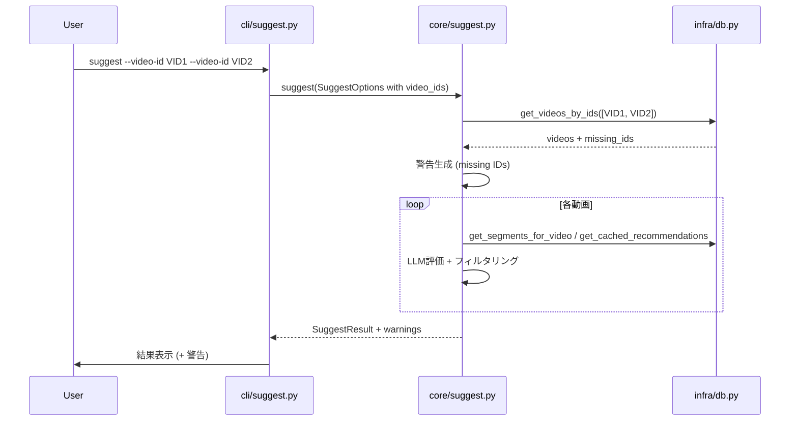
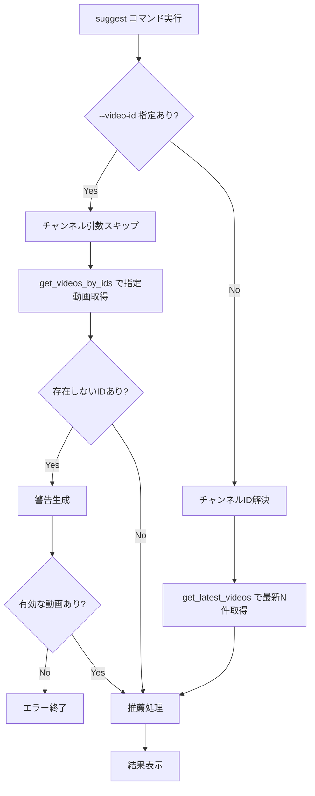

# Design Document

## Overview

**Purpose**: `suggest`コマンドに`--video-id`オプションを追加し、推薦対象を特定の動画IDに絞り込めるようにする。
**Users**: CLIユーザーが特定の動画のおすすめシーンだけを確認したいワークフローで使用する。
**Impact**: 既存の`suggest`コマンドにオプションを追加する拡張であり、既存動作に影響しない。

### Goals
- `search`コマンドと一貫した`--video-id`オプションのインターフェースを提供
- 後方互換性を維持（`--video-id`省略時は従来動作）
- `--video-id`指定時はチャンネル引数を不要にし、ユーザー体験を向上

### Non-Goals
- 動画IDのURL形式からの自動抽出（`clip`コマンドにはあるが`suggest`では対象外）
- 新しいDB検索インデックスの追加
- `suggest`コマンドの出力フォーマット変更

## Architecture

### Existing Architecture Analysis

現在の`suggest`コマンドは以下のフローで動作する:

1. CLI層（`cli/suggest.py`）: チャンネルID解決 → `SuggestService`呼び出し → 結果表示
2. コア層（`core/suggest.py`）: `db.get_latest_videos()` → 各動画のセグメント評価 → フィルタリング
3. インフラ層（`infra/db.py`）: `DatabaseClient`が動画・セグメント・推薦データのCRUDを提供

`search`コマンドには既に`--video-id`（`multiple=True`）が実装されており、`Database.validate_video_ids()`によるバリデーションパターンが確立されている。`suggest`は`DatabaseClient`を使用するため、同等のメソッドを追加する。

### Architecture Pattern & Boundary Map



**Architecture Integration**:
- Selected pattern: 既存の3層構成（CLI → コア → インフラ）を維持
- Existing patterns preserved: `search`コマンドの`--video-id`処理パターンを踏襲
- New components rationale: 新規コンポーネントなし。既存コンポーネントへのメソッド・フィールド追加のみ

### Technology Stack

| Layer | Choice / Version | Role in Feature | Notes |
|-------|------------------|-----------------|-------|
| CLI | click | `--video-id`オプション定義（`multiple=True`） | 既存パターン踏襲 |
| Core | Python 3.12+ | `SuggestService`に動画IDフィルタリングロジック追加 | |
| Data | SQLite（DatabaseClient） | `get_videos_by_ids`メソッド追加 | |

## System Flows

### --video-id指定時のフロー



## Requirements Traceability

| Requirement | Summary | Components | Interfaces | Flows |
|-------------|---------|------------|------------|-------|
| 1.1 | --video-id指定で対象絞り込み | CLI, SuggestService | SuggestOptions.video_ids | --video-id指定時フロー |
| 1.2 | 複数--video-id指定 | CLI | click option multiple=True | |
| 1.3 | 省略時は従来動作 | SuggestService | SuggestOptions.video_ids=None | 既存フロー |
| 1.4 | --video-idと--count同時指定 | SuggestService | video_ids優先ロジック | |
| 2.1 | 単一ID不在時のエラー | SuggestService, DatabaseClient | get_videos_by_ids | バリデーションフロー |
| 2.2 | 一部ID不在時の警告+続行 | SuggestService | SuggestResult.warnings | |
| 2.3 | 全ID不在時のエラー終了 | SuggestService, CLI | NoArchivesError | |
| 3.1 | 対象動画の進捗表示 | CLI | ステータスメッセージ | |
| 3.2 | JSON時はstderr出力 | CLI | _status関数（既存） | |
| 4.1 | --video-id + --tui連携 | CLI | 既存TUIフロー | |
| 4.2 | 全オプション組み合わせ | CLI | | |
| 5.1 | --video-id + --json出力 | CLI | RecommendationFormatter | |
| 5.2 | JSON構造維持 | — | SuggestResult（変更なし） | |

## Components and Interfaces

| Component | Domain/Layer | Intent | Req Coverage | Key Dependencies | Contracts |
|-----------|-------------|--------|--------------|------------------|-----------|
| CLI suggest | CLI | --video-idオプション受け取り・チャンネル解決スキップ | 1.1, 1.2, 3.1, 3.2, 4.1, 4.2, 5.1, 5.2 | SuggestService (P0) | — |
| SuggestOptions | Models | video_idsフィールド追加 | 1.1, 1.2, 1.3, 1.4 | — | State |
| SuggestService | Core | video_ids指定時の動画取得・バリデーション | 1.1, 1.3, 1.4, 2.1, 2.2, 2.3 | DatabaseClient (P0) | Service |
| SuggestResult | Models | 警告フィールド追加 | 2.2 | — | State |
| DatabaseClient | Infra | get_videos_by_idsメソッド追加 | 1.1, 2.1 | SQLite (P0) | Service |

### Models Layer

#### SuggestOptions

| Field | Detail |
|-------|--------|
| Intent | 推薦オプションに動画IDリストを追加 |
| Requirements | 1.1, 1.2, 1.3, 1.4 |

**Responsibilities & Constraints**
- `video_ids`フィールドを追加し、動画IDによるフィルタリングを表現
- `channel_id`をオプショナルに変更（`video_ids`指定時は不要）

**Contracts**: State [x]

##### State Management

```python
@dataclass
class SuggestOptions:
    channel_id: str | None = None
    count: int = 3
    threshold: int = 7
    video_ids: list[str] | None = None
```

- `video_ids`がNoneの場合: 従来動作（`channel_id`必須、`count`で最新N件取得）
- `video_ids`が指定された場合: `channel_id`と`count`は無視

#### SuggestResult

| Field | Detail |
|-------|--------|
| Intent | 推薦結果に警告リストを追加 |
| Requirements | 2.2 |

**Contracts**: State [x]

##### State Management

```python
@dataclass
class SuggestResult:
    videos: list[VideoWithRecommendations]
    total_candidates: int
    filtered_count: int
    warnings: list[str] = field(default_factory=list)
```

### Core Layer

#### SuggestService

| Field | Detail |
|-------|--------|
| Intent | video_ids指定時の動画取得ルーティングとバリデーション |
| Requirements | 1.1, 1.3, 1.4, 2.1, 2.2, 2.3 |

**Responsibilities & Constraints**
- `video_ids`指定時: `get_videos_by_ids`で動画を取得し、不在IDを警告に追加
- `video_ids`未指定時: 既存の`get_latest_videos`による最新N件取得
- 全IDが不在の場合は`NoArchivesError`を送出

**Dependencies**
- Outbound: DatabaseClient — 動画取得・バリデーション (P0)
- Outbound: LLMClientProtocol — セグメント評価 (P0)

**Contracts**: Service [x]

##### Service Interface

```python
class SuggestService:
    def suggest(self, options: SuggestOptions) -> SuggestResult:
        """推薦を実行する。

        video_ids指定時:
          - get_videos_by_idsで動画取得
          - 不在IDはwarningsに追加
          - 有効な動画がなければNoArchivesError
        video_ids未指定時:
          - channel_id必須チェック → channel_exists → get_latest_videos
        """
        ...
```

- Preconditions: `video_ids`または`channel_id`のいずれかが指定されていること
- Postconditions: `SuggestResult.warnings`に不在動画IDの警告が含まれる
- Invariants: `SuggestResult.videos`には有効な推薦のみ含まれる

**Implementation Notes**
- `_resolve_videos`プライベートメソッドを追加し、video_ids/channel_id分岐を集約
- 警告は`search`コマンドと同一フォーマット: `"動画ID '{vid}' はデータベースに存在しません"`

### Infra Layer

#### DatabaseClient

| Field | Detail |
|-------|--------|
| Intent | 動画IDリストによる動画情報取得 |
| Requirements | 1.1, 2.1 |

**Responsibilities & Constraints**
- `get_videos_by_ids`: 指定された動画IDリストに対応する動画情報を返す
- 返り値は`get_latest_videos`と同じ`list[dict[str, str]]`形式
- 存在しないIDを判別可能にする（返却結果とリクエストの差分で判定）

**Dependencies**
- External: SQLite — 動画テーブルクエリ (P0)

**Contracts**: Service [x]

##### Service Interface

```python
class DatabaseClient:
    def get_videos_by_ids(self, video_ids: list[str]) -> list[dict[str, str]]:
        """指定された動画IDの情報を取得する。

        Returns:
            video_id, title, published_at, duration_secondsを含むdictリスト。
            存在しないIDは結果に含まれない。
        """
        ...
```

- Preconditions: `video_ids`が空でないこと
- Postconditions: 返却リストには既存の動画のみ含まれる
- Invariants: 返り値の各dictは`get_latest_videos`と同一のキー構造

### CLI Layer

#### suggest コマンド（変更）

| Field | Detail |
|-------|--------|
| Intent | --video-idオプションの追加とチャンネル引数の条件付きスキップ |
| Requirements | 1.1, 1.2, 3.1, 3.2, 4.1, 4.2, 5.1, 5.2 |

**Implementation Notes**
- `@click.option("--video-id", multiple=True, default=())`を追加（`search`と同じシグネチャ）
- `video_id`指定時は`resolve_channel_id`をスキップ（チャンネル引数が未指定でもエラーにしない）
- `SuggestResult.warnings`をstderrに出力（`_status`関数を使用）
- 進捗メッセージ表示は既存の動画一覧表示ロジックをそのまま活用（`video_ids`指定時はサービスから返された動画情報で表示）

## Data Models

### Domain Model

変更は既存モデルへのフィールド追加のみ:

- `SuggestOptions`: `video_ids: list[str] | None` 追加、`channel_id`を`str | None`に変更
- `SuggestResult`: `warnings: list[str]` 追加

新規エンティティやテーブルの追加は不要。

## Error Handling

### Error Categories and Responses

**User Errors**:
- 全指定IDが不在 → `NoArchivesError`（既存例外を再利用）、CLIでメッセージ表示+終了
- 一部IDが不在 → `SuggestResult.warnings`に警告追加、有効IDのみで処理続行

**Business Logic Errors**:
- `video_ids`も`channel_id`も未指定 → CLIレベルでバリデーション（clickのrequired制御）

## Testing Strategy

### Unit Tests
- `SuggestService.suggest()`: video_ids指定時に`get_videos_by_ids`が呼ばれること
- `SuggestService.suggest()`: video_ids未指定時に従来の`get_latest_videos`が呼ばれること
- `SuggestService.suggest()`: 一部ID不在時にwarningsが設定されること
- `SuggestService.suggest()`: 全ID不在時に`NoArchivesError`が送出されること
- `DatabaseClient.get_videos_by_ids()`: 存在するIDのみが返却されること

### Integration Tests
- CLI: `--video-id`オプションが正しくパースされること
- CLI: `--video-id`指定時にチャンネル引数なしで動作すること
- CLI: `--video-id` + `--json`で正しいJSON出力が得られること
- CLI: `--video-id` + `--tui`でTUIフローが起動すること
