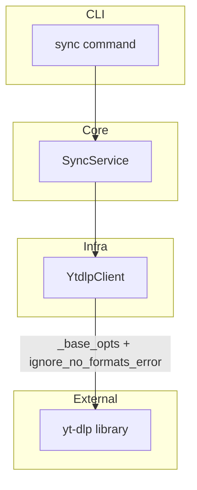
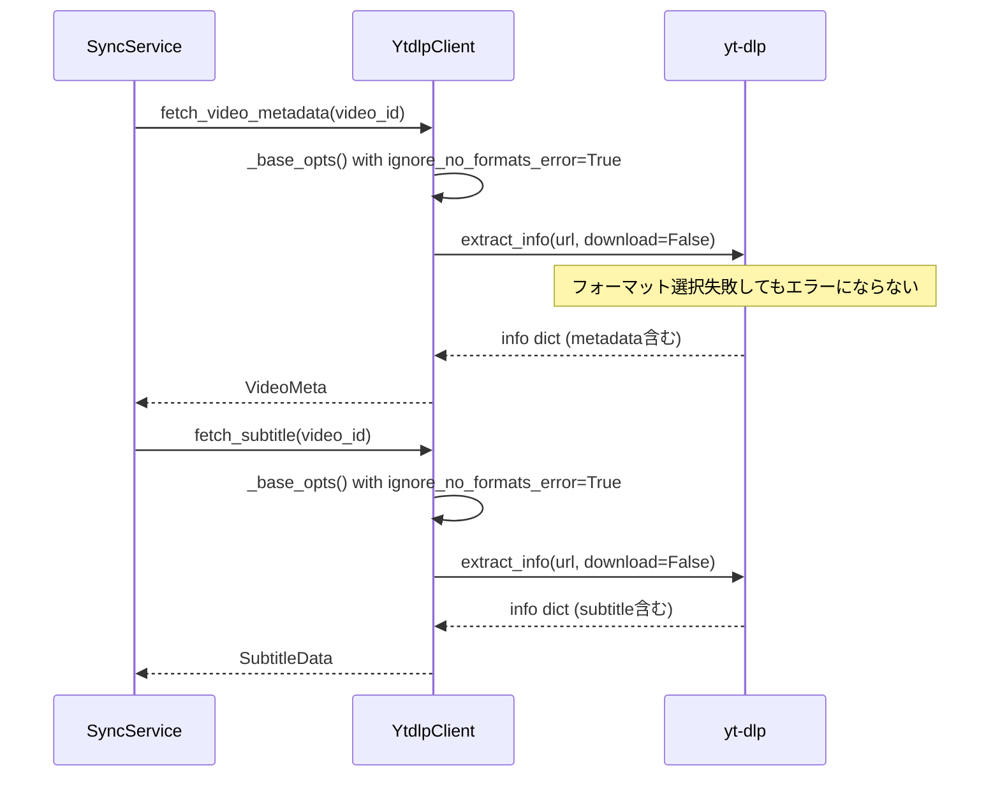

# Design Document: sync-format-unavailable

## Overview

**Purpose**: `sync`コマンド実行時の "Requested format is not available" エラーを解消し、動画フォーマットが利用不可でも字幕・メタデータの取得を正常に完了させる。

**Users**: kirinuki CLIの全ユーザーが`sync`コマンドで恩恵を受ける。

**Impact**: `YtdlpClient._base_opts()`に`ignore_no_formats_error`オプションを追加する最小限の変更。

### Goals
- フォーマット不可の動画でも字幕・メタデータを正常に取得できるようにする
- 動画ダウンロード（clip）のフォーマット検証動作を維持する
- 既存のエラーハンドリング構造を変更しない

### Non-Goals
- yt-dlpのフォーマット選択ロジック自体の変更
- 新しいエラー型の追加やエラー分類体系の再設計
- `download_video()`の動作変更

## Architecture

### Existing Architecture Analysis

現在の`YtdlpClient`は2つのオプション構築パターンを持つ：

1. **`_base_opts()`ベース**（情報抽出用）: `fetch_video_metadata()`, `fetch_subtitle()`, `list_channel_video_ids()`, `resolve_channel_name()`が使用。`skip_download=True`を基本とする
2. **独自opts構築**（ダウンロード用）: `download_video()`が使用。明示的な`format`指定と`download=True`

この分離は既に確立されており、今回の修正はこのパターンを活用する。

### Architecture Pattern & Boundary Map



**Architecture Integration**:
- Selected pattern: 既存のレイヤー分離型アーキテクチャを維持
- 変更箇所: `YtdlpClient._base_opts()`のみ（infra層）
- 既存パターン保持: CLI→Core→Infraの依存方向、エラーハンドリングチェーン
- Steering compliance: インフラ層の内部変更のみで、コア層・CLI層への変更不要

### Technology Stack

| Layer | Choice / Version | Role in Feature | Notes |
|-------|------------------|-----------------|-------|
| Infra | yt-dlp（Python library） | `ignore_no_formats_error`オプションの利用 | 公式サポートオプション |

## System Flows



`download_video()`は`_base_opts()`を使用しないため、フォーマットエラーは従来通りraiseされる。

## Requirements Traceability

| Requirement | Summary | Components | Interfaces | Flows |
|-------------|---------|------------|------------|-------|
| 1.1 | fetch_video_metadata時のフォーマットエラー抑制 | YtdlpClient._base_opts | ignore_no_formats_error | sync flow |
| 1.2 | fetch_subtitle時のフォーマットエラー抑制 | YtdlpClient._base_opts | ignore_no_formats_error | sync flow |
| 1.3 | skip_download時のフォーマット非依存 | YtdlpClient._base_opts | ignore_no_formats_error | sync flow |
| 2.1 | 字幕取得成功時のunavailable非記録 | YtdlpClient._base_opts | — | sync flow |
| 2.2 | 真に利用不可の場合の記録 | 既存エラーハンドリング（変更なし） | — | sync flow |
| 3.1 | download_videoのフォーマット検証維持 | YtdlpClient.download_video | 独自opts | — |
| 3.2 | _base_optsの変更がdownload_videoに非影響 | YtdlpClient.download_video | 独自opts | — |

## Components and Interfaces

| Component | Domain/Layer | Intent | Req Coverage | Key Dependencies | Contracts |
|-----------|--------------|--------|--------------|-----------------|-----------|
| YtdlpClient._base_opts | Infra | 情報抽出用ベースオプション構築 | 1.1, 1.2, 1.3, 2.1 | yt-dlp (P0) | Service |

### Infra層

#### YtdlpClient._base_opts

| Field | Detail |
|-------|--------|
| Intent | 情報抽出メソッド用のyt-dlpベースオプション辞書を構築する |
| Requirements | 1.1, 1.2, 1.3, 2.1, 3.2 |

**Responsibilities & Constraints**
- 情報抽出（メタデータ・字幕・チャンネル情報）に必要なyt-dlpオプションを一元管理
- `skip_download=True`と`ignore_no_formats_error=True`を常に含む
- `download_video()`からは使用されない（設計上の不変条件）

**Dependencies**
- External: yt-dlp — `ignore_no_formats_error`オプション (P0)
- Inbound: fetch_video_metadata, fetch_subtitle, list_channel_video_ids, resolve_channel_name — ベースオプション取得 (P0)

**Contracts**: Service [x]

##### Service Interface

```python
def _base_opts(self) -> dict:
    """情報抽出用ベースオプションを返す。

    Returns:
        dict: 以下のキーを含むオプション辞書
            - quiet: True
            - no_warnings: True
            - skip_download: True
            - ignore_no_formats_error: True
            - cookiefile: str (cookie存在時のみ)

    Postconditions:
        - 返却辞書は常にskip_download=Trueを含む
        - 返却辞書は常にignore_no_formats_error=Trueを含む

    Invariants:
        - download_video()はこのメソッドを使用しない
    """
```

**Implementation Notes**
- 変更: `"ignore_no_formats_error": True`をopts辞書に追加する1行のみ
- download_videoとの分離はコメントで明記し、将来のリファクタリング時の注意喚起とする

## Error Handling

### Error Strategy

既存のエラーハンドリング構造を変更しない。`ignore_no_formats_error=True`により、フォーマット不可エラー自体が発生しなくなる。

**変更前**: フォーマット不可 → `DownloadError` → `VideoUnavailableError` → unavailableとしてDB記録
**変更後**: フォーマット不可 → yt-dlpが自動スキップ → メタデータ・字幕の正常抽出

真に利用不可な動画（削除・非公開等）は従来通り`DownloadError` → `VideoUnavailableError`としてハンドリングされる。

## Testing Strategy

### Unit Tests
1. `_base_opts()`の返却辞書に`ignore_no_formats_error: True`が含まれることを検証
2. `_base_opts()`の返却辞書に`skip_download: True`が含まれることを検証
3. `download_video()`のopts辞書に`ignore_no_formats_error`が含まれ**ない**ことを検証

### Integration Tests
1. フォーマット不可の動画に対して`fetch_video_metadata()`がVideoMetaを正常に返すことを検証（yt-dlpモック使用）
2. フォーマット不可の動画に対して`fetch_subtitle()`がSubtitleDataを正常に返すことを検証（yt-dlpモック使用）
3. 真に利用不可な動画に対して`VideoUnavailableError`が引き続きraiseされることを検証
