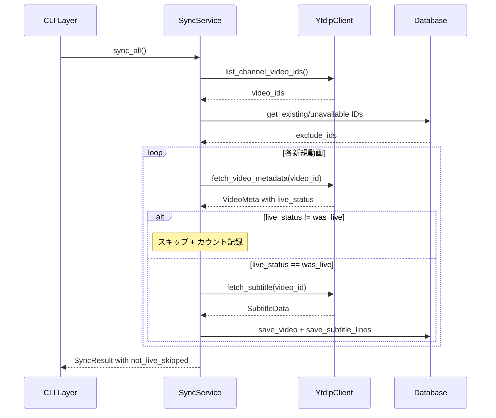

# Design Document: sync-live-archive-filter

## Overview

**Purpose**: `kirinuki sync` コマンドの同期対象を、ライブ配信アーカイブ（`was_live`）のみに限定する。通常のアップロード動画やプレミア公開がsync対象に含まれる現行の問題を解消する。

**Users**: kirinuki CLIユーザーが `sync` コマンドを実行する際、ライブ配信アーカイブのみが処理される。

**Impact**: 既存のsyncパイプラインに `live_status` による判定ロジックを追加。既にsync済みの動画データには影響しない。

### Goals
- yt-dlpの `live_status` フィールドを使用し、ライブ配信アーカイブ（`was_live`）のみをsync対象とする
- 非ライブ動画のスキップを結果サマリーに表示する
- 既存のAPI呼び出しに追加のオーバーヘッドを発生させない

### Non-Goals
- 既にsync済みの非ライブ動画データの削除やクリーンアップ
- `/streams` タブを使用したチャンネルURL最適化
- flat extraction時の `live_status` 判定
- `live_status` が `None` の動画の強制的な除外

## Architecture

### Existing Architecture Analysis

現行のsyncパイプラインは以下の流れで動作する:

1. `list_channel_video_ids()` — チャンネルの `/videos` タブからflat extractionで全動画IDを取得
2. DB差分比較 — 既存sync済み・unavailable記録済みのIDを除外
3. `_sync_single_video()` — 個別動画の処理:
   - `fetch_video_metadata()` — メタデータ取得（`extract_info`）
   - `fetch_subtitle()` — 字幕取得
   - DB保存 + セグメンテーション

**問題**: ステップ1で全動画（通常動画含む）を取得しており、ライブ配信アーカイブかどうかの判定がない。

### Architecture Pattern & Boundary Map



**Architecture Integration**:
- Selected pattern: 既存パイプラインへの判定ステップ挿入
- Existing patterns preserved: CLI→Core→Infra の3層構造、差分sync、SkipReasonパターン
- New components rationale: 新規コンポーネントなし。既存のデータクラスとenumにフィールドを追加

### Technology Stack

| Layer | Choice / Version | Role in Feature | Notes |
|-------|------------------|-----------------|-------|
| CLI | click | スキップ件数のサマリー表示 | 既存ラベルマップに追加 |
| Services | SyncService | `live_status` 判定ロジック | `_sync_single_video()` 拡張 |
| Infra | yt-dlp (Python API) | `live_status` フィールド取得 | `extract_info` の `info` dictから読み取り |
| Models | Pydantic / dataclass | `VideoMeta`, `SkipReason`, `SyncResult` 拡張 | フィールド追加 |

## System Flows

上記のシーケンス図を参照。追加フローは `fetch_video_metadata()` 直後の `live_status` 判定のみ。

## Requirements Traceability

| Requirement | Summary | Components | Interfaces | Flows |
|-------------|---------|------------|------------|-------|
| 1.1 | メタデータからライブ配信アーカイブを判定 | SyncService, YtdlpClient | `fetch_video_metadata()` | sync_single_video |
| 1.2 | `live_status` フィールドで識別 | YtdlpClient, VideoMeta | `VideoMeta.live_status` | - |
| 1.3 | `was_live` はsync対象 | SyncService | - | sync_single_video |
| 1.4 | `was_live` 以外は除外 | SyncService | - | sync_single_video |
| 2.1 | スキップ理由の記録 | SyncService, SkipReason | `SkipReason.NOT_LIVE_ARCHIVE` | sync_single_video |
| 2.2 | スキップ件数のサマリー表示 | CLI (sync command), SyncResult | `SyncResult.not_live_skipped` | sync完了時 |
| 2.3 | スキップのログ記録 | SyncService | `logger.info()` | sync_single_video |
| 3.1 | 字幕取得前にフィルタリング | SyncService | - | sync_single_video |
| 3.2 | 最小限のAPI呼び出し | YtdlpClient | `fetch_video_metadata()` | sync_single_video |

## Components and Interfaces

| Component | Domain/Layer | Intent | Req Coverage | Key Dependencies | Contracts |
|-----------|-------------|--------|--------------|------------------|-----------|
| VideoMeta | Infra (dataclass) | メタデータに `live_status` 追加 | 1.2 | yt-dlp info dict (P0) | - |
| YtdlpClient | Infra | `live_status` を `VideoMeta` に含める | 1.1, 1.2, 3.2 | yt-dlp (P0) | Service |
| SkipReason | Models (enum) | 非ライブスキップ理由の定義 | 2.1 | - | - |
| SyncResult | Models (Pydantic) | 非ライブスキップ件数の集計 | 2.2 | - | - |
| SyncService | Core | `live_status` 判定とスキップ処理 | 1.1, 1.3, 1.4, 2.1, 2.3, 3.1 | YtdlpClient (P0), Database (P0) | Service |
| CLI sync | CLI | スキップサマリー表示 | 2.2 | SyncService (P0) | - |

### Infra Layer

#### VideoMeta

| Field | Detail |
|-------|--------|
| Intent | yt-dlpメタデータに `live_status` フィールドを追加 |
| Requirements | 1.2 |

**Responsibilities & Constraints**
- `live_status` フィールドを `str | None` 型で保持
- yt-dlpの `info` dictから `live_status` キーを読み取り

##### Service Interface
```python
@dataclass
class VideoMeta:
    video_id: str
    title: str
    published_at: datetime | None
    duration_seconds: int
    live_status: str | None  # 追加: "was_live", "not_live", etc.
```

#### YtdlpClient.fetch_video_metadata

| Field | Detail |
|-------|--------|
| Intent | `extract_info` の結果から `live_status` を読み取り `VideoMeta` に含める |
| Requirements | 1.1, 1.2, 3.2 |

**Implementation Notes**
- 既存の `extract_info()` 呼び出しの結果から `info.get("live_status")` を追加で読み取る
- 追加のAPI呼び出しは不要
- `live_status` が存在しない場合は `None` を設定

### Models Layer

#### SkipReason

| Field | Detail |
|-------|--------|
| Intent | 非ライブ動画のスキップ理由を定義 |
| Requirements | 2.1 |

```python
class SkipReason(str, Enum):
    # ... 既存値 ...
    NOT_LIVE_ARCHIVE = "not_live_archive"  # 追加
```

#### SyncResult

| Field | Detail |
|-------|--------|
| Intent | 非ライブスキップ件数を集計 |
| Requirements | 2.2 |

```python
class SyncResult(BaseModel):
    # ... 既存フィールド ...
    not_live_skipped: int = 0  # 追加
```

### Core Layer

#### SyncService._sync_single_video

| Field | Detail |
|-------|--------|
| Intent | メタデータ取得後に `live_status` を判定し、非ライブ動画をスキップ |
| Requirements | 1.1, 1.3, 1.4, 2.1, 2.3, 3.1 |

**Responsibilities & Constraints**
- `fetch_video_metadata()` 後、`fetch_subtitle()` 前に `live_status` を判定
- `live_status` が `"was_live"` の場合のみ字幕取得・保存に進む
- `live_status` が `None` の場合は安全側に倒してsync対象とする（スキップしない）
- スキップ時はログ出力（動画ID、タイトル、`live_status` 値を含む）
- `result.not_live_skipped` をインクリメント
- `result.skip_reasons` に `SkipReason.NOT_LIVE_ARCHIVE` を記録

**Preconditions**: `video_id` が有効なYouTube動画ID
**Postconditions**: 非ライブ動画は字幕取得されず、スキップカウントが更新される

### CLI Layer

#### sync コマンド

| Field | Detail |
|-------|--------|
| Intent | 非ライブスキップ件数をサマリーに表示 |
| Requirements | 2.2 |

**Implementation Notes**
- `reason_labels` マップに `"not_live_archive": "配信アーカイブ以外"` を追加
- `SyncResult.not_live_skipped` を結果サマリーに含める

## Data Models

### Domain Model

**変更対象のみ記載:**

- `VideoMeta` (dataclass): `live_status: str | None` フィールド追加
- `SkipReason` (enum): `NOT_LIVE_ARCHIVE = "not_live_archive"` 値追加
- `SyncResult` (Pydantic model): `not_live_skipped: int = 0` フィールド追加

**DBスキーマへの変更は不要** — `live_status` はフィルタリング判定にのみ使用し、永続化しない。

## Error Handling

### Error Strategy

- **`live_status` が `None`**: yt-dlpが `live_status` を返さない場合、スキップせずにsync対象として処理する（安全側）。ログにwarningを出力
- **既存エラーハンドリング**: `AuthenticationRequiredError`, `VideoUnavailableError` のハンドリングは変更なし。`live_status` 判定はこれらの例外ハンドリングの内側で実行

## Testing Strategy

### Unit Tests
- `YtdlpClient.fetch_video_metadata()`: `live_status` フィールドが `VideoMeta` に正しく設定されることを検証
- `SyncService._sync_single_video()`: `live_status == "was_live"` の場合にsync処理が進むことを検証
- `SyncService._sync_single_video()`: `live_status == "not_live"` の場合にスキップされ、カウントが更新されることを検証
- `SyncService._sync_single_video()`: `live_status is None` の場合にsync対象として処理されることを検証

### Integration Tests
- `sync_channel()`: ライブ配信アーカイブと通常動画が混在するチャンネルで、ライブアーカイブのみがsyncされることを検証
- `SyncResult`: `not_live_skipped` カウントと `skip_reasons` に `NOT_LIVE_ARCHIVE` が正しく集計されることを検証
- CLI sync出力: 非ライブスキップ件数がサマリーに表示されることを検証
