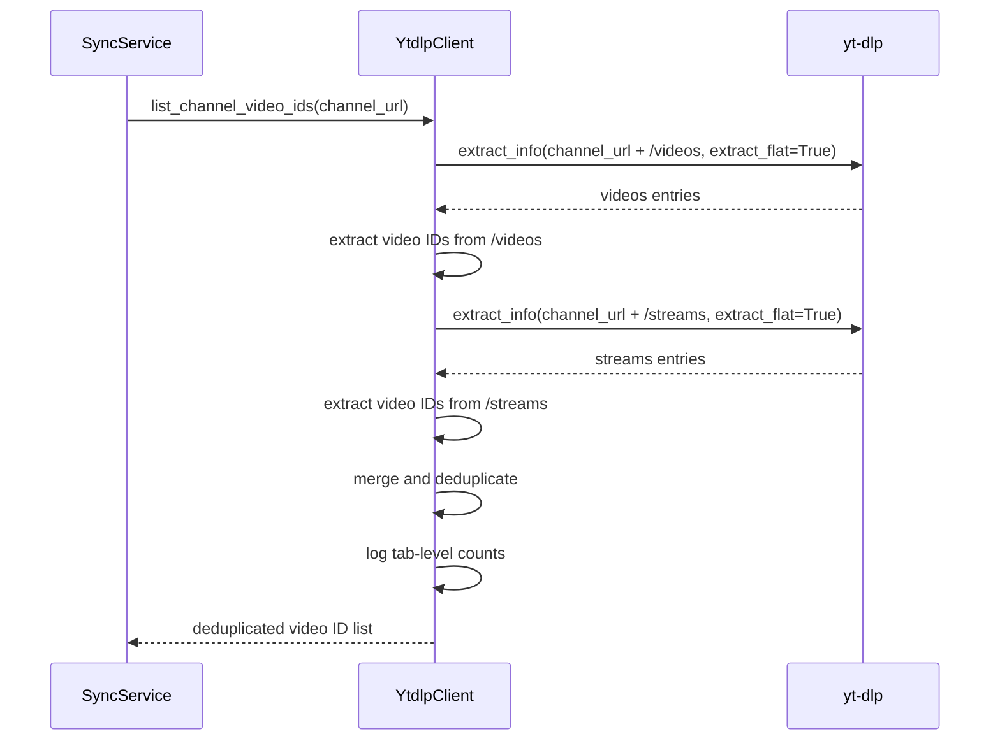

# Design Document

## Overview

**Purpose**: ライブ配信アーカイブが `/streams` タブにあるチャンネルで `kirinuki sync` が0件になる問題を解決する。`YtdlpClient.list_channel_video_ids()` を拡張し、`/videos` と `/streams` の両タブから動画IDを取得・マージする。

**Users**: kirinukiユーザーが、ライブ配信主体のYouTubeチャンネルのアーカイブを漏れなく同期できるようになる。

**Impact**: `YtdlpClient.list_channel_video_ids()` の内部実装を変更。外部インターフェースは維持。

### Goals
- `/videos` と `/streams` の両タブから動画IDを取得し、ライブアーカイブの取りこぼしを解消する
- 片方のタブ取得失敗時でも、もう片方の結果で同期を継続する
- タブごとの検出件数をログに出力し、問題診断を容易にする

### Non-Goals
- `/shorts` タブからの取得（ライブアーカイブの対象外）
- チャンネルURLの正規化ロジックの全面的見直し
- SyncServiceのインターフェース変更

## Architecture

### Existing Architecture Analysis

現在のフロー:
1. `SyncService.sync_channel()` → `YtdlpClient.list_channel_video_ids(channel_url)` を呼び出し
2. `list_channel_video_ids()` はURLに `/videos` を付加して `extract_flat` で動画ID一覧を取得
3. SyncServiceは返されたID一覧からDB既存分を除外し、新規分を逐次処理

変更対象は `list_channel_video_ids()` の内部実装のみ。SyncServiceとの契約（`channel_url` を受け取り `list[str]` を返す）は維持。

### Architecture Pattern & Boundary Map

**Architecture Integration**:
- Selected pattern: 既存のラッパーパターンを維持（YtdlpClientがyt-dlpとの境界）
- Existing patterns preserved: SyncService → YtdlpClient の呼び出し構造はそのまま
- New components rationale: 新規コンポーネント追加なし。既存メソッドの内部拡張のみ

### Technology Stack

| Layer | Choice / Version | Role in Feature | Notes |
|-------|------------------|-----------------|-------|
| Backend / Services | Python 3.12+ | SyncService, YtdlpClient | 変更なし |
| External | yt-dlp (extract_flat) | チャンネル動画ID一覧取得 | `/streams` パスも同様に動作 |

## System Flows



フォールバック: 各 `extract_info` 呼び出しは独立した try-except で囲む。片方が失敗しても、もう片方の結果で処理を継続。両方失敗した場合は空リストを返す。

## Requirements Traceability

| Requirement | Summary | Components | Interfaces | Flows |
|-------------|---------|------------|------------|-------|
| 1.1 | /videos と /streams 両方から取得 | YtdlpClient | list_channel_video_ids | sync flow |
| 1.2 | 重複排除 | YtdlpClient | list_channel_video_ids | merge step |
| 1.3 | /streams 失敗時フォールバック | YtdlpClient | list_channel_video_ids | error handling |
| 1.4 | /videos 失敗時フォールバック | YtdlpClient | list_channel_video_ids | error handling |
| 2.1 | サマリー表示維持 | SyncService, CLI | sync_all, sync command | 変更なし |
| 2.2 | タブ別検出件数のログ | YtdlpClient | list_channel_video_ids | log step |
| 3.1 | live_statusフィルタ維持 | SyncService | _sync_single_video | 変更なし |
| 3.2 | already_synced維持 | SyncService | sync_channel | 変更なし |
| 3.3 | unavailable除外維持 | SyncService | sync_channel | 変更なし |
| 3.4 | /streams 不在時の正常動作 | YtdlpClient | list_channel_video_ids | fallback |

## Components and Interfaces

| Component | Domain/Layer | Intent | Req Coverage | Key Dependencies | Contracts |
|-----------|--------------|--------|--------------|------------------|-----------|
| YtdlpClient | Infra | 動画ID一覧取得を /videos + /streams に拡張 | 1.1, 1.2, 1.3, 1.4, 2.2, 3.4 | yt-dlp (P0) | Service |
| SyncService | Core | 変更なし（後方互換性確認のみ） | 2.1, 3.1, 3.2, 3.3 | YtdlpClient (P0) | - |

### Infra Layer

#### YtdlpClient.list_channel_video_ids

| Field | Detail |
|-------|--------|
| Intent | チャンネルURLから /videos と /streams の両タブの動画IDを取得・マージして返す |
| Requirements | 1.1, 1.2, 1.3, 1.4, 2.2, 3.4 |

**Responsibilities & Constraints**
- `/videos` と `/streams` の2つのタブURLに対して `extract_flat` を実行
- 両方の結果を重複排除してマージ（順序は `/videos` → `/streams` の出現順）
- 各タブの取得は独立して失敗可能（他方に影響しない）
- タブごとの検出件数を `logger.info` で出力

**Dependencies**
- External: yt-dlp `extract_info(extract_flat=True)` — 動画ID一覧取得 (P0)

**Contracts**: Service [x]

##### Service Interface

```python
class YtdlpClient:
    def list_channel_video_ids(self, channel_url: str) -> list[str]:
        """チャンネルの /videos と /streams から動画IDを取得し、重複排除して返す。

        Args:
            channel_url: チャンネルのベースURL

        Returns:
            重複排除された動画IDのリスト。片方のタブが失敗しても、もう片方の結果を返す。
            両方失敗した場合は空リスト。
        """
        ...
```

- Preconditions: `channel_url` が有効なYouTubeチャンネルURL
- Postconditions: 返却リストに重複なし。各要素は11文字のYouTube動画ID
- Invariants: メソッドのシグネチャ・戻り値型は変更なし

**Implementation Notes**
- 内部ヘルパー `_fetch_tab_video_ids(tab_url: str) -> list[str]` を導入し、単一タブからのID抽出ロジックを共通化
- 各タブの `extract_info` 呼び出しを独立した try-except で囲む。例外時は空リストを返しログ出力
- URLの正規化: ベースURLから末尾のタブパス（`/videos`, `/streams` 等）を除去し、`/videos` と `/streams` を順に付加
- ログ出力例: `"Channel videos: /videos=%d, /streams=%d, merged=%d"` (INFOレベル)

## Error Handling

### Error Strategy

| エラーシナリオ | 対応 | 要件 |
|--------------|------|------|
| /videos タブの extract_info 失敗 | ログ記録、/streams の結果のみ使用 | 1.4 |
| /streams タブの extract_info 失敗 | ログ記録、/videos の結果のみ使用 | 1.3 |
| 両タブとも失敗 | ログ記録、空リスト返却（SyncServiceは0件で完了） | 1.3, 1.4 |
| /streams タブが存在しない | yt-dlpが空entriesを返すか例外 → フォールバック | 3.4 |

例外は `list_channel_video_ids` 内部で捕捉し、呼び出し元（SyncService）には伝播しない。`logger.warning` でタブ別の失敗を記録する。

## Testing Strategy

### Unit Tests（YtdlpClient）
1. **両タブ成功**: `/videos` と `/streams` からIDが取得され、マージ・重複排除される
2. **片方のみ成功（/videos失敗）**: `/streams` の結果のみ返却
3. **片方のみ成功（/streams失敗）**: `/videos` の結果のみ返却
4. **両タブ失敗**: 空リスト返却
5. **重複IDのマージ**: 両タブに同一IDがある場合、1つだけ返却
6. **ログ出力**: タブごとの件数がINFOレベルでログ出力される

### Unit Tests（SyncService）
7. **既存テストの回帰確認**: `list_channel_video_ids` のモック戻り値は `list[str]` のままで既存テスト全てパス
