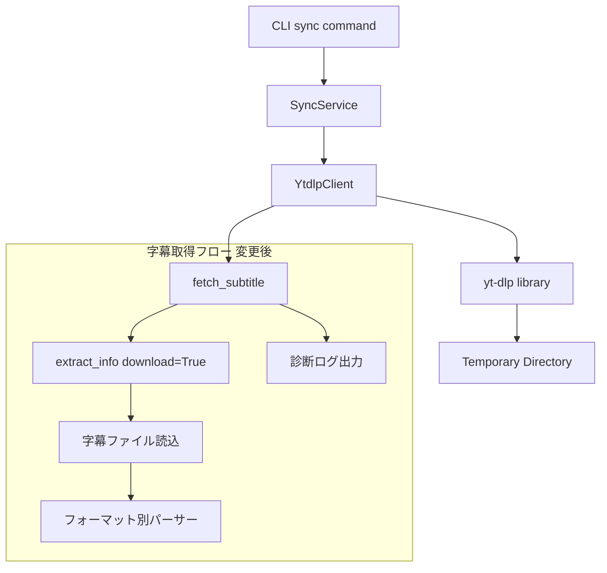
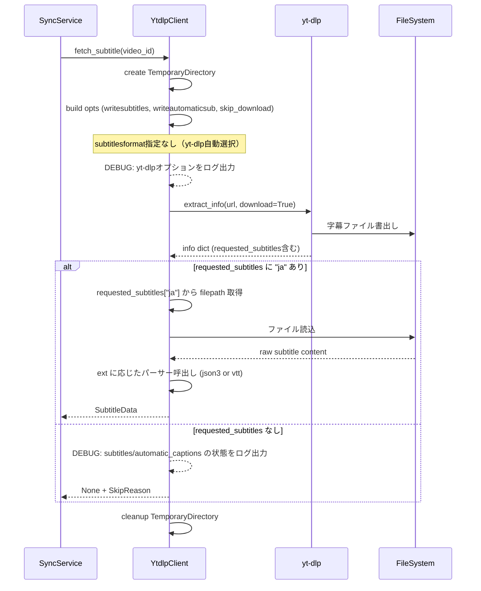

# Design Document: sync-no-subtitle-data

## Overview

**Purpose**: `kirinuki sync`コマンドで全動画の字幕が取得できない問題を修正し、字幕取得の信頼性を大幅に向上させる。

**Users**: kirinukiユーザーが字幕同期を実行する際に、自動生成字幕・手動字幕の両方を確実に取得できるようにする。

**Impact**: `YtdlpClient.fetch_subtitle()`の字幕データ取得方式を根本的に変更し、診断ログ・フォーマットフォールバック・スキップ理由の可視化を追加する。

### Goals

- `extract_info(download=False)`で`data`フィールドが空となる根本原因を解消する
- 複数字幕フォーマット（json3, vtt）への対応でフォーマット起因のスキップを防止する
- 診断ログにより字幕取得失敗の原因を迅速に特定可能にする
- スキップ理由のカテゴリ別表示でユーザーに適切な情報を提供する

### Non-Goals

- 字幕言語のフォールバック（Requirement 4）は本設計のスコープ外とし、将来対応とする
- `youtube-transcript-api`等の代替ライブラリへの移行
- 字幕パースロジックの最適化やパフォーマンスチューニング
- CLIの`--verbose`フラグの新規追加（既存ログレベルで対応）

## Architecture

### Existing Architecture Analysis

- **CLI層**（`cli/main.py`）: `sync`コマンドが`SyncService.sync_all()`を呼び出し、`SyncResult`を表示
- **コア層**（`core/sync_service.py`）: `_sync_single_video()`が`YtdlpClient.fetch_subtitle()`を呼び、`None`ならスキップ
- **インフラ層**（`infra/ytdlp_client.py`）: `fetch_subtitle()`が`extract_info(download=False)`で情報取得後、`requested_subtitles["ja"]["data"]`から字幕データを読む
- **問題の根本原因**: `extract_info(download=False)`では`data`フィールドが充填されない。URLのみが返される

### Architecture Pattern & Boundary Map



**Architecture Integration**:
- Selected pattern: 既存のアダプターパターンを維持。`YtdlpClient`内の`fetch_subtitle()`のみ変更
- Existing patterns preserved: CLI→コア→インフラの3層構造、エラーハンドリングパターン
- New components rationale: VTTパーサーの追加（json3以外のフォーマット対応）、`SkipReason`列挙型（スキップ理由の構造化）
- Steering compliance: インフラ層内の変更に閉じ、コア層への影響を最小化

### Technology Stack

| Layer | Choice / Version | Role in Feature | Notes |
|-------|------------------|-----------------|-------|
| CLI | click（既存） | スキップ理由の内訳表示 | 変更軽微 |
| Backend / Services | SyncService（既存） | 診断ログ出力、SkipReason集計 | 軽微な拡張 |
| Infrastructure | YtdlpClient（既存） | 字幕取得方式変更の主要対象 | `download=True`への変更 |
| Infrastructure | tempfile（標準ライブラリ） | 字幕ファイルの一時保存 | 新規利用 |

## System Flows

### 字幕取得フロー（変更後）



## Requirements Traceability

| Requirement | Summary | Components | Interfaces | Flows |
|-------------|---------|------------|------------|-------|
| 1.1 | subtitles/automatic_captionsの有無をDEBUGログ | YtdlpClient, SyncService | fetch_subtitle | 字幕取得フロー |
| 1.2 | yt-dlpオプションをDEBUGログ | YtdlpClient | fetch_subtitle | 字幕取得フロー |
| 1.3 | 利用可能な字幕言語・フォーマットをDEBUGログ | YtdlpClient | fetch_subtitle | 字幕取得フロー |
| 2.1 | json3不可時の代替フォーマット取得 | YtdlpClient | fetch_subtitle, _parse_vtt | 字幕取得フロー |
| 2.2 | 代替フォーマットからのSubtitleDataパース | YtdlpClient | _parse_vtt | — |
| 2.3 | フォーマットフォールバック順序の設定可能性 | YtdlpClient | fetch_subtitle | — |
| 3.1 | 手動字幕なし時の自動生成字幕フォールバック | YtdlpClient | fetch_subtitle | 字幕取得フロー |
| 3.2 | writeautomaticsubによるrequested_subtitles反映検証 | YtdlpClient | fetch_subtitle | 字幕取得フロー |
| 3.3 | 字幕なし vs 取得失敗の区別ログ | YtdlpClient | fetch_subtitle, SkipReason | 字幕取得フロー |
| 5.1 | スキップ理由別内訳表示 | CLI, SyncResult | sync command output | — |
| 5.2 | verbose時の個別スキップ理由表示 | CLI, SyncService | sync command output | — |
| 5.3 | SyncResultにスキップ理由別カウント | SyncResult | — | — |

## Components and Interfaces

| Component | Domain/Layer | Intent | Req Coverage | Key Dependencies | Contracts |
|-----------|--------------|--------|--------------|------------------|-----------|
| YtdlpClient.fetch_subtitle | Infra | 字幕データ取得（ファイル書出し方式に変更） | 1.1-1.3, 2.1-2.3, 3.1-3.3 | yt-dlp (P0), tempfile (P0) | Service |
| YtdlpClient._parse_vtt | Infra | VTTフォーマットのパース | 2.2 | なし | — |
| SkipReason | Models | スキップ理由の列挙型 | 3.3, 5.1-5.3 | なし | — |
| SyncResult | Models | スキップ理由別カウント追加 | 5.3 | SkipReason (P0) | State |
| SyncService._sync_single_video | Core | スキップ理由の記録・ログ | 1.1, 3.3, 5.2 | YtdlpClient (P0) | — |
| CLI sync output | CLI | スキップ理由別内訳表示 | 5.1, 5.2 | SyncResult (P0) | — |

### Infra層

#### YtdlpClient.fetch_subtitle（変更）

| Field | Detail |
|-------|--------|
| Intent | yt-dlpのファイル書出し機能を活用して字幕データを確実に取得する |
| Requirements | 1.1, 1.2, 1.3, 2.1, 2.2, 2.3, 3.1, 3.2, 3.3 |

**Responsibilities & Constraints**
- `extract_info(url, download=True)` + `skip_download=True`で字幕ファイルのみ取得
- `subtitlesformat`オプションを削除し、yt-dlpの自動フォーマット選択に委ねる
- 一時ディレクトリに書き出された字幕ファイルを読み込み、拡張子に応じてパーサーを呼び分ける
- `requested_subtitles`が空の場合、`subtitles`/`automatic_captions`の状態をDEBUGログに出力

**Dependencies**
- External: yt-dlp — 字幕ファイルの書出し (P0)
- External: tempfile — 一時ディレクトリ管理 (P0)

**Contracts**: Service [x]

##### Service Interface

```python
class YtdlpClient:
    def fetch_subtitle(self, video_id: str) -> tuple[SubtitleData | None, SkipReason | None]:
        """字幕データを取得する。

        Returns:
            tuple[SubtitleData | None, SkipReason | None]:
                - 字幕が取得できた場合: (SubtitleData, None)
                - 字幕が取得できなかった場合: (None, SkipReason)
        """
        ...

    def _parse_vtt(self, raw_data: str) -> list[SubtitleEntry]:
        """VTTフォーマットの字幕をパースする。"""
        ...

    def _parse_json3(self, raw_data: str) -> list[SubtitleEntry]:
        """JSON3フォーマットの字幕をパースする（既存）。"""
        ...
```

- Preconditions: video_idが有効なYouTube動画ID
- Postconditions: 字幕が存在する場合SubtitleDataを返す。存在しない場合はNoneとSkipReasonを返す
- Invariants: 一時ディレクトリは必ずクリーンアップされる

**Implementation Notes**
- `download=False`から`download=True`への変更が核心。`skip_download=True`により動画本体はDLされない
- `subtitlesformat`を指定しないことで、yt-dlpが最適なフォーマットを自動選択する
- 書き出されたファイルの拡張子（`.json3`, `.vtt`, `.srv3`等）でパーサーを決定
- 字幕ファイルが見つからない場合は`SkipReason.NO_SUBTITLE_AVAILABLE`を返す
- yt-dlpのオプション辞書・レスポンスのsubtitles/automatic_captionsの状態をDEBUGログで出力

#### YtdlpClient._parse_vtt（新規）

| Field | Detail |
|-------|--------|
| Intent | VTT（WebVTT）フォーマットの字幕テキストをSubtitleEntryリストにパースする |
| Requirements | 2.2 |

**Responsibilities & Constraints**
- VTTフォーマットのタイムスタンプ行（`HH:MM:SS.mmm --> HH:MM:SS.mmm`）を解析
- テキスト行を抽出し、HTMLタグを除去
- 空行・ヘッダー行をスキップ

**Contracts**: なし（内部メソッド）

**Implementation Notes**
- 正規表現ベースの軽量パーサーで十分。外部ライブラリ（webvtt-py）は不要
- タイムスタンプの形式: `HH:MM:SS.mmm --> HH:MM:SS.mmm`をミリ秒に変換

### Models層

#### SkipReason（新規）

| Field | Detail |
|-------|--------|
| Intent | 字幕スキップの理由を構造化する列挙型 |
| Requirements | 3.3, 5.1, 5.3 |

**Contracts**: State [x]

##### State Management

```python
from enum import Enum

class SkipReason(str, Enum):
    NO_SUBTITLE_AVAILABLE = "no_subtitle_available"  # 字幕データ自体が存在しない
    NO_TARGET_LANGUAGE = "no_target_language"          # 指定言語の字幕がない
    PARSE_FAILED = "parse_failed"                     # 字幕パースに失敗
    FETCH_FAILED = "fetch_failed"                     # 字幕取得に失敗（yt-dlpエラー等）
```

#### SyncResult（変更）

| Field | Detail |
|-------|--------|
| Intent | スキップ理由別のカウントを保持する |
| Requirements | 5.3 |

**Contracts**: State [x]

##### State Management

```python
class SyncResult(BaseModel):
    already_synced: int = 0
    newly_synced: int = 0
    skipped: int = 0
    auth_errors: int = 0
    unavailable_skipped: int = 0
    errors: list[SyncError] = []
    skip_reasons: dict[str, int] = {}  # SkipReason値 → カウント
```

- `skip_reasons`は`SkipReason`の値をキーとしたカウント辞書
- `skipped`フィールドは後方互換性のため維持（総スキップ数）

### Core層

#### SyncService._sync_single_video（変更）

| Field | Detail |
|-------|--------|
| Intent | fetch_subtitleの戻り値変更に対応し、スキップ理由を記録する |
| Requirements | 1.1, 3.3, 5.2 |

**Implementation Notes**
- `fetch_subtitle()`の戻り値を`tuple[SubtitleData | None, SkipReason | None]`に対応
- スキップ時に`SkipReason`を`SyncResult.skip_reasons`に集計
- INFOログにスキップ理由を含める

### CLI層

#### sync コマンド出力（変更）

| Field | Detail |
|-------|--------|
| Intent | スキップ理由の内訳をユーザーに表示する |
| Requirements | 5.1, 5.2 |

**Implementation Notes**
- `SyncResult.skip_reasons`の内訳を同期完了メッセージに追加表示
- ログレベルをDEBUGに設定した場合（`-v`等）、個別のスキップ理由が確認可能（既存のlogging.basicConfigを活用）

## Data Models

### Domain Model

既存の`SubtitleData`・`SubtitleEntry`モデルは変更なし。新規追加は`SkipReason`列挙型のみ。

`SyncResult`に`skip_reasons: dict[str, int]`フィールドを追加。

### Data Contracts

**fetch_subtitleの戻り値変更**:
- 変更前: `SubtitleData | None`
- 変更後: `tuple[SubtitleData | None, SkipReason | None]`

この変更は`SyncService._sync_single_video()`のみに影響する。

## Error Handling

### Error Strategy

| エラー種別 | 原因 | 対応 |
|-----------|------|------|
| 字幕ファイルが見つからない | yt-dlpが字幕を書き出さなかった | `SkipReason.NO_SUBTITLE_AVAILABLE`を返す |
| 字幕パース失敗 | 未知のフォーマットまたは破損データ | `SkipReason.PARSE_FAILED`を返し、WARNINGログ |
| 一時ディレクトリ関連 | ディスク容量不足等 | 例外を上位に伝播（既存のエラーハンドリングで捕捉） |
| yt-dlp DownloadError | 認証エラー、動画不可 | 既存のAuthenticationRequiredError/VideoUnavailableError |

## Testing Strategy

### Unit Tests

1. **fetch_subtitle: ファイル書出し方式の正常系** — `download=True`で字幕ファイルが書き出され、SubtitleDataが返ることを検証
2. **fetch_subtitle: 字幕なし** — 字幕ファイルが書き出されなかった場合に`(None, SkipReason.NO_SUBTITLE_AVAILABLE)`が返ることを検証
3. **_parse_vtt: VTTパース** — VTTフォーマットの字幕が正しくSubtitleEntryリストに変換されることを検証
4. **_parse_json3: JSON3パース（既存）** — 既存テストを維持
5. **SkipReason集計** — SyncResult.skip_reasonsに正しくカウントされることを検証

### Integration Tests

1. **sync完了時のスキップ理由表示** — SyncResultにskip_reasonsが含まれ、CLI出力に反映されることを検証
2. **診断ログ出力** — DEBUGレベルで字幕取得の詳細情報がログに記録されることを検証
3. **フォーマットフォールバック** — json3が利用不可の場合にvttフォーマットの字幕が取得できることを検証
