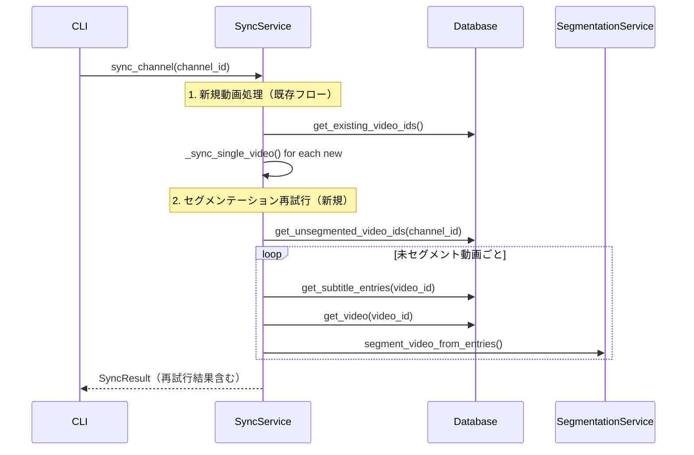

# Design Document

## Overview

**Purpose**: セグメンテーションに失敗した動画を次回の`kirinuki sync`で自動的に再試行する機能。DB保存済みの字幕データを利用するため、YouTubeへの再アクセスは不要。

**Users**: `kirinuki sync`を実行するユーザー。一時的なAPIエラー（Anthropic APIクレジット不足等）の解消後にsyncを再実行するだけでセグメンテーションが完了する。

**Impact**: 既存の`sync_channel()`フローに再試行ステップを追加。新規動画処理後、セグメンテーション未完了の既存動画を検出して再試行する。

### Goals
- セグメンテーション未完了動画を自動検出し、DB内の字幕データで再試行する
- 再試行の成功・失敗件数をsyncサマリーに含める
- 既存のsync処理に影響を与えない

### Non-Goals
- セグメンテーション失敗回数の上限管理（無制限に再試行する）
- 手動での再試行コマンド追加
- セグメンテーション失敗理由の分類・記録

## Architecture

### Existing Architecture Analysis

現在のsync処理フロー:
1. `sync_channel()`: チャンネル全動画IDを取得 → 既存IDと比較 → 新規動画を`_sync_single_video()`で処理
2. `_sync_single_video()`: メタデータ取得 → 字幕取得 → DB保存 → セグメンテーション（失敗時はログ出力のみ）
3. セグメンテーション失敗した動画は`videos`テーブルに保存済みのため、次回syncで`existing_ids`に含まれスキップされる

制約:
- `segments`テーブルにセグメンテーション状態カラムはない（行の有無で判定）
- `subtitle_lines`テーブルに字幕データが保存済み
- `videos`テーブルに`duration_seconds`が保存済み

### Architecture Pattern & Boundary Map



**Architecture Integration**:
- Selected pattern: 既存sync_channel()への追加ステップ（パイプライン拡張）
- Domain/feature boundaries: SyncServiceが再試行の制御を担当。DatabaseとSegmentationServiceの既存インターフェースを活用
- Existing patterns preserved: try/except による個別動画のエラーハンドリング、ログ出力パターン
- New components rationale: 新コンポーネントなし。Database層に2メソッド追加のみ

### Technology Stack

| Layer | Choice / Version | Role in Feature | Notes |
|-------|------------------|-----------------|-------|
| Backend / Services | Python 3.12+ | SyncService拡張 | 既存コード |
| Data / Storage | SQLite | 未セグメント動画検出、字幕データ取得 | LEFT JOINクエリ追加 |

## Requirements Traceability

| Requirement | Summary | Components | Interfaces | Flows |
|-------------|---------|------------|------------|-------|
| 1.1 | セグメンテーション未完了動画の検出と再試行 | Database, SyncService | get_unsegmented_video_ids, get_subtitle_entries | sync_channelフロー |
| 1.2 | 再試行成功のカウント | SyncResult, SyncService | segmentation_retried | sync_channelフロー |
| 1.3 | 再試行失敗のログ記録と次回対象維持 | SyncService | ログ出力 | sync_channelフロー |
| 2.1 | 再試行件数のサマリー表示 | SyncResult, CLI | segmentation_retried, segmentation_retry_failed | sync表示 |
| 2.2 | 従来サマリー表示の維持 | CLI | 既存フィールド | 変更なし |
| 3.1 | 新規動画処理の維持 | SyncService | 変更なし | 変更なし |
| 3.2 | セグメンテーション完了済み動画の除外 | Database | get_unsegmented_video_ids | LEFT JOINクエリ |
| 3.3 | 再試行時のYouTube API不使用 | SyncService, Database | get_subtitle_entries | DB読み取りのみ |

## Components and Interfaces

| Component | Domain/Layer | Intent | Req Coverage | Key Dependencies | Contracts |
|-----------|--------------|--------|--------------|------------------|-----------|
| Database | Infra | 未セグメント動画検出・字幕取得 | 1.1, 3.2, 3.3 | sqlite3 (P0) | Service |
| SyncService | Core | 再試行フロー制御 | 1.1, 1.2, 1.3, 3.1 | Database (P0), SegmentationService (P0) | Service |
| SyncResult | Models | 再試行結果保持 | 2.1, 2.2 | なし | State |
| CLI sync | CLI | 再試行結果表示 | 2.1, 2.2 | SyncResult (P0) | — |

### Infra Layer

#### Database

| Field | Detail |
|-------|--------|
| Intent | セグメンテーション未完了動画のID一覧取得、字幕エントリー取得 |
| Requirements | 1.1, 3.2, 3.3 |

**Responsibilities & Constraints**
- `videos`テーブルと`segments`テーブルのLEFT JOINで未セグメント動画を検出
- `subtitle_lines`テーブルから`SubtitleEntry`リストを構築して返却
- チャンネルID単位でフィルタリング

**Dependencies**
- Inbound: SyncService — 未セグメント動画検出と字幕取得 (P0)

**Contracts**: Service [x]

##### Service Interface

```python
class Database:
    def get_unsegmented_video_ids(self, channel_id: str) -> list[str]:
        """セグメンテーション未完了の動画IDを返す。
        videos LEFT JOIN segments WHERE segments.id IS NULLで検出。
        """
        ...

    def get_subtitle_entries(self, video_id: str) -> list[SubtitleEntry]:
        """DB保存済みの字幕行をSubtitleEntryリストとして返す。"""
        ...
```

- Preconditions: `channel_id`が`channels`テーブルに存在すること
- Postconditions: 空リスト or 有効なデータのリスト
- Invariants: 読み取り専用操作（データ変更なし）

**Implementation Notes**
- `get_unsegmented_video_ids`: `SELECT v.video_id FROM videos v LEFT JOIN segments s ON v.video_id = s.video_id WHERE v.channel_id = ? AND s.id IS NULL`
- `get_subtitle_entries`: `SELECT start_ms, duration_ms, text FROM subtitle_lines WHERE video_id = ? ORDER BY start_ms`。`SubtitleEntry(start_ms=..., duration_ms=..., text=...)`に変換

### Core Layer

#### SyncService

| Field | Detail |
|-------|--------|
| Intent | 新規動画処理後にセグメンテーション未完了動画の再試行を実行 |
| Requirements | 1.1, 1.2, 1.3, 3.1 |

**Responsibilities & Constraints**
- `sync_channel()`内で新規動画処理後に再試行ステップを実行
- 再試行にはDB内の字幕データのみを使用（YouTube APIアクセスなし）
- 各動画の再試行失敗は個別にキャッチし、他の動画の再試行を妨げない

**Dependencies**
- Outbound: Database — `get_unsegmented_video_ids()`, `get_subtitle_entries()`, `get_video()` (P0)
- Outbound: SegmentationService — `segment_video_from_entries()` (P0)

**Contracts**: Service [x]

##### Service Interface

```python
class SyncService:
    def _retry_segmentation(self, channel_id: str, result: SyncResult) -> None:
        """セグメンテーション未完了動画の再試行を実行する。
        成功/失敗件数をresultに反映する。
        """
        ...
```

- Preconditions: 新規動画処理が完了していること
- Postconditions: `result.segmentation_retried`と`result.segmentation_retry_failed`が更新される
- Invariants: YouTube APIへのアクセスは行わない

**Implementation Notes**
- `sync_channel()`の最終同期日時更新の前に`_retry_segmentation()`を呼び出す
- 各動画の再試行は独立。一つの失敗が他に影響しない（try/except per video）
- `sync_all()`での結果集約に新フィールドの加算を追加

### Models Layer

#### SyncResult

| Field | Detail |
|-------|--------|
| Intent | セグメンテーション再試行の結果を保持 |
| Requirements | 2.1, 2.2 |

**Contracts**: State [x]

##### State Management

```python
class SyncResult(BaseModel):
    # 既存フィールド（変更なし）
    already_synced: int = 0
    newly_synced: int = 0
    skipped: int = 0
    auth_errors: int = 0
    unavailable_skipped: int = 0
    not_live_skipped: int = 0
    errors: list[SyncError] = []
    skip_reasons: dict[str, int] = {}
    # 新規フィールド
    segmentation_retried: int = 0
    segmentation_retry_failed: int = 0
```

- デフォルト値0のため後方互換性あり

### CLI Layer

#### sync コマンド表示

| Field | Detail |
|-------|--------|
| Intent | 再試行結果のサマリー表示 |
| Requirements | 2.1, 2.2 |

**Implementation Notes**
- 再試行結果がある場合のみ表示（`segmentation_retried > 0 or segmentation_retry_failed > 0`）
- 表示例: `セグメンテーション再試行: 成功 3件 / 失敗 1件`
- 既存のサマリー表示は変更なし

## Error Handling

### Error Strategy

セグメンテーション再試行の各動画は独立してエラーハンドリングする。既存の`_sync_single_video()`内のセグメンテーション失敗パターンと同一のアプローチ。

### Error Categories and Responses

**System Errors**: LLM APIエラー（クレジット不足、レートリミット、タイムアウト）→ `logger.warning()`でログ記録、次回syncで再試行対象として残る
**Business Logic Errors**: 字幕データが空の場合 → スキップ（再試行対象にもならない、`subtitle_lines`が空のためLEFT JOINで検出されない前提は崩れるが、`get_subtitle_entries()`の結果が空なら再試行をスキップ）

## Testing Strategy

### Unit Tests
- `Database.get_unsegmented_video_ids()`: セグメント済み/未済の混在ケース
- `Database.get_subtitle_entries()`: 字幕エントリー取得と変換
- `SyncService._retry_segmentation()`: 再試行成功/失敗のカウント
- `SyncResult`: 新フィールドのデフォルト値と集約

### Integration Tests
- sync_channelフロー全体: 新規動画処理→セグメンテーション失敗→再sync→再試行成功
- 再試行時のYouTube API非呼び出し確認

### E2E Tests
- CLI表示: 再試行結果のサマリーフォーマット確認
