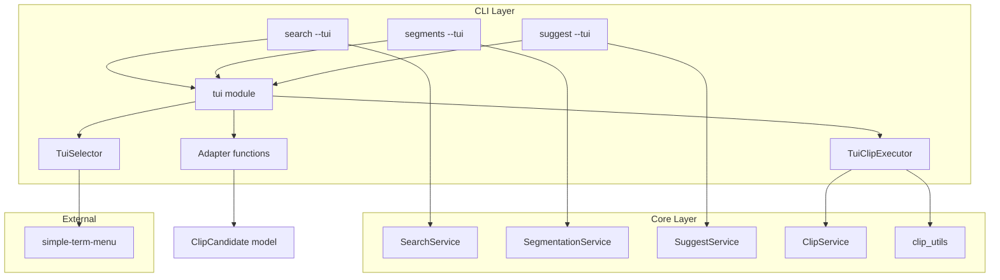
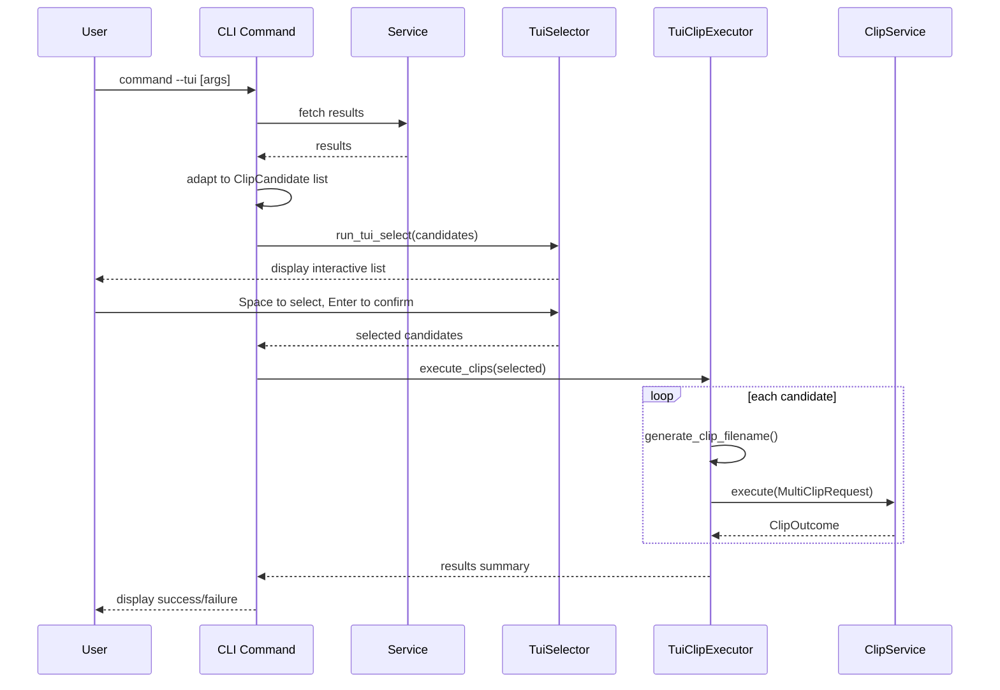
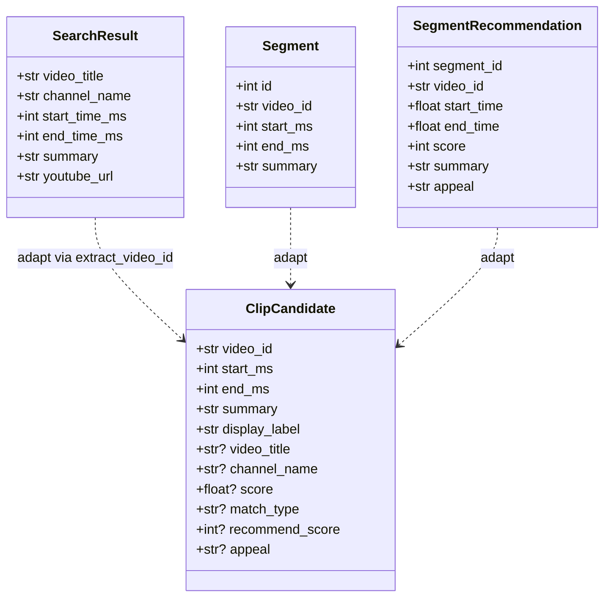

# Design Document: tui-interactive-clip

## Overview

**Purpose**: search/segments/suggestコマンドの結果をインタラクティブなTUI画面で表示し、複数選択→一括切り抜き実行までをシームレスに行えるモードを提供する。

**Users**: 配信アーカイブから切り抜きを作成するユーザーが、検索→選択→実行の一連操作をターミナル上で完結させる。

**Impact**: 既存CLIコマンドに`--tui`フラグを追加。既存のテキスト出力には影響なし（後方互換性維持）。

### Goals
- search/segments/suggestの結果をTUIで一覧表示し、Spaceキーで複数選択可能にする
- 選択したセグメントをEnterキーで一括切り抜き実行する
- 出力ファイル名を`{動画ID}-{開始時間}-{話題名}.mp4`形式で自動生成する
- 既存コマンドの動作を一切変更しない

### Non-Goals
- TUI画面での検索クエリ入力（検索はCLI引数のまま）
- 切り抜き済みファイルのプレビュー再生
- TUI画面内でのフィルタリング・ソート操作
- suggestコマンドのサービス初期化パスの統合（既存の分離を維持）

## Architecture

### Existing Architecture Analysis

現在のアーキテクチャはCLI→Core→Infraの3層構造。各コマンドはサービス層を呼び出し、結果をclick.echoでテキスト出力する。TUIモードはCLI層の表示ロジックを差し替えるだけで、Core/Infra層は変更不要。

既存の統合ポイント:
- `create_app_context()` — search/segmentsが利用するDIコンテナ
- `DatabaseClient` + `LLMClient` — suggestの独自初期化パス
- `ClipService.execute()` — 切り抜き実行の共通エントリポイント

### Architecture Pattern & Boundary Map



**Architecture Integration**:
- **Selected pattern**: Adapterパターン。3種の結果型を共通のClipCandidateに変換し、統一されたTUI体験を提供
- **Domain boundaries**: TUIロジックはCLI層に閉じる。Core層の変更はファイル名生成関数の追加のみ。既存モデルの変更なし
- **Existing patterns preserved**: CLI→Core→Infraの3層分離、サービスのDIパターン
- **New components**: ClipCandidateモデル、TUIモジュール（Adapter/Selector/Executor）
- **Steering compliance**: CLIファースト、ローカル完結の原則を維持

### Technology Stack

| Layer | Choice / Version | Role in Feature | Notes |
|-------|------------------|-----------------|-------|
| CLI / TUI | simple-term-menu 1.x | マルチセレクトメニュー表示 | 純Python、ゼロ依存。詳細はresearch.md参照 |
| CLI Framework | Click（既存） | --tuiフラグ追加 | 変更なし |
| Core | Python 3.12+（既存） | ファイル名生成、アダプター | 変更最小 |

## System Flows

### TUIモード全体フロー



**Key Decisions**:
- 各候補を個別のMultiClipRequest（1レンジ）として実行し、エラー分離を保証
- TUI終了後にクリップ実行（TUI画面とクリップ進捗表示を分離）

## Requirements Traceability

| Requirement | Summary | Components | Interfaces | Flows |
|-------------|---------|------------|------------|-------|
| 1.1, 1.2, 1.3 | 各コマンドに--tuiフラグ追加 | search/segments/suggestコマンド | --tui CLIオプション | TUI全体フロー |
| 1.4 | 後方互換性維持 | 既存コマンドハンドラ | 分岐ロジック | — |
| 2.1-2.5 | TUI結果一覧表示 | Adapter, TuiSelector | adapt_*(), run_tui_select() | TUI全体フロー |
| 3.1-3.4 | 複数選択機能 | TuiSelector | simple-term-menu multi_select | TUI全体フロー |
| 4.1-4.4 | 切り抜き実行 | TuiClipExecutor | execute_clips() | TUI全体フロー |
| 5.1-5.5 | ファイル名自動生成 | clip_utils | generate_clip_filename(), sanitize_filename() | — |
| 6.1-6.3 | キャンセルと終了 | TuiSelector, TuiClipExecutor | q/Esc/Ctrl+C処理 | TUI全体フロー |

## Components and Interfaces

| Component | Domain/Layer | Intent | Req Coverage | Key Dependencies | Contracts |
|-----------|-------------|--------|--------------|------------------|-----------|
| ClipCandidate | Models | TUI表示・選択の統一データモデル | 2, 3, 4, 5 | — | State |
| Adapter functions | CLI | 各結果型→ClipCandidate変換 | 2.1-2.4 | SearchResult, Segment, SegmentRecommendation (P0) | Service |
| TuiSelector | CLI | マルチセレクトメニュー表示・操作 | 2.5, 3.1-3.4, 6.1-6.2 | simple-term-menu (P0) | Service |
| TuiClipExecutor | CLI | 選択候補の一括切り抜き実行 | 4.1-4.3, 5.1-5.5, 6.3 | ClipService (P0), clip_utils (P0) | Service |
| generate_clip_filename | Core | ファイル名自動生成 | 5.1-5.4 | sanitize_filename (P0) | Service |

### Models Layer

#### ClipCandidate

| Field | Detail |
|-------|--------|
| Intent | TUI表示と切り抜き実行に必要な情報を統一的に保持する |
| Requirements | 2.1-2.4, 3.1, 4.1, 5.1 |

**Responsibilities & Constraints**
- search/segments/suggestの結果をTUI表示可能な共通形式で保持
- 切り抜き実行に必要な情報（video_id, 時間範囲, summary）を型安全に提供
- イミュータブルなデータオブジェクト

**Contracts**: State [x]

##### State Management

```python
class ClipCandidate(BaseModel):
    """TUI表示・切り抜き実行用の統一データモデル"""
    video_id: str
    start_ms: int
    end_ms: int
    summary: str
    display_label: str  # TUIメニュー表示用のフォーマット済み文字列

    # searchコマンド用の追加情報（オプション）
    video_title: str | None = None
    channel_name: str | None = None
    score: float | None = None
    match_type: str | None = None

    # suggestコマンド用の追加情報（オプション）
    recommend_score: int | None = None
    appeal: str | None = None
```

### CLI Layer

#### Adapter Functions

| Field | Detail |
|-------|--------|
| Intent | 各コマンドの結果型をClipCandidateリストに変換する |
| Requirements | 2.1-2.4 |

**Responsibilities & Constraints**
- SearchResult、Segment、SuggestResultそれぞれの型からClipCandidateへの変換ロジック
- display_labelのフォーマットは各コマンドの表示要件に応じてカスタマイズ
- SearchResultからのvideo_id取得は既存の`extract_video_id(youtube_url)`を使用（SearchResult.youtube_urlに絶対URLが含まれているため、モデル変更不要）
- 変換時にvideo_id抽出に失敗した場合はその項目をスキップ

**Dependencies**
- Inbound: CLI commands — 各コマンドハンドラから呼び出し (P0)
- Outbound: ClipCandidate — 変換先モデル (P0)
- Outbound: format_time_range — 時間表示のフォーマット (P1)
- Outbound: extract_video_id — SearchResult.youtube_urlからvideo_id抽出 (P0)

**Contracts**: Service [x]

##### Service Interface

```python
def adapt_search_results(results: list[SearchResult]) -> list[ClipCandidate]:
    """SearchResult一覧をClipCandidate一覧に変換する。
    display_label例: "[0.85 キーワード] 動画タイトル | 18:03-19:31 話題の要約"
    """
    ...

def adapt_segments(segments: list[Segment]) -> list[ClipCandidate]:
    """Segment一覧をClipCandidate一覧に変換する。
    display_label例: "18:03-19:31 話題の要約"
    """
    ...

def adapt_suggest_results(result: SuggestResult) -> list[ClipCandidate]:
    """SuggestResultをClipCandidate一覧に変換する。
    display_label例: "[8/10] 動画タイトル | 18:03-19:31 話題の要約"
    """
    ...
```

- Preconditions: 入力リストが空でないこと（空の場合は空リストを返す）
- Postconditions: 各ClipCandidateのvideo_id, start_ms, end_ms, summary, display_labelが設定済み

#### TuiSelector

| Field | Detail |
|-------|--------|
| Intent | simple-term-menuを用いたマルチセレクトメニューの表示と選択結果の取得 |
| Requirements | 2.5, 3.1-3.4, 6.1-6.2 |

**Responsibilities & Constraints**
- ClipCandidateのdisplay_labelをメニュー項目として表示
- Spaceキーでトグル選択、Enterで確定、q/Escでキャンセル
- 選択件数のステータス表示
- ターミナル高さを超える場合はスクロール対応（simple-term-menuが自動処理）

**Dependencies**
- External: simple-term-menu — TUIメニュー描画 (P0)
- Inbound: CLI commands — 変換済みClipCandidateリストを受け取る (P0)

**Contracts**: Service [x]

##### Service Interface

```python
def run_tui_select(candidates: list[ClipCandidate]) -> list[ClipCandidate]:
    """マルチセレクトメニューを表示し、選択された候補を返す。

    キャンセル時（q/Esc）は空リストを返す。
    """
    ...
```

- Preconditions: candidatesが1件以上
- Postconditions: 戻り値はcandidatesの部分集合（順序保持）。キャンセル時は空リスト
- Invariants: 入力candidatesは変更されない

**Implementation Notes**
- simple-term-menuのTerminalMenu(options, multi_select=True, show_multi_select_hint=True)を使用
- quit_keys=("q", "escape")を設定してキャンセルキーを定義
- status_barにselected件数を表示（status_bar_below_preview=Trueで下部配置）

#### TuiClipExecutor

| Field | Detail |
|-------|--------|
| Intent | 選択されたClipCandidateの一括切り抜き実行と進捗表示 |
| Requirements | 4.1-4.3, 5.1-5.5, 6.3 |

**Responsibilities & Constraints**
- 選択された各候補に対してファイル名を自動生成し、ClipServiceで切り抜き実行
- 進捗表示（N件目/全M件）
- Ctrl+Cで現在処理中の切り抜き完了後に残りをスキップ
- 成功/失敗のサマリー表示

**Dependencies**
- Outbound: ClipService.execute() — 切り抜き実行 (P0)
- Outbound: generate_clip_filename() — ファイル名生成 (P0)
- Outbound: AppConfig.output_dir — 出力先ディレクトリ (P1)

**Contracts**: Service [x]

##### Service Interface

```python
def execute_clips(
    selected: list[ClipCandidate],
    clip_service: ClipService,
    output_dir: Path,
    on_progress: Callable[[str], None] | None = None,
) -> list[ClipOutcome]:
    """選択された候補を順次切り抜き実行する。

    各候補に対してgenerate_clip_filenameでファイル名を生成し、
    ClipService.executeを1レンジで呼び出す。
    KeyboardInterrupt時は処理済み結果を返す。
    """
    ...
```

- Preconditions: selectedが1件以上、clip_serviceが初期化済み、output_dirが存在するか作成可能
- Postconditions: 各候補に対するClipOutcomeのリストを返す（成功/失敗問わず）
- Invariants: 既に成功した切り抜きファイルは中断時も保持される

### Core Layer

#### generate_clip_filename

| Field | Detail |
|-------|--------|
| Intent | 動画ID・開始時間・話題名から安全なファイル名を自動生成する |
| Requirements | 5.1-5.4 |

**Responsibilities & Constraints**
- 形式: `{video_id}-{Mm}{SS}s-{sanitized_summary}.mp4`
- 開始時間は総分数表記（例: 72m15s）
- 話題名はファイルシステム安全な文字列にサニタイズ
- 話題名の最大長は50文字に制限

**Contracts**: Service [x]

##### Service Interface

```python
def generate_clip_filename(video_id: str, start_ms: int, summary: str) -> str:
    """切り抜きファイル名を自動生成する。

    形式: {video_id}-{M}m{SS}s-{sanitized_summary}.mp4
    例: dQw4w9WgXcQ-18m03s-面白い話題について.mp4
    """
    ...

def sanitize_filename(text: str, max_length: int = 50) -> str:
    """テキストからファイル名に使用できない文字を除去し、長さを制限する。

    除去対象: / \\ : * ? \" < > | および制御文字
    空白はアンダースコアに置換。末尾のドットとスペースを除去。
    """
    ...
```

- Preconditions: video_idが空でない、start_ms >= 0、summaryが空でない
- Postconditions: 戻り値はファイルシステム安全な文字列で.mp4拡張子を含む

## Data Models

### Domain Model



新規永続化データなし。ClipCandidateはTUIセッション中のみ存在するインメモリモデル。

## Error Handling

### Error Strategy

| Error Category | Trigger | Response |
|---------------|---------|----------|
| 結果0件 | コマンド結果が空 | TUI起動せず「結果がありません」と表示して終了 |
| TUIキャンセル | q/Esc押下 | 空リスト返却→「キャンセルしました」と表示 |
| 未選択でEnter | 選択0件でEnter | 「セグメントが選択されていません」と通知 |
| 切り抜き失敗 | ytdlp/ffmpegエラー | 該当候補をエラー記録し、残りを続行。最後にサマリー表示 |
| Ctrl+C（TUI中） | TUI表示中にCtrl+C | TUI終了、切り抜き未実行 |
| Ctrl+C（実行中） | 切り抜き処理中にCtrl+C | 現在の処理完了後にスキップ、それまでの結果をサマリー表示 |
| ターミナル非対応 | パイプやリダイレクト先で--tui使用 | エラーメッセージ表示、通常モードへのフォールバック提案 |

## Testing Strategy

### Unit Tests
- `generate_clip_filename()`: 各種入力パターン（通常、長い話題名、特殊文字、1時間超の開始時間）
- `sanitize_filename()`: ファイル名禁止文字、空白置換、長さ制限、エッジケース
- `adapt_search_results()`: SearchResult→ClipCandidate変換の正確性
- `adapt_segments()`: Segment→ClipCandidate変換の正確性
- `adapt_suggest_results()`: SuggestResult→ClipCandidate変換の正確性
- `execute_clips()`: 正常系（成功/失敗混在）、KeyboardInterrupt時の中断動作

### Integration Tests
- search --tui: SearchService結果→TUI表示→選択→ClipService実行の一連フロー（ClipServiceはモック）
- segments --tui: SegmentationService結果→TUI表示→選択→実行フロー
- suggest --tui: SuggestService結果→TUI表示→選択→実行フロー
- 後方互換性: --tuiなしで従来のテキスト出力が変わらないことを確認

### E2E Tests
- 結果0件時のTUI起動スキップ
- Ctrl+C/Escキャンセル時の正常終了
