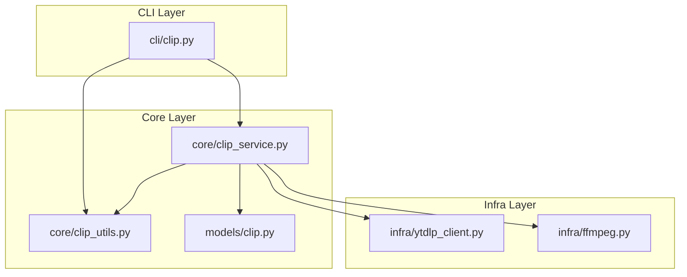
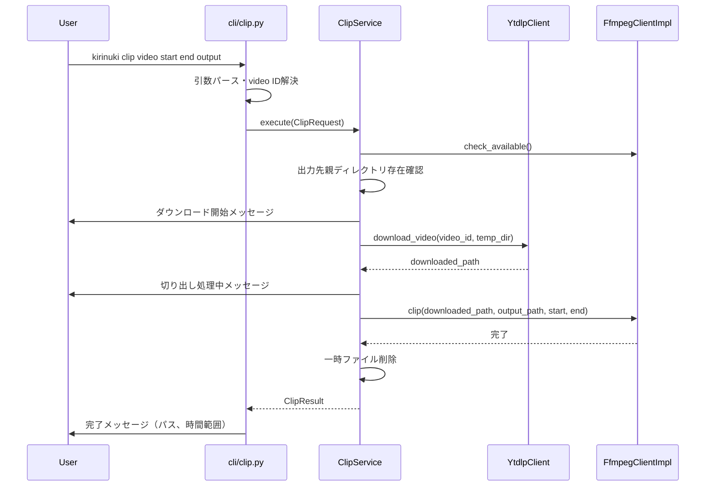

# Design Document: video-clip-command

## Overview

**Purpose**: YouTube動画の指定区間を切り抜くCLIコマンド `kirinuki clip` を提供し、プロダクトのコア機能「オンデマンドクリッピング」を実現する。

**Users**: CLIユーザーが動画ID/URLと時間範囲を指定して、切り抜き動画を生成するワークフローで使用する。

**Impact**: 既存のインフラ層（`YtdlpClient`, `FfmpegClientImpl`）とモデル層（`ClipRequest`, `ClipResult`）を活用し、新規にサービス層（`ClipService`）とCLIコマンド（`cli/clip.py`）を追加する。

### Goals
- 動画ID/URLと時間範囲を指定して切り抜き動画を1コマンドで生成できる
- 遅延DL戦略に従い、元動画を一時DL→切り出し→即時削除する
- 既存コンポーネントを最大限再利用し、最小限の新規コードで実装する

### Non-Goals
- 動画のバッチ切り抜き（複数区間の一括処理）
- 切り抜き結果のDB登録やメタデータ管理
- 動画のエンコード設定（コーデック、ビットレート等）のカスタマイズ
- ダウンロード進捗のプログレスバー表示

## Architecture

### Existing Architecture Analysis

既存コードベースに切り抜きの基盤が揃っている:

| 既存コンポーネント | 場所 | 本機能での役割 |
|---|---|---|
| `ClipRequest` / `ClipResult` | `models/clip.py` | リクエスト・結果のデータモデル |
| `extract_video_id()` | `core/clip_utils.py` | URLからの動画ID抽出 |
| `parse_time_str()` | `core/clip_utils.py` | 時刻文字列→秒数変換 |
| `FfmpegClientImpl` | `infra/ffmpeg.py` | ffmpegによる区間切り出し |
| `YtdlpClient.download_video()` | `infra/ytdlp_client.py` | 動画DL（Cookie認証対応） |
| エラー型群 | `core/errors.py` | 各種異常系ハンドリング |

### Architecture Pattern & Boundary Map



**Architecture Integration**:
- **Selected pattern**: 既存の3層アーキテクチャ（CLI → Core → Infra）を踏襲
- **New components**: `ClipService`（Core層）と `cli/clip.py`（CLI層）の2つのみ
- **Steering compliance**: 「CLI層は薄く」「コア層は外部非依存（Protocol経由）」の原則を維持

### Technology Stack

| Layer | Choice / Version | Role in Feature | Notes |
|-------|------------------|-----------------|-------|
| CLI | click | コマンド定義・引数パース | 既存利用 |
| Core | Python 3.12+ / Pydantic v2 | オーケストレーション・バリデーション | 新規 `ClipService` |
| Infra | yt-dlp / ffmpeg (subprocess) | 動画DL・区間切り出し | 既存利用 |

## System Flows



異常系: `download_video` または `clip` で例外が発生した場合、一時ディレクトリは `TemporaryDirectory` コンテキストマネージャにより自動クリーンアップされる。

## Requirements Traceability

| Requirement | Summary | Components | Interfaces | Flows |
|-------------|---------|------------|------------|-------|
| 1.1 | 4つの位置引数受け取り | `cli/clip.py` | CLI引数定義 | メインフロー |
| 1.2 | URLから動画ID抽出 | `cli/clip.py`, `clip_utils` | `resolve_video_id()` | メインフロー |
| 1.3 | 動画ID直接指定 | `cli/clip.py`, `clip_utils` | `resolve_video_id()` | メインフロー |
| 1.4 | MM:SS形式の時刻変換 | `cli/clip.py`, `clip_utils` | `parse_time_str()` | メインフロー |
| 1.5 | HH:MM:SS形式の時刻変換 | `cli/clip.py`, `clip_utils` | `parse_time_str()` | メインフロー |
| 2.1 | DL→切り出し→保存 | `ClipService` | `execute()` | メインフロー |
| 2.2 | 元動画即時削除 | `ClipService` | `execute()` | メインフロー |
| 2.3 | エラー時クリーンアップ | `ClipService` | `execute()` | 異常系フロー |
| 2.4 | Cookie認証対応 | `ClipService`, `YtdlpClient` | `download_video()` | メインフロー |
| 3.1 | 時間範囲バリデーション | `ClipRequest` | `model_validator` | メインフロー |
| 3.2 | URL/ID バリデーション | `clip_utils` | `resolve_video_id()` | メインフロー |
| 3.3 | 出力先ディレクトリ確認 | `ClipService` | `execute()` | メインフロー |
| 3.4 | ffmpeg存在確認 | `FfmpegClientImpl` | `check_available()` | メインフロー |
| 3.5 | DL失敗エラー表示 | `ClipService`, `cli/clip.py` | 例外ハンドリング | 異常系フロー |
| 4.1 | DL開始メッセージ | `ClipService` | `on_progress` コールバック | メインフロー |
| 4.2 | 切り出し中メッセージ | `ClipService` | `on_progress` コールバック | メインフロー |
| 4.3 | 完了メッセージ | `cli/clip.py` | `ClipResult` 表示 | メインフロー |

## Components and Interfaces

| Component | Domain/Layer | Intent | Req Coverage | Key Dependencies | Contracts |
|-----------|-------------|--------|--------------|-----------------|-----------|
| `cli/clip.py` | CLI | CLIコマンド定義・引数パース・結果表示 | 1.1-1.5, 3.5, 4.3 | ClipService (P0) | Service |
| `ClipService` | Core | DL→切り出し→クリーンアップのオーケストレーション | 2.1-2.4, 3.3, 3.4, 4.1, 4.2 | YtdlpClient (P0), FfmpegClient (P0) | Service |
| `resolve_video_id()` | Core (clip_utils) | URL/動画IDの統一解決 | 1.2, 1.3, 3.2 | なし | — |

### CLI Layer

#### cli/clip.py

| Field | Detail |
|-------|--------|
| Intent | `kirinuki clip` コマンドの定義。引数パース→サービス呼び出し→結果表示 |
| Requirements | 1.1, 1.2, 1.3, 1.4, 1.5, 3.5, 4.3 |

**Responsibilities & Constraints**
- 4つの位置引数（video, start, end, output）を click で定義
- `<video>` のURL/ID解決と `<start>`/`<end>` の秒数変換をCLI層で実施
- `ClipRequest` を構築し `ClipService.execute()` に委譲
- 例外をキャッチしてユーザー向けエラーメッセージを `click.echo` で表示
- `ClipResult` から完了情報を表示

**Dependencies**
- Outbound: `ClipService` — 切り抜き処理の実行 (P0)
- Outbound: `clip_utils` — `resolve_video_id()`, `parse_time_str()` (P0)

**Contracts**: Service [x]

##### Service Interface
```python
# cli/clip.py のclick コマンド定義
@cli.command()
@click.argument("video")
@click.argument("start")
@click.argument("end")
@click.argument("output", type=click.Path())
def clip(video: str, start: str, end: str, output: str) -> None: ...
```

**Implementation Notes**
- `main.py` の `cli` グループに登録する
- 既存の `create_app_context()` パターンに従い、`ClipService` を生成
- 例外ハンドリング: `InvalidURLError`, `TimeRangeError`, `FfmpegNotFoundError`, `VideoDownloadError`, `ClipError`, `AuthenticationRequiredError` を個別キャッチし、`click.echo` でメッセージ表示後 `raise SystemExit(1)`

### Core Layer

#### ClipService

| Field | Detail |
|-------|--------|
| Intent | 動画DL→ffmpeg切り出し→一時ファイルクリーンアップのオーケストレーション |
| Requirements | 2.1, 2.2, 2.3, 2.4, 3.3, 3.4, 4.1, 4.2 |

**Responsibilities & Constraints**
- `ClipRequest` を受け取り、一連の処理を実行して `ClipResult` を返す
- 一時ディレクトリは `tempfile.TemporaryDirectory()` で管理し、正常・異常問わず確実にクリーンアップ
- 進捗通知はコールバック関数（`Callable[[str], None]`）で受け取り、CLI層から `click.echo` を渡す

**Dependencies**
- Inbound: `cli/clip.py` — 呼び出し元 (P0)
- Outbound: `YtdlpClient` — 動画ダウンロード (P0), Protocol経由ではなく直接依存（既存パターンに合わせる）
- Outbound: `FfmpegClient` — 区間切り出し (P0), Protocol型で受け取る

**Contracts**: Service [x]

##### Service Interface
```python
from collections.abc import Callable
from pathlib import Path
from typing import Protocol

from kirinuki.models.clip import ClipRequest, ClipResult


class FfmpegClient(Protocol):
    def check_available(self) -> None: ...
    def clip(
        self, input_path: Path, output_path: Path,
        start_seconds: float, end_seconds: float,
    ) -> None: ...


class ClipService:
    def __init__(
        self,
        ytdlp_client: YtdlpClient,
        ffmpeg_client: FfmpegClient,
    ) -> None: ...

    def execute(
        self,
        request: ClipRequest,
        on_progress: Callable[[str], None] | None = None,
    ) -> ClipResult: ...
```

- **Preconditions**: `request` は有効な `ClipRequest`（Pydanticバリデーション済み）
- **Postconditions**: 出力先に切り抜き動画が存在、一時ファイルは削除済み
- **Invariants**: 一時ディレクトリは `execute()` 終了時に必ず削除される

**Implementation Notes**
- `execute()` 内部フロー: (1) `ffmpeg.check_available()` → (2) 出力先親ディレクトリ存在確認 → (3) `on_progress("ダウンロード中...")` → (4) `ytdlp.download_video()` → (5) `on_progress("切り出し中...")` → (6) `ffmpeg.clip()` → (7) `ClipResult` 返却。一時ディレクトリは `with TemporaryDirectory()` で管理
- 出力先の親ディレクトリが存在しない場合は `FileNotFoundError` を送出

#### resolve_video_id() — clip_utils.py への追加

| Field | Detail |
|-------|--------|
| Intent | URL/動画IDの入力を統一的に解決し、動画IDを返す |
| Requirements | 1.2, 1.3, 3.2 |

**Contracts**: Service [x]

```python
import re

_YOUTUBE_VIDEO_ID_RE = re.compile(r"^[a-zA-Z0-9_-]{11}$")

def resolve_video_id(video: str) -> str:
    """URL or 動画IDを受け取り、動画IDを返す。

    - 11文字の動画IDパターンにマッチ → そのまま返す
    - それ以外 → extract_video_id() でURL解析を試みる

    Raises:
        InvalidURLError: URLとしても動画IDとしても無効な場合
    """
    ...
```

## Error Handling

### Error Strategy
既存のドメインエラー型を活用し、CLI層で統一的にキャッチ・表示する。

### Error Categories and Responses

| Error Type | 原因 | Req | ユーザーメッセージ |
|---|---|---|---|
| `InvalidURLError` | 無効なURL/動画ID | 3.2 | "無効な動画ID/URLです: {input}" |
| `TimeRangeError` / `ValidationError` | 開始≧終了、負の値 | 3.1 | "時間範囲が不正です: {detail}" |
| `FfmpegNotFoundError` | ffmpeg未インストール | 3.4 | "ffmpegがインストールされていません。..." |
| `VideoDownloadError` | DL失敗 | 3.5 | "動画のダウンロードに失敗しました: {reason}" |
| `AuthenticationRequiredError` | Cookie認証失敗 | 3.5 | "認証が必要です。`kirinuki cookie set` で設定してください" |
| `ClipError` | ffmpeg切り出し失敗 | 3.5 | "切り出しに失敗しました: {detail}" |
| `FileNotFoundError` | 出力先ディレクトリ不在 | 3.3 | "出力先ディレクトリが存在しません: {path}" |

## Testing Strategy

### Unit Tests
- `resolve_video_id()`: URL入力、動画ID入力、無効入力のパターンテスト
- `ClipService.execute()`: 正常系（モックDL→モックclip→ClipResult返却）
- `ClipService.execute()`: 異常系（DL失敗時の一時ディレクトリクリーンアップ確認）
- `ClipService.execute()`: 出力先ディレクトリ不在時の `FileNotFoundError`
- `ClipService.execute()`: `on_progress` コールバックの呼び出し順序確認

### Integration Tests
- CLI `kirinuki clip` の引数パース確認（click の `CliRunner` 使用）
- 無効な引数でのエラーメッセージ表示確認
- ffmpeg未検出時のエラーメッセージ確認
