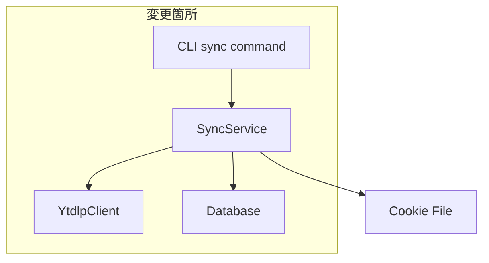
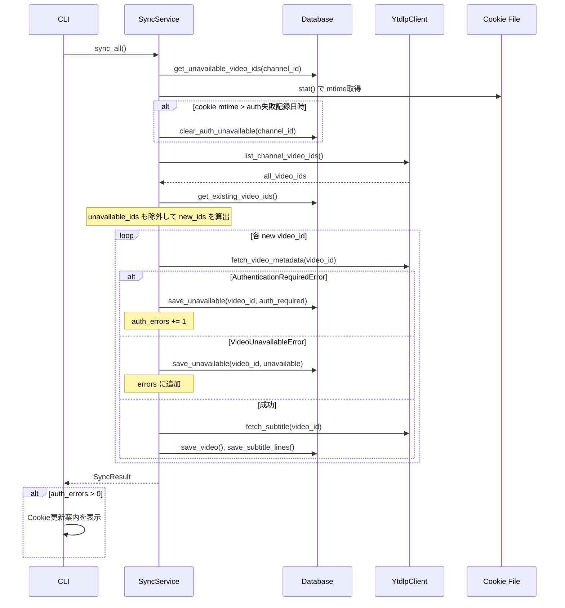

# Design Document

## Overview

**Purpose**: `kirinuki sync` でメンバー限定動画が「Video unavailable」となる問題を解決する。yt-dlpのエラーを適切に分類し、ユーザーにCookie更新を案内し、unavailable動画の再試行を抑止する。

**Users**: kirinuki CLIユーザーがメンバー限定配信を含むチャンネルを同期する際に、エラーの原因と対処法を把握できるようになる。

**Impact**: `YtdlpClient`のエラーハンドリング、`SyncService`の同期ロジック、`Database`のスキーマ、`SyncResult`のモデル、CLI出力を変更する。

### Goals
- メンバー限定auth失敗と恒久的unavailableを区別する
- Cookie更新の案内を適切に表示する
- unavailable動画の再試行を防止し同期時間を短縮する

### Non-Goals
- yt-dlpのflat extraction時に `availability` フィールドで事前フィルタリング（信頼性不十分のため見送り）
- Cookie有効性の事前検証
- ネットワークエラーのリトライ機構

## Architecture

### Existing Architecture Analysis

現在の同期フローは CLI → `SyncService` → `YtdlpClient` / `Database` の3層構成。

問題箇所:
- `YtdlpClient.fetch_video_metadata()`: `assert info is not None` でNoneを未処理
- `SyncService.sync_channel()`: 汎用 `Exception` キャッチでエラー種別を区別しない
- `Database`: unavailable動画の記録機構なし
- CLI: エラー種別に応じた案内なし

### Architecture Pattern & Boundary Map

既存レイヤー構成を維持し、各層に最小限の拡張を加える。



**Architecture Integration**:
- Selected pattern: 既存のレイヤードアーキテクチャを踏襲
- Domain/feature boundaries: infra層でyt-dlpエラー→ドメイン例外への変換、core層で同期ロジック判定、CLI層で表示
- Existing patterns preserved: `download_video()` のDownloadError分類パターンを `fetch_video_metadata()` に展開
- New components rationale: `unavailable_videos` テーブルのみ新規追加。新コンポーネントは不要
- Steering compliance: CLI層は薄く・コア層は外部非依存・インフラ層は交換可能の原則を維持

### Technology Stack

| Layer | Choice / Version | Role in Feature | Notes |
|-------|------------------|-----------------|-------|
| CLI | click | エラー種別に応じた表示 | 既存 |
| Backend / Services | SyncService | unavailableフィルタリング・記録 | 既存拡張 |
| Data / Storage | SQLite | unavailable_videosテーブル | 既存DB拡張 |
| Infrastructure | yt-dlp | エラー分類元 | 既存 |

## System Flows

### 同期フロー（エラーハンドリング込み）



**Key Decisions**:
- Cookie mtime比較はsync_channel()の冒頭で1回だけ実施
- auth失敗はfetch_video_metadata()の段階で検出されるため、fetch_subtitle()は呼ばない

## Requirements Traceability

| Requirement | Summary | Components | Interfaces | Flows |
|-------------|---------|------------|------------|-------|
| 1.1 | DownloadErrorからauth失敗を判定 | YtdlpClient | fetch_video_metadata | 同期フロー |
| 1.2 | auth失敗時にAuthenticationRequiredError送出 | YtdlpClient | fetch_video_metadata | 同期フロー |
| 1.3 | info=None時にVideoUnavailableError送出 | YtdlpClient | fetch_video_metadata | 同期フロー |
| 1.4 | その他DownloadErrorはVideoUnavailableError | YtdlpClient | fetch_video_metadata | 同期フロー |
| 2.1 | auth失敗時にCookie更新案内を表示 | CLI sync | - | 同期フロー |
| 2.2 | auth失敗件数を分けて表示 | SyncResult, CLI sync | - | 同期フロー |
| 3.1 | エラー時に次の動画に継続 | SyncService | sync_channel | 同期フロー |
| 3.2 | エラー動画のID・理由を一覧表示 | CLI sync | - | 同期フロー |
| 4.1 | VideoUnavailableをDBに記録 | Database, SyncService | save_unavailable | 同期フロー |
| 4.2 | AuthenticationRequiredをDBに記録 | Database, SyncService | save_unavailable | 同期フロー |
| 4.3 | 記録済みunavailableをスキップ | SyncService | sync_channel | 同期フロー |
| 4.4 | スキップ件数をサマリーに含める | SyncResult, CLI sync | - | 同期フロー |
| 5.1 | cookie更新後にauth記録を自動リセット | SyncService | sync_channel | 同期フロー |
| 5.2 | 明示的なunavailable記録リセット | Database, CLI | clear_unavailable | - |

## Components and Interfaces

| Component | Domain/Layer | Intent | Req Coverage | Key Dependencies | Contracts |
|-----------|--------------|--------|--------------|-----------------|-----------|
| YtdlpClient | Infra | yt-dlpエラーをドメイン例外に変換 | 1.1-1.4 | yt-dlp (P0) | Service |
| SyncService | Core | unavailableフィルタリング・記録・auth記録リセット | 3.1, 4.1-4.4, 5.1 | Database (P0), YtdlpClient (P0) | Service |
| Database | Infra | unavailable_videosテーブルCRUD | 4.1-4.3, 5.1-5.2 | SQLite (P0) | Service |
| SyncResult | Models | auth_errors・unavailable_skippedカウント | 2.2, 4.4 | - | State |
| CLI sync | CLI | エラー種別表示・Cookie案内 | 2.1, 2.2, 3.2, 4.4 | SyncService (P0) | - |

### Infra層

#### YtdlpClient（変更）

| Field | Detail |
|-------|--------|
| Intent | yt-dlpのDownloadErrorをドメイン例外に変換する |
| Requirements | 1.1, 1.2, 1.3, 1.4 |

**Responsibilities & Constraints**
- `fetch_video_metadata()` で `DownloadError` をキャッチし、メッセージ内容に応じて `AuthenticationRequiredError` または `VideoUnavailableError` を送出
- `assert info is not None` を `VideoUnavailableError` 送出に置換
- `download_video()` 既存パターンと同じキーワード判定ロジック

**Dependencies**
- External: yt-dlp — 動画メタデータ取得 (P0)
- Outbound: `AuthenticationRequiredError`, `VideoUnavailableError` — ドメイン例外 (P0)

**Contracts**: Service [x]

##### Service Interface

```python
class YtdlpClient:
    def fetch_video_metadata(self, video_id: str) -> VideoMeta:
        """動画メタデータを取得する。

        Raises:
            AuthenticationRequiredError: メンバー限定動画でCookie認証に失敗した場合
            VideoUnavailableError: 動画が削除・非公開等でアクセスできない場合
        """
        ...
```

- Preconditions: video_idが有効なYouTube動画ID
- Postconditions: 成功時はVideoMetaを返却。失敗時は例外を送出
- Invariants: 認証関連キーワード（"Join this channel", "Sign in", "members-only"）はAuthenticationRequiredErrorにマッピング

**Implementation Notes**
- `download_video()` のL163-166と同一のキーワードリストを共通メソッド `_is_auth_error(msg: str) -> bool` として抽出
- `fetch_subtitle()` も同様のエラーハンドリングを追加（現在は `extract_info()` がNoneを返すケースのみ考慮）

#### Database（変更）

| Field | Detail |
|-------|--------|
| Intent | unavailable動画の記録・照会・削除 |
| Requirements | 4.1, 4.2, 4.3, 5.1, 5.2 |

**Responsibilities & Constraints**
- `unavailable_videos` テーブルのCRUD操作
- `error_type` カラムで `auth_required` と `unavailable` を区別

**Dependencies**
- External: SQLite — データ永続化 (P0)

**Contracts**: Service [x]

##### Service Interface

```python
class Database:
    def save_unavailable_video(
        self, video_id: str, channel_id: str, error_type: str, reason: str
    ) -> None:
        """unavailable動画を記録する。

        error_type: "auth_required" | "unavailable"
        """
        ...

    def get_unavailable_video_ids(self, channel_id: str) -> set[str]:
        """チャンネルの記録済みunavailable動画IDセットを返す。"""
        ...

    def get_auth_unavailable_recorded_at(self, channel_id: str) -> datetime | None:
        """チャンネルのauth_required記録の最古日時を返す。記録なしの場合None。"""
        ...

    def clear_unavailable_by_type(self, channel_id: str, error_type: str) -> int:
        """指定error_typeの記録を削除し、削除件数を返す。"""
        ...

    def clear_all_unavailable(self, channel_id: str | None = None) -> int:
        """unavailable記録を削除する。channel_id指定時はそのチャンネルのみ。"""
        ...
```

- Preconditions: DBが初期化済み
- Postconditions: `save_unavailable_video` は既存レコードがあれば上書き（UPSERT）
- Invariants: `error_type` は `"auth_required"` または `"unavailable"` のみ

### Core層

#### SyncService（変更）

| Field | Detail |
|-------|--------|
| Intent | unavailableフィルタリング・記録・cookie更新時の自動リセット |
| Requirements | 3.1, 4.1, 4.2, 4.3, 4.4, 5.1 |

**Responsibilities & Constraints**
- sync_channel() の冒頭でcookie mtimeとauth記録日時を比較し、必要に応じてリセット
- new_ids算出時にunavailable記録済みIDも除外
- `AuthenticationRequiredError` と `VideoUnavailableError` を個別にキャッチしDB記録

**Dependencies**
- Inbound: CLI — sync呼び出し (P0)
- Outbound: Database — unavailable記録 (P0)
- Outbound: YtdlpClient — メタデータ取得 (P0)
- External: Cookie file — mtime参照 (P1)

**Contracts**: Service [x]

##### Service Interface

```python
class SyncService:
    def sync_channel(self, channel_id: str) -> SyncResult:
        """チャンネルの差分同期を実行する。

        - cookie更新時にauth記録を自動リセット
        - unavailable記録済みの動画をスキップ
        - エラーを分類してSyncResultに反映
        """
        ...
```

- Preconditions: channel_idが登録済み
- Postconditions: SyncResultに auth_errors, unavailable_skipped を含む
- Invariants: 個別動画のエラーで同期全体が中断しない

**Implementation Notes**
- cookie mtimeは `Path.stat().st_mtime` で取得。cookie fileが存在しない場合はリセット判定をスキップ
- `_sync_single_video()` で `AuthenticationRequiredError` / `VideoUnavailableError` を明示的にキャッチ

### Models

#### SyncResult（変更）

| Field | Detail |
|-------|--------|
| Intent | 同期結果にauth失敗件数とunavailableスキップ件数を追加 |
| Requirements | 2.2, 4.4 |

##### State Management

```python
class SyncResult(BaseModel):
    already_synced: int = 0
    newly_synced: int = 0
    skipped: int = 0
    auth_errors: int = 0           # 新規: メンバー限定auth失敗件数
    unavailable_skipped: int = 0   # 新規: 記録済みunavailableスキップ件数
    errors: list[SyncError] = []
```

#### VideoUnavailableError（新規）

errors.py に追加:

```python
class VideoUnavailableError(SegmentExtractorError):
    """動画がunavailable（削除・非公開等）"""

    def __init__(self, video_id: str, reason: str) -> None:
        self.video_id = video_id
        super().__init__(f"Video unavailable ({video_id}): {reason}")
```

### CLI層

#### sync command（変更）

| Field | Detail |
|-------|--------|
| Intent | エラー種別に応じた表示とCookie更新案内 |
| Requirements | 2.1, 2.2, 3.2, 4.4 |

**Implementation Notes**
- `result.auth_errors > 0` の場合、`"メンバー限定動画の認証に失敗しました（{N}件）。Cookieを更新してください: kirinuki cookie set"` を表示
- `result.unavailable_skipped > 0` の場合、サマリーに `"unavailableスキップ {N}件"` を含める
- 既存のerrorループは維持

## Data Models

### Physical Data Model

新規テーブル `unavailable_videos`:

```sql
CREATE TABLE IF NOT EXISTS unavailable_videos (
    video_id TEXT PRIMARY KEY,
    channel_id TEXT NOT NULL REFERENCES channels(channel_id),
    error_type TEXT NOT NULL CHECK(error_type IN ('auth_required', 'unavailable')),
    reason TEXT NOT NULL,
    recorded_at TEXT NOT NULL
);
CREATE INDEX IF NOT EXISTS idx_unavailable_channel
    ON unavailable_videos(channel_id);
CREATE INDEX IF NOT EXISTS idx_unavailable_type
    ON unavailable_videos(channel_id, error_type);
```

- `video_id`: PRIMARY KEY。同一動画の再記録はUPSERT
- `error_type`: `"auth_required"`（Cookie更新で解決可能）または `"unavailable"`（恒久的）
- `recorded_at`: ISO 8601タイムスタンプ。cookie mtimeとの比較に使用

## Error Handling

### Error Categories and Responses

| Error | Source | Exception | Recovery | User Message |
|-------|--------|-----------|----------|-------------|
| メンバー限定auth失敗 | yt-dlp DownloadError | AuthenticationRequiredError | Cookie更新 | Cookie更新案内 |
| 動画unavailable | yt-dlp DownloadError / None | VideoUnavailableError | なし（恒久的） | エラー一覧に表示 |
| ネットワークエラー等 | 汎用Exception | Exception | リトライ（手動） | エラー一覧に表示 |

### Error Classification Logic

`YtdlpClient._is_auth_error(msg: str) -> bool` で以下のキーワードを判定:
- `"Join this channel"`
- `"Sign in"`
- `"login"`（case-insensitive）
- `"members-only"`（case-insensitive）

`download_video()` の既存判定（L164-166）と統合し、単一メソッドで管理する。

## Testing Strategy

### Unit Tests
- `YtdlpClient.fetch_video_metadata`: DownloadError → AuthenticationRequiredError変換
- `YtdlpClient.fetch_video_metadata`: DownloadError → VideoUnavailableError変換
- `YtdlpClient.fetch_video_metadata`: info=None → VideoUnavailableError
- `YtdlpClient._is_auth_error`: キーワード判定の網羅テスト
- `SyncService.sync_channel`: auth失敗動画のDB記録とauth_errorsカウント
- `SyncService.sync_channel`: unavailable記録済み動画のスキップ
- `SyncService.sync_channel`: cookie更新後のauth記録自動リセット
- `Database`: unavailable_videos CRUD操作

### Integration Tests
- 同期フロー全体: auth失敗・unavailable・成功の混在ケースでSyncResultが正しい
- cookie mtime比較による自動リセットフロー
- CLI出力: auth失敗時のCookie更新案内表示
