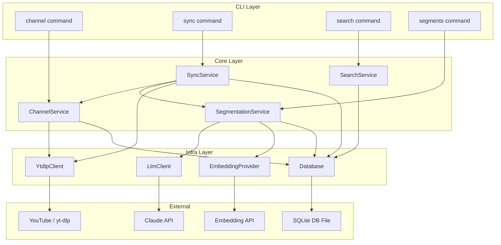
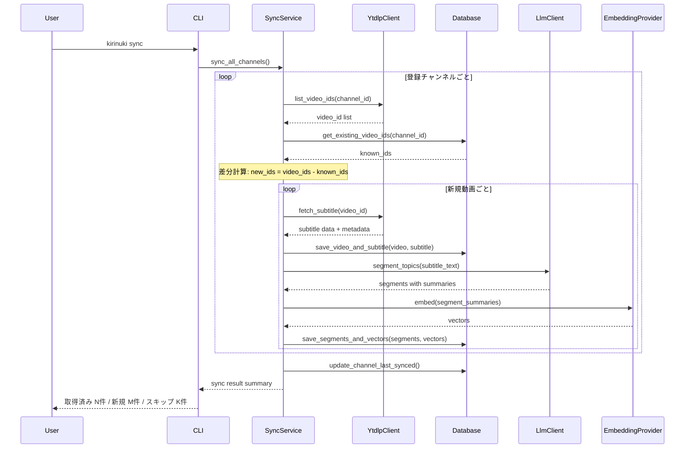
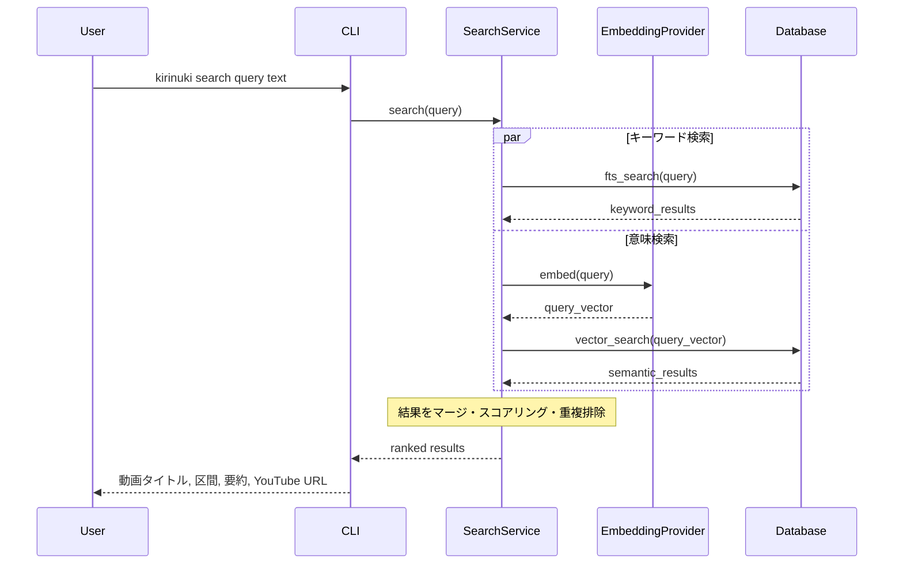
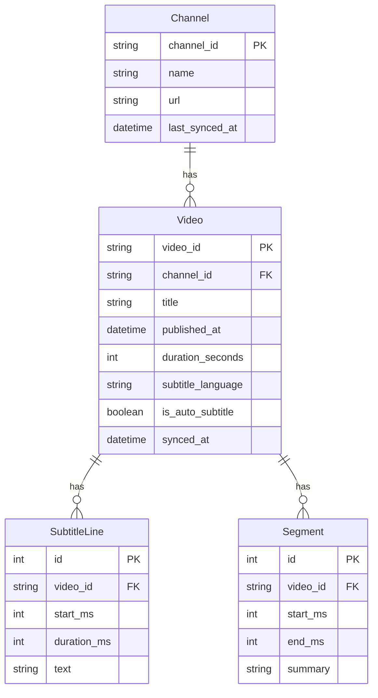

# Design Document — youtube-live-clipper

## Overview

**Purpose**: YouTube Liveの配信アーカイブから字幕・メタデータをチャンネル単位で差分同期し、LLMによる話題セグメンテーションと横断検索を提供するCLIツール。

**Users**: 配信アーカイブから特定の話題を探したいユーザー。「あの話どの配信でしてた？」を解決する。

### Goals
- チャンネル登録→同期→検索のシンプルなワークフローを提供
- 字幕のみ保存しストレージ消費を最小化
- FTS5（キーワード）+ ベクトル検索（意味）のハイブリッド検索
- メンバー限定動画を含む全アーカイブを対象

### Non-Goals
- 動画ファイルのダウンロード・切り抜き生成（将来フェーズ）
- リアルタイムの配信モニタリング
- Web UIやGUIの提供

## Architecture

### Architecture Pattern & Boundary Map

レイヤードアーキテクチャ（CLI → Core → Infra）をベースに、インフラ層はProtocolで抽象化。



**Architecture Integration**:
- **Selected pattern**: レイヤード + Protocol抽象化（steering準拠の3層構成）
- **Domain boundaries**: チャンネル管理、同期、セグメンテーション、検索を独立したサービスとして分離
- **Existing patterns preserved**: steering定義のCLI→Core→Infra依存方向
- **New components rationale**: 各コアサービスは単一責務。インフラ層はProtocolで外部依存を抽象化しテスト時にモック差し替え可能

### Technology Stack

| Layer | Choice / Version | Role in Feature | Notes |
|-------|------------------|-----------------|-------|
| CLI | click or typer | サブコマンド定義、引数パース | steering準拠 |
| Core Services | Python 3.12+ | ビジネスロジック | 型ヒント必須 |
| Data / Storage | SQLite + FTS5 trigram + sqlite-vec | メタデータ・字幕・ベクトル永続化 | 単一DBファイル |
| LLM | Claude Haiku 4.5 (anthropic SDK) | 話題セグメンテーション | Structured Outputs |
| Embedding | OpenAI text-embedding-3-small (default) | セグメント要約のベクトル化 | Provider抽象化で差し替え可能 |
| Video Metadata | yt-dlp (Python library) | チャンネル一覧・字幕取得 | Cookie認証対応 |
| Validation | Pydantic v2 | 設定・モデルバリデーション | steering準拠 |

## System Flows

### 同期フロー（sync）



### 検索フロー（search）



## Requirements Traceability

| Requirement | Summary | Components | Interfaces | Flows |
|-------------|---------|------------|------------|-------|
| 1.1 | チャンネル登録 | ChannelService, Database | ChannelService.register() | — |
| 1.2 | 差分同期 | SyncService, YtdlpClient, Database | SyncService.sync_all() | 同期フロー |
| 1.3 | 字幕のみ取得 | YtdlpClient | YtdlpClient.fetch_subtitle() | 同期フロー |
| 1.4 | メンバー限定対応 | YtdlpClient | cookiefile設定 | 同期フロー |
| 1.5 | 自動生成字幕フォールバック | YtdlpClient | yt-dlpオプション | 同期フロー |
| 1.6 | 字幕なし動画スキップ | SyncService | エラーハンドリング | 同期フロー |
| 1.7 | 同期進捗表示 | SyncService, CLI | SyncResult | 同期フロー |
| 2.1 | SQLite永続化 | Database | Database Protocol | 全フロー |
| 2.2 | 動画ID・チャンネルID一意識別 | Database | スキーマ制約 | — |
| 2.3 | FTSインデックス | Database | FTS5 trigram | 検索フロー |
| 2.4 | チャンネル一覧表示 | ChannelService, Database | ChannelService.list_channels() | — |
| 2.5 | 動画一覧表示 | ChannelService, Database | ChannelService.list_videos() | — |
| 3.1 | LLMセグメンテーション | SegmentationService, LlmClient | SegmentationService.segment() | 同期フロー |
| 3.2 | セグメント保存 | Database | segments table | 同期フロー |
| 3.3 | ベクトルインデックス | EmbeddingProvider, Database | sqlite-vec | 同期フロー |
| 3.4 | セグメント一覧表示 | SegmentationService, Database | SegmentationService.list_segments() | — |
| 4.1 | ハイブリッド検索 | SearchService, Database, EmbeddingProvider | SearchService.search() | 検索フロー |
| 4.2 | 検索結果情報 | SearchService | SearchResult model | 検索フロー |
| 4.3 | タイムスタンプ付きURL | SearchService | URL生成ロジック | 検索フロー |
| 4.4 | 該当なし表示 | SearchService, CLI | 空結果ハンドリング | 検索フロー |
| 5.1 | Cookieパス設定 | Config model | 設定ファイル | — |
| 5.2 | Cookie使用 | YtdlpClient | cookiefile option | 同期フロー |
| 5.3 | Cookie未設定エラー | YtdlpClient, CLI | エラーメッセージ | — |
| 6.1 | サブコマンドCLI | CLI Layer | click/typer | 全フロー |
| 6.2 | 設定管理 | Config model | Pydantic + 環境変数 | — |
| 6.3 | ヘルプ表示 | CLI Layer | click/typer built-in | — |

## Components and Interfaces

| Component | Domain/Layer | Intent | Req Coverage | Key Dependencies | Contracts |
|-----------|-------------|--------|--------------|------------------|-----------|
| ChannelService | Core | チャンネル登録・一覧管理 | 1.1, 2.4, 2.5 | Database (P0), YtdlpClient (P0) | Service |
| SyncService | Core | チャンネル差分同期オーケストレーション | 1.2-1.7 | YtdlpClient (P0), Database (P0), SegmentationService (P0) | Service |
| SegmentationService | Core | LLM話題分割・セグメント管理 | 3.1-3.4 | LlmClient (P0), EmbeddingProvider (P0), Database (P0) | Service |
| SearchService | Core | ハイブリッド横断検索 | 4.1-4.4 | Database (P0), EmbeddingProvider (P1) | Service |
| YtdlpClient | Infra | yt-dlpラッパー | 1.2-1.6, 5.2-5.3 | yt-dlp (P0, External) | Service |
| LlmClient | Infra | Claude APIラッパー | 3.1 | anthropic SDK (P0, External) | Service |
| EmbeddingProvider | Infra | エンベディング生成抽象化 | 3.3, 4.1 | openai SDK (P0, External) | Service |
| Database | Infra | SQLite + FTS5 + sqlite-vecアクセス | 2.1-2.3 | sqlite3 (P0), sqlite-vec (P0) | Service, State |
| Config | Models | アプリ設定モデル | 5.1, 6.2 | pydantic (P0) | State |

### Core Layer

#### ChannelService

| Field | Detail |
|-------|--------|
| Intent | チャンネルの登録・一覧取得・動画一覧取得 |
| Requirements | 1.1, 2.4, 2.5 |

**Responsibilities & Constraints**
- チャンネルURL/IDからチャンネル情報を取得し登録
- 登録済みチャンネル・動画の一覧クエリ

**Dependencies**
- Outbound: Database — チャンネル・動画データの読み書き (P0)
- External: YtdlpClient — チャンネルメタデータ取得 (P0)

**Contracts**: Service [x]

##### Service Interface
```python
class ChannelService(Protocol):
    def register(self, channel_url: str) -> Channel:
        """チャンネルを同期対象として登録する。"""
        ...

    def list_channels(self) -> list[ChannelSummary]:
        """登録済みチャンネル一覧を同期済み動画数・最終同期日時とともに返す。"""
        ...

    def list_videos(self, channel_id: str) -> list[VideoSummary]:
        """指定チャンネルの同期済み動画一覧を返す。"""
        ...
```

#### SyncService

| Field | Detail |
|-------|--------|
| Intent | 登録済みチャンネルの差分同期オーケストレーション |
| Requirements | 1.2, 1.3, 1.4, 1.5, 1.6, 1.7 |

**Responsibilities & Constraints**
- flat extractionでチャンネル全動画IDを取得し、DBと比較して新規動画を特定
- 新規動画ごとに字幕取得→セグメンテーション→インデックス登録のパイプライン実行
- 同期進捗の集計と報告

**Dependencies**
- Outbound: Database — 既存動画ID取得、新規データ保存 (P0)
- Outbound: YtdlpClient — 動画一覧・字幕取得 (P0)
- Outbound: SegmentationService — 話題分割 (P0)

**Contracts**: Service [x]

##### Service Interface
```python
@dataclass
class SyncResult:
    already_synced: int
    newly_synced: int
    skipped: int
    errors: list[SyncError]

@dataclass
class SyncError:
    video_id: str
    reason: str

class SyncService(Protocol):
    def sync_all(self) -> SyncResult:
        """全登録チャンネルの差分同期を実行する。"""
        ...

    def sync_channel(self, channel_id: str) -> SyncResult:
        """指定チャンネルの差分同期を実行する。"""
        ...
```

#### SegmentationService

| Field | Detail |
|-------|--------|
| Intent | LLMによる字幕の話題セグメンテーション・管理 |
| Requirements | 3.1, 3.2, 3.3, 3.4 |

**Responsibilities & Constraints**
- 字幕テキストをLLMに送信し話題セグメントを生成
- セグメント要約をベクトル化してインデックス登録
- 4時間超の配信は45分チャンク+5分オーバーラップで分割処理

**Dependencies**
- Outbound: LlmClient — 話題分割API呼び出し (P0)
- Outbound: EmbeddingProvider — 要約テキストのベクトル化 (P0)
- Outbound: Database — セグメント保存・取得 (P0)

**Contracts**: Service [x]

##### Service Interface
```python
class SegmentationService(Protocol):
    def segment_video(self, video_id: str, subtitle_text: str) -> list[Segment]:
        """字幕テキストを話題セグメントに分割し、DB保存・インデックス登録まで行う。"""
        ...

    def list_segments(self, video_id: str) -> list[Segment]:
        """指定動画のセグメント一覧を時系列順に返す。"""
        ...
```

#### SearchService

| Field | Detail |
|-------|--------|
| Intent | FTS5 + ベクトルのハイブリッド横断検索 |
| Requirements | 4.1, 4.2, 4.3, 4.4 |

**Responsibilities & Constraints**
- キーワード検索（FTS5）と意味検索（ベクトル）を並行実行
- 結果のマージ・スコアリング・重複排除
- タイムスタンプ付きYouTube URLの生成

**Dependencies**
- Outbound: Database — FTS5クエリ、ベクトル検索 (P0)
- Outbound: EmbeddingProvider — クエリテキストのベクトル化 (P1)

**Contracts**: Service [x]

##### Service Interface
```python
@dataclass
class SearchResult:
    video_title: str
    channel_name: str
    start_time_ms: int
    end_time_ms: int
    summary: str
    youtube_url: str  # タイムスタンプ付き (e.g. https://youtube.com/watch?v=xxx&t=123)

class SearchService(Protocol):
    def search(self, query: str, limit: int = 10) -> list[SearchResult]:
        """全動画を横断してハイブリッド検索を実行する。"""
        ...
```

### Infra Layer

#### YtdlpClient

| Field | Detail |
|-------|--------|
| Intent | yt-dlp Python APIラッパー |
| Requirements | 1.2, 1.3, 1.4, 1.5, 1.6, 5.2, 5.3 |

**Responsibilities & Constraints**
- チャンネル全動画IDのflat extraction
- 個別動画の字幕取得（json3形式）
- Cookie認証の透過的な適用

**Dependencies**
- External: yt-dlp library (P0)

**Contracts**: Service [x]

##### Service Interface
```python
@dataclass
class VideoMeta:
    video_id: str
    title: str
    published_at: datetime | None
    duration_seconds: int

@dataclass
class SubtitleData:
    video_id: str
    language: str
    is_auto_generated: bool
    entries: list[SubtitleEntry]

@dataclass
class SubtitleEntry:
    start_ms: int
    duration_ms: int
    text: str

class YtdlpClient(Protocol):
    def list_channel_video_ids(self, channel_url: str) -> list[str]:
        """チャンネルの全動画IDをflat extractionで取得する。"""
        ...

    def fetch_video_metadata(self, video_id: str) -> VideoMeta:
        """動画のメタデータを取得する。"""
        ...

    def fetch_subtitle(self, video_id: str) -> SubtitleData | None:
        """動画の字幕をjson3形式で取得する。字幕なしの場合はNone。"""
        ...
```

**Implementation Notes**
- `extract_flat=True`でflat extraction、`skip_download=True`で動画DL回避
- `writesubtitles=True` + `writeautomaticsub=True`で手動字幕優先、自動生成フォールバック
- Cookie: `Config.cookie_file_path`が設定されていれば`cookiefile`オプションに渡す
- yt-dlpのAPIは非公式のため、薄いラッパーで影響範囲を限定

#### LlmClient

| Field | Detail |
|-------|--------|
| Intent | Claude APIによる話題セグメンテーション |
| Requirements | 3.1 |

**Responsibilities & Constraints**
- 字幕テキストを受け取り、話題セグメントのリストを返す
- Structured Outputsで出力フォーマットを保証
- 長時間配信のチャンク分割はSegmentationServiceの責務（LlmClientは単一リクエスト処理）

**Dependencies**
- External: anthropic Python SDK (P0)

**Contracts**: Service [x]

##### Service Interface
```python
@dataclass
class TopicSegment:
    start_ms: int
    end_ms: int
    summary: str

class LlmClient(Protocol):
    def analyze_topics(self, subtitle_text: str) -> list[TopicSegment]:
        """字幕テキストを話題セグメントに分割する。"""
        ...
```

**Implementation Notes**
- モデル: `claude-haiku-4-5-20251001`をデフォルトに。Config経由で変更可能
- Structured Outputs (GA)で`list[TopicSegment]`相当のJSONスキーマを指定
- 入力が200Kトークン超の場合はエラー（チャンク分割はSegmentationService側）

#### EmbeddingProvider

| Field | Detail |
|-------|--------|
| Intent | テキストのベクトル化（プロバイダー抽象化） |
| Requirements | 3.3, 4.1 |

**Responsibilities & Constraints**
- テキストのリストを受け取り、ベクトルのリストを返す
- プロバイダー差し替え可能（OpenAI、Voyage AI、ローカルモデル）

**Dependencies**
- External: openai SDK or voyage SDK (P0)

**Contracts**: Service [x]

##### Service Interface
```python
class EmbeddingProvider(Protocol):
    @property
    def dimensions(self) -> int:
        """ベクトルの次元数を返す。"""
        ...

    def embed(self, texts: list[str]) -> list[list[float]]:
        """テキストリストをベクトルリストに変換する。"""
        ...
```

#### Database

| Field | Detail |
|-------|--------|
| Intent | SQLite + FTS5 + sqlite-vecの統合データアクセス |
| Requirements | 2.1, 2.2, 2.3 |

**Responsibilities & Constraints**
- 単一SQLiteファイルでリレーショナル・全文検索・ベクトル検索を統合管理
- マイグレーション管理（スキーマバージョニング）
- トランザクション管理

**Dependencies**
- External: sqlite3 (P0, 標準ライブラリ)
- External: sqlite-vec (P0)

**Contracts**: Service [x] / State [x]

##### State Management
- **State model**: SQLite単一ファイル（`~/.kirinuki/data.db` or 設定可能）
- **Persistence**: WALモード推奨（読み書き並行性向上）
- **Concurrency**: CLIツールのため同時実行は想定しない。単一接続

## Data Models

### Domain Model



**Business Rules**:
- Channel : Video = 1 : N
- Video : SubtitleLine = 1 : N（時系列順）
- Video : Segment = 1 : N（時系列順、区間は重複しない）
- SegmentのベクトルはsegmentのIDで紐付け（sqlite-vec仮想テーブル）

### Physical Data Model

```sql
-- チャンネル
CREATE TABLE channels (
    channel_id TEXT PRIMARY KEY,
    name TEXT NOT NULL,
    url TEXT NOT NULL,
    last_synced_at TEXT  -- ISO 8601
);

-- 動画
CREATE TABLE videos (
    video_id TEXT PRIMARY KEY,
    channel_id TEXT NOT NULL REFERENCES channels(channel_id),
    title TEXT NOT NULL,
    published_at TEXT,  -- ISO 8601
    duration_seconds INTEGER NOT NULL,
    subtitle_language TEXT NOT NULL,
    is_auto_subtitle INTEGER NOT NULL DEFAULT 0,  -- boolean
    synced_at TEXT NOT NULL  -- ISO 8601
);
CREATE INDEX idx_videos_channel ON videos(channel_id);

-- 字幕行
CREATE TABLE subtitle_lines (
    id INTEGER PRIMARY KEY AUTOINCREMENT,
    video_id TEXT NOT NULL REFERENCES videos(video_id),
    start_ms INTEGER NOT NULL,
    duration_ms INTEGER NOT NULL,
    text TEXT NOT NULL
);
CREATE INDEX idx_subtitle_lines_video ON subtitle_lines(video_id);

-- FTS5全文検索（trigram tokenizer for Japanese）
CREATE VIRTUAL TABLE subtitle_fts USING fts5(
    text,
    video_id UNINDEXED,
    start_ms UNINDEXED,
    duration_ms UNINDEXED,
    tokenize='trigram'
);

-- 話題セグメント
CREATE TABLE segments (
    id INTEGER PRIMARY KEY AUTOINCREMENT,
    video_id TEXT NOT NULL REFERENCES videos(video_id),
    start_ms INTEGER NOT NULL,
    end_ms INTEGER NOT NULL,
    summary TEXT NOT NULL
);
CREATE INDEX idx_segments_video ON segments(video_id);

-- ベクトルインデックス（sqlite-vec）
CREATE VIRTUAL TABLE segment_vectors USING vec0(
    segment_id INTEGER PRIMARY KEY,
    embedding float[1536]  -- OpenAI text-embedding-3-small dimensions
);

-- スキーマバージョン管理
CREATE TABLE schema_version (
    version INTEGER PRIMARY KEY
);
```

**Key Design Points**:
- `subtitle_fts`は`subtitle_lines`と同期。挿入時にトリガーまたはアプリ側で同時書き込み
- `segment_vectors`の次元数はEmbeddingProviderの`dimensions`と一致させる（DBマイグレーション必要）
- 日時はISO 8601文字列で保存（SQLiteに日時型がないため）

## Error Handling

### Error Categories and Responses

**User Errors**:
- 無効なチャンネルURL → URLフォーマット検証、エラーメッセージ表示
- Cookie未設定でメンバー限定動画 → 認証設定手順を案内

**External Service Errors**:
- yt-dlpの字幕取得失敗 → 動画をスキップ、エラーログ記録、同期は続行
- YouTube API制限 / ネットワークエラー → リトライ（最大3回、指数バックオフ）後にエラー報告
- Claude API エラー → セグメンテーション失敗として記録、同期は続行（字幕データは保存済み）
- Embedding API エラー → 同上

**Data Errors**:
- SQLiteロック → CLIツールのため基本的に発生しない。万が一の場合はエラーメッセージ表示

### Error Strategy
- 同期処理は**部分的失敗を許容**する設計。個別動画の失敗は他の動画の処理に影響しない
- 失敗した動画はSyncResult.errorsに集約し、最後にまとめて報告
- セグメンテーション未完了の動画はFTS検索の対象にはなるが、意味検索の対象にはならない

## Testing Strategy

### Unit Tests
- **SegmentationService**: チャンク分割ロジック（長時間配信の分割、オーバーラップ処理）
- **SearchService**: ハイブリッド検索のマージ・スコアリング・重複排除ロジック
- **SyncService**: 差分計算ロジック（新規ID特定、スキップ判定）
- **URL生成**: タイムスタンプ付きYouTube URL生成の正確性
- **Config**: 設定ファイル・環境変数の読み込みとバリデーション

### Integration Tests
- **Database**: SQLite + FTS5 + sqlite-vecの統合テスト（CRUD、FTSクエリ、ベクトル検索）
- **YtdlpClient**: yt-dlp APIのモック（flat extraction、字幕取得、Cookie認証）
- **LlmClient**: Claude APIのモック（Structured Outputs応答の解析）
- **同期パイプライン**: 字幕取得→セグメンテーション→インデックス登録の一連のフロー

### E2E Tests
- チャンネル登録→同期→検索の完全なワークフロー（外部APIモック使用）

## Security Considerations

- **APIキー管理**: LLM APIキー、Embedding APIキーは環境変数または設定ファイルで管理。設定ファイルは`~/.kirinuki/config.toml`に配置し、パーミッション警告を表示
- **Cookie保護**: Cookieファイルパスのみ設定に保持。Cookie内容はDBに保存しない
- **データの局所性**: 全データはローカルSQLiteに保存。外部送信されるのはLLM/Embedding APIへの字幕テキストのみ
